# 3계층 아키텍쳐 AWS로 실습하기

## 순서
1. S3설정 이미지 업로드, 여러 권한 해제 하기
2. DB구성 RDS 세팅
3. was 톰캣 서버 생성 톰캣이랑 DB연결하기 인바운드 규칙 편집 포트 8080, 8009 추가 DB인바운드 규칙 편집 우분투 톰캣 서비스 등록

4. 톰캣 이미지 생성

5. 톰캣 대상 그룹 포트번호 8009

6. 로드 벨런싱

3. 아파치가 설치된 EC2 S3에 올린 이미지를 이 곳에 출력되게 한다.우분투 인스턴스 하나 생성 웹서버 설치, 톰캣 연결 프로그램 다운 워커 지정하기(경로 잘 확인 하기)
4. 오토 스케일링을 위한 이미지 생성 (2번의 EC2가 필요함)
5. 부하를 분산할 로드 벨런서 생성
6. 시작 구성 만들기 
7. 오토 스케일링 그룹 만들기 최대 용량 3개
- DB, 톰캣, 아파치 순으로 하기

## DB 만들기
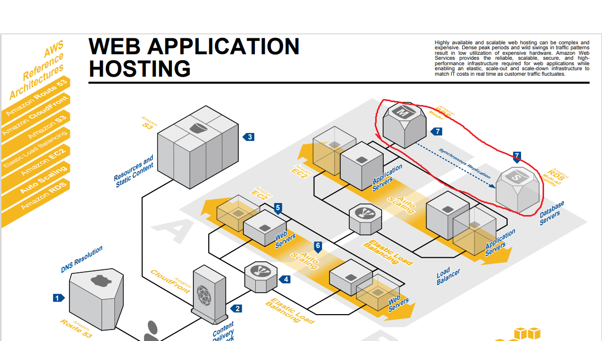<br/>
데이터 베이스를 생성하고 그것을 이중화 한다.<br/>
- RDS에 들어가서 DB를 만든다
- MySQL WorkBench로 연결되는지 확인
- 이중화 시작<br/><br/>


## 톰캣 구성해서 DB랑 연결하기
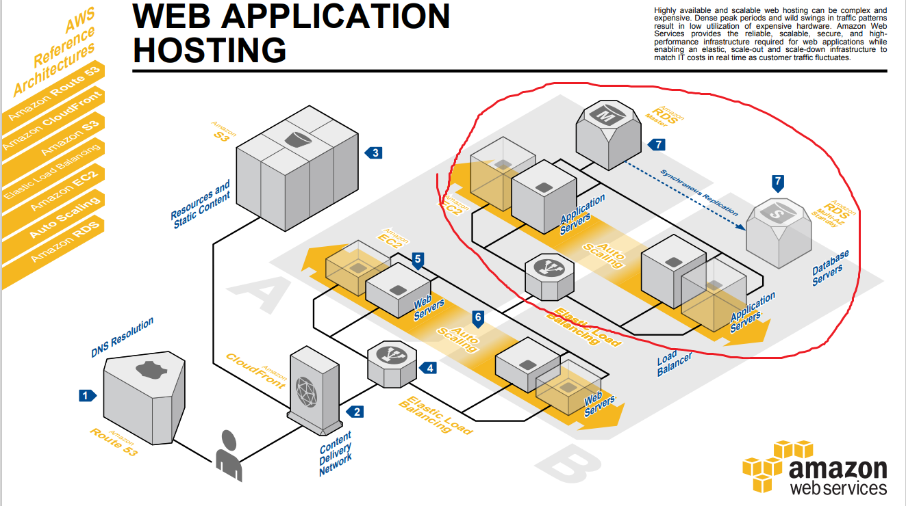<br/>
톰캣 인스턴스를 생성하고 DB랑 연결한다.<br/>>

1. 인스턴스 생성
2. 톰캣 설정
- apt업데이트
```shell
sudo su - root
apt update
```
- JAVA다운
```shell
apt-get install openjdk-8-jdk
```

- 톰캣설치, 설정
```shell
wget https://dlcdn.apache.org/tomcat/tomcat-9/v9.0.67/bin/apache-tomcat-9.0.67.tar.gz

tar zxvf apache-tomcat-9.0.67.tar.gz

mv apache-tomcat-9.0.67 /usr/local/tomcat9/

vi /etc/systemd/tomcat.service #생성 후 다음 내용 작성
```

```
[Unit]
Description=tomcat 9
After=network.target syslog.target
	
[Service]
Type=forking
Environment="JAVA_HOME=/usr/lib/jvm/java-8-openjdk-amd64"
User=root
Group=root
ExecStart=/usr/local/tomcat9/bin/startup.sh
ExecStop=/usr/local/tomcat9/bin/shutdown.sh
	
[Install]
WantedBy=multi-user.target
```
```shell
vi /usr/local/tomcat9/conf/server.xml # 파일에서 153번 줄에 다음 내용 추가
<Context path="" docBase="[이니셜]" reloadable="true" />

# 121번 라인에 다음 내용 추가
<Connector protocol="AJP/1.3"
    address="0.0.0.0"
    secretRequired="false"
    port="8009"
    redirectPort="8443" />
	
```


```shell
systemctl daemon-reload
systemctl enable tomcat
systemctl restart tomcat
```
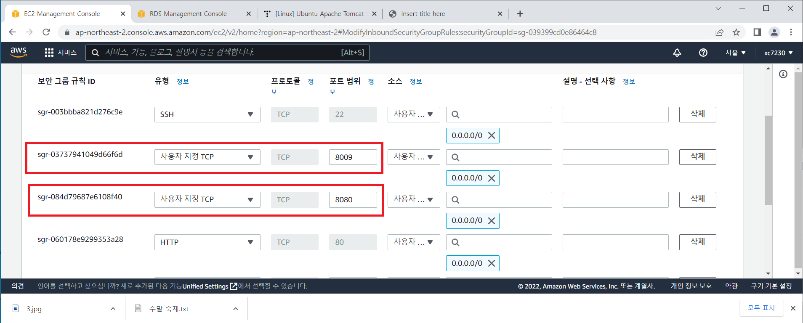<br/>
인바운드 규칙에 8080포트를 추가해준다.<br/>

- JSP 생성
```shell
vi /usr/local/tomcat9/webapps/[이니셜]/db.jsp
```
```
<%@ page language="java" contentType="text/html; charset=UTF-8" pageEncoding="UTF-8" %>
<%@page import="java.sql.*"%>
<%@ page import="java.net.InetAddress" %>
<!DOCTYPE html PUBLIC "-//W3C//DTD HTML 4.01 Transitional//EN" "http://www.w3.org/TR/html4/loose.dtd">
<html>
<head>
<meta http-equiv="Content-Type" content="text/html; charset=UTF-8">
<title>Insert title here</title>
</head>
<body>

클라이언트 IP <%=request.getRemoteAddr()%><br>
요청URI <%=request.getRequestURI()%><br>
요청URL: <%=request.getRequestURL()%><br>
서버이름 <%=request.getServerName()%><br>
<%
InetAddress inet= InetAddress.getLocalHost();
%>
동작 서버 IP <%=inet.getHostAddress()%><br>
서버포트 <%=request.getServerPort()%><br>

	<%
		Connection conn = null;
		ResultSet rs = null;
	      
		String url = "jdbc:mysql://[DB 서버 IP]:3306/[이니셜_db]?serverTimezone=UTC";
		String id = "[이니셜]";
		String pwd = "[DB 비번]";


		try {
			Class.forName("com.mysql.jdbc.Driver");
			conn = DriverManager.getConnection(url, id, pwd);
			Statement stmt = conn.createStatement();
     
	
			String sql = "SELECT sname FROM student";
			rs = stmt.executeQuery(sql);
			
			while(rs.next()) {
				out.println(rs.getString("sname"));
			}


			conn.close();
		} catch (Exception e) {

			e.printStackTrace();
		}	
	%>
</body>
</html>
```
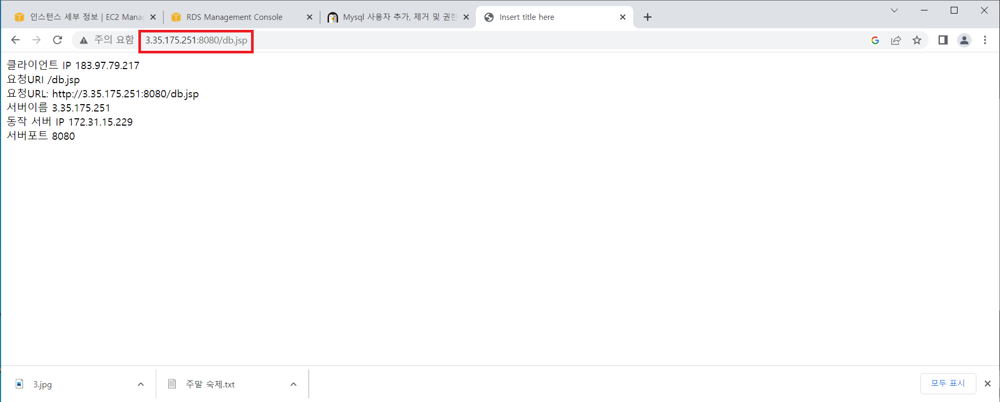<br/>
다음과 같이 나오면 성공<br/>

- 대상 그룹 생성


- 로드 벨런서 생성
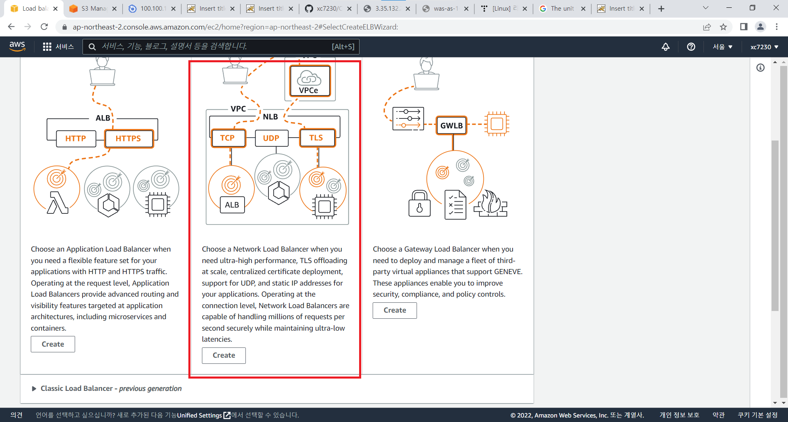<br/>
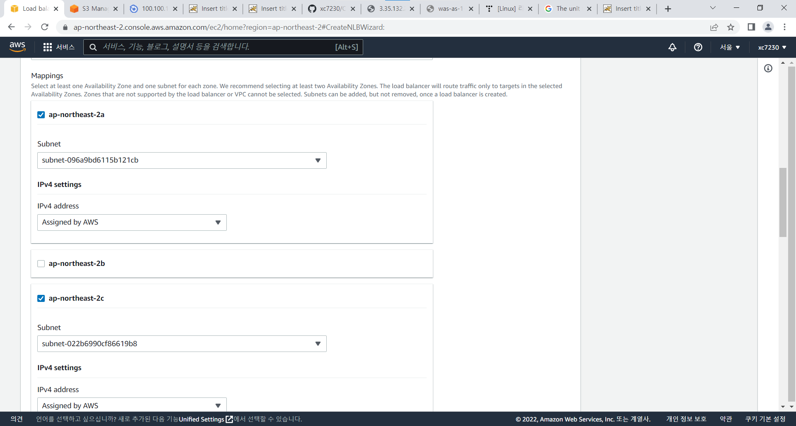<br/>
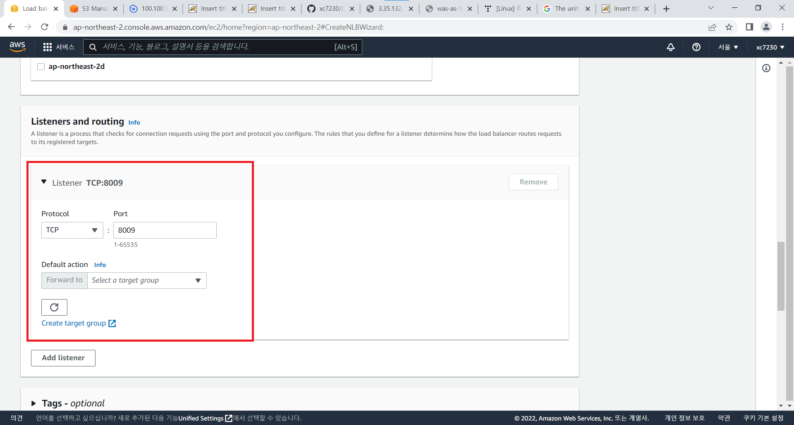<br/>

- 이미지 생성
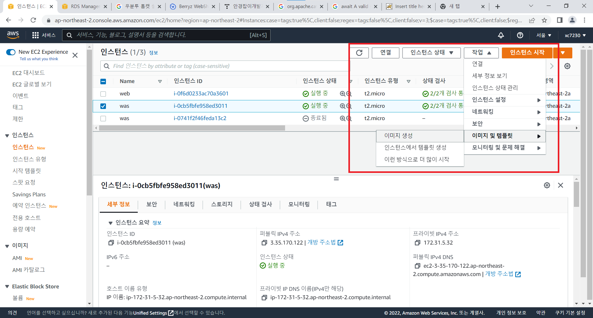<br/>

- 시작구성 생성
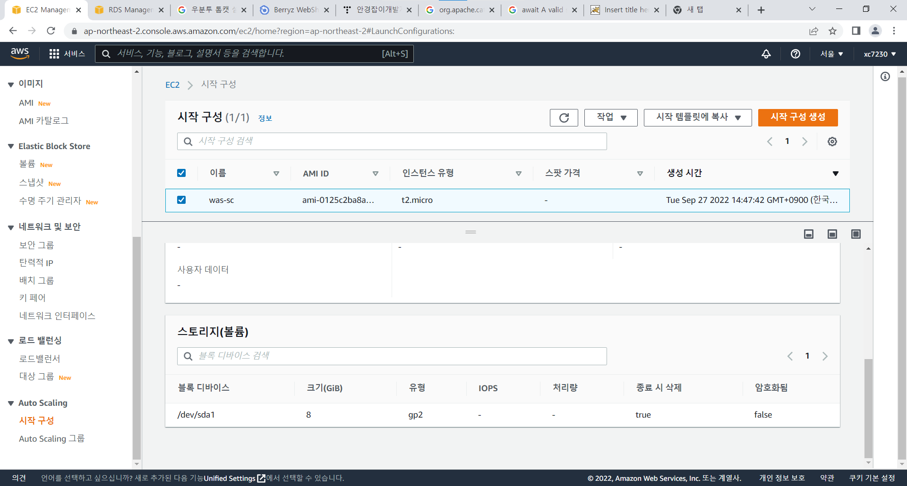<br/>

- 오토 스케일링 생성

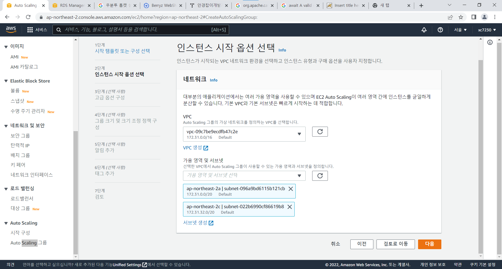<br/>
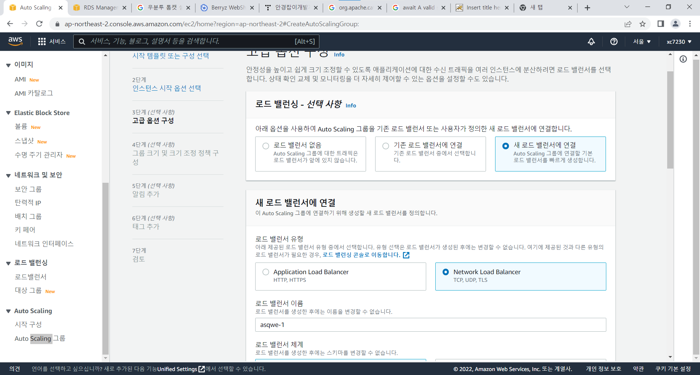<br/>

- 로드벨런싱
오토스케일링을 생성할 때 같이 생성 할 수 있다.<br/>

## 웹서버에 S3와 톰캣 연결하기

- S3 만들고 권한 설정
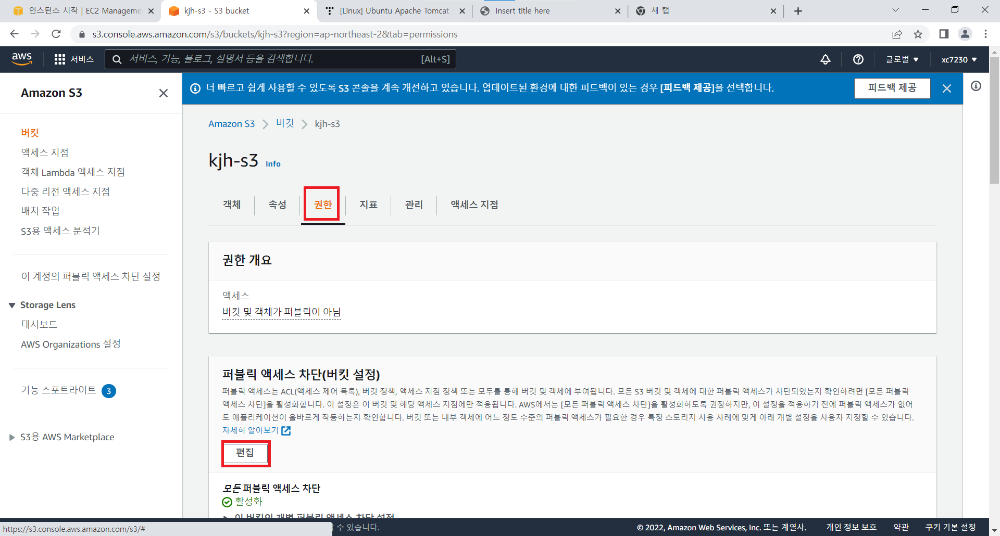<br/>
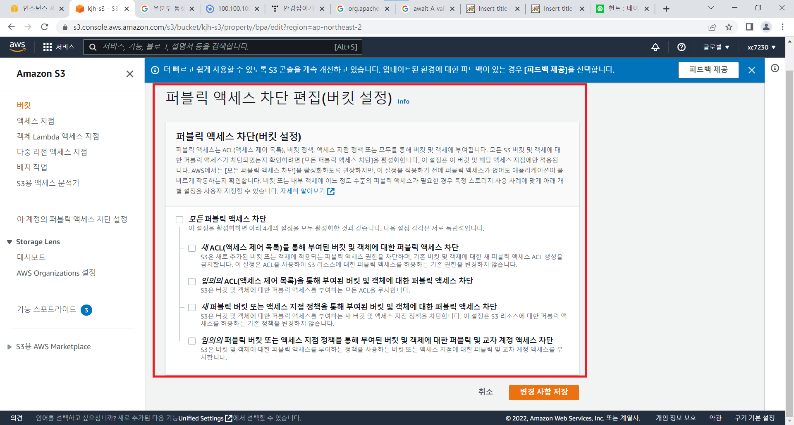<br/>
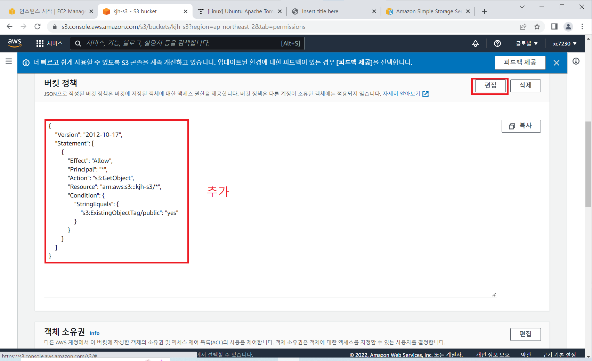<br/>
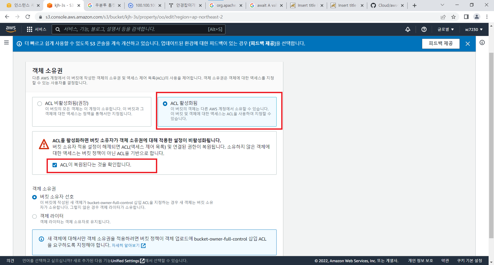<br/>
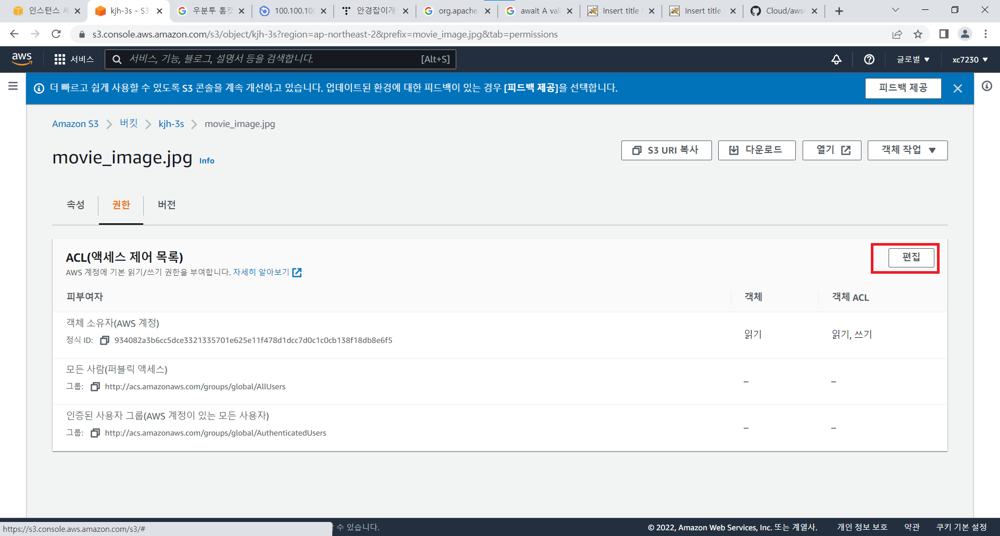<br/>
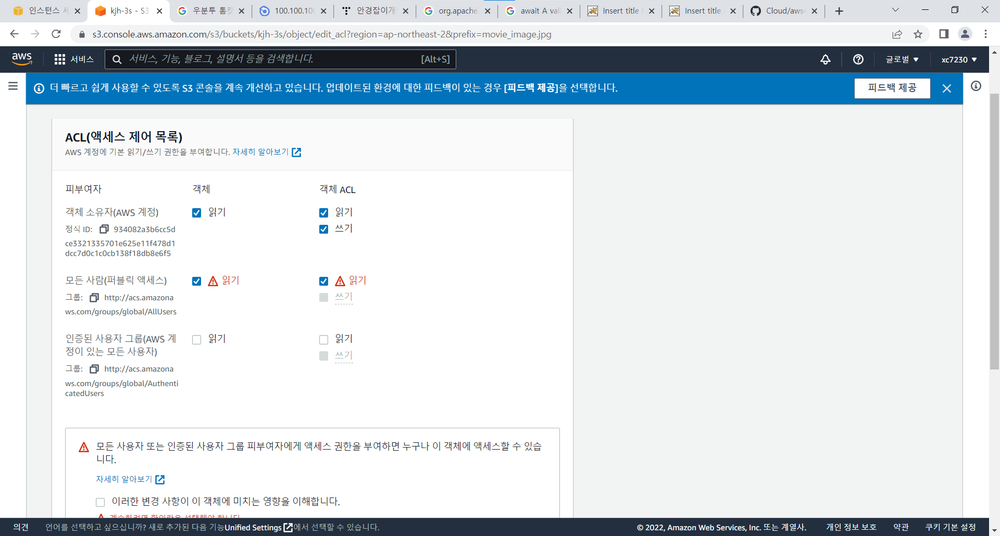<br/>
- 다운 및 설정
```shell
apt update
apt install -y apache2 apache2-dev libapache2-mod-jk

vi /var/www/html/index.html
```
```html
<h1>Web Server</h1>
<meta charset="utf-8">
영화 헌트
	
```
```shell
vi  /etc/libapache2-mod-jk/workers.properties
```
```
worker.list=worker1
worker.worker1.type=ajp13
worker.worker1.host=[톰캣의 LB의 주소]
worker.worker1.port=8009
```


