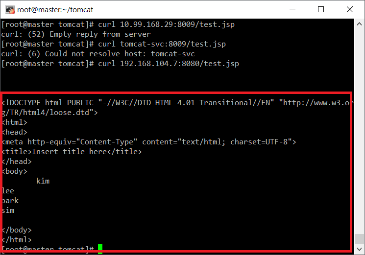
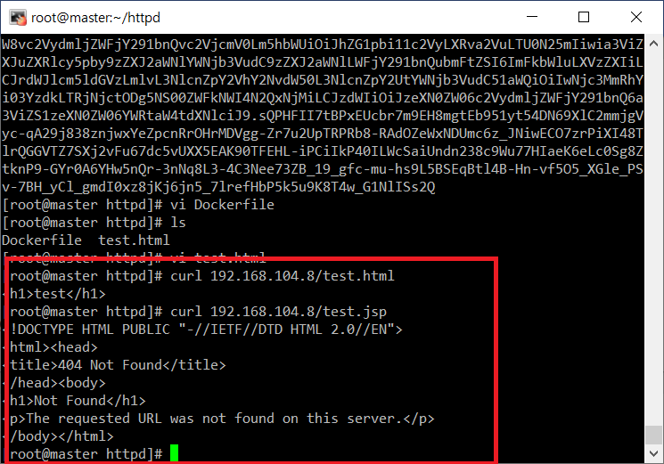

# 3계층 아키텍처 구성
1. mysql 이미지를 이용해서 DB서버 설정(시크릿, 볼륨, 파드, 서비스(클러스터IP))
2. tomcat 이미지를 이용해서 was 서버 설정(파드, 서비스(클러스터IP))
3. httpd 서비스를 이용해서 web 서버 설정(파드, 서비스(로드밸런서))
4. 각 서버의 이중화 구성은 하지말고 1대씩만 설정

## DB 설정
- 시크릿 생성
```yaml
apiVersion: v1
kind: Secret
metadata:
  name: mysql-sec
data:
  MYSQL_ROOT_PASSWORD: cXdlcjEyMzQ=
```

- pv 생성
```yaml
apiVersion: v1
kind: PersistentVolume
metadata:
  name: mysql-pv
spec:
  capacity:
    storage: 10G
  accessModes:
  - ReadWriteOnce
  local:
    path: /mysql-volume
  nodeAffinity:
    required:
      nodeSelectorTerms:
      - matchExpressions:
        - {key: kubernetes.io/hostname, operator: In, values: [node1]}
```

- pvc 생성
```yaml
apiVersion: v1
kind: PersistentVolumeClaim
metadata:
  name: mysql-pvc
spec:
  accessModes:
  - ReadWriteOnce
  resources:
    requests:
      storage: 10G
  storageClassName: ""
```

- sql 파드 생성
```yaml
apiVersion: v1
kind: Pod
metadata:
  name: mysql-pod
  labels:
    type: db
spec:
  nodeSelector:
    kubernetes.io/hostname: node1
  containers:
  - name: container
    image: mysql:latest
    ports:
    - containerPort: 3306
    envFrom:
    - secretRef:
        name: mysql-sec
    volumeMounts:
    - name: mysql-pvc-pv
      mountPath: /var/lib/mysql
  volumes:
  - name : mysql-pvc-pv
    persistentVolumeClaim:
      claimName: mysql-pvc
```
- node1에 퍼시스턴트 볼륨 디렉토리 생성
```sheel
cd /
mkdir mysql-volume
```


- 서비스(클러스터IP)
```yaml
apiVersion: v1
kind: Service
metadata:
  name: mysql-svc
spec:
  selector:
    type: db
  ports:
  - port: 3306
    targetPort: 3306
```

- 확인
`master`
```shell
yum install -y mysql-server
mysql -u root -p -h 10.99.38.110 # 서비스의 아이피, 비밀번호를 치고 들어가지면 성공
```

- sql db 및 테이블 생성
```sql
CREATE DATABASE kjh_db;
use kjh_db;
CREATE TABLE student (sname VARCHAR(10), sage INT);
INSERT INTO student VALUES('kim',10);
INSERT INTO student VALUES('lee',20);
INSERT INTO student VALUES('park',30);
INSERT INTO student VALUES('sim',40);
```


## tomcat 설정
- 도커 파일 생성
`master`
```shell
mkdir tomcat
cd tomcat
wget wget https://dev.mysql.com/get/Downloads/Connector-J/mysql-connector-java-8.0.19.tar.gz
tar zxvf mysql-connector-java-8.0.19.tar.gz
vi Dockerfile
```
```shell
FROM tomcat:9.0
RUN rm -rf /usr/local/tomcat/conf/server.xml
ADD ./server.xml /usr/local/tomcat/conf/server.xml
RUN mkdir /usr/local/tomcat/webapps/kjh
ADD ./test.jsp /usr/local/tomcat/webapps/kjh/test.jsp
ADD ./mysql-connector-java-8.0.19/mysql-connector-java-8.0.19.jar /usr/local/tomcat/lib/mysql-connector-java-8.0.19.jar
EXPOSE 8080
EXPOSE 8009
CMD catalina.sh run
```
- 톰캣에 db연결하기
```shell
vi server.xml
```
```xml
<?xml version="1.0" encoding="UTF-8"?>
<!--
  Licensed to the Apache Software Foundation (ASF) under one or more
  contributor license agreements.  See the NOTICE file distributed with
  this work for additional information regarding copyright ownership.
  The ASF licenses this file to You under the Apache License, Version 2.0
  (the "License"); you may not use this file except in compliance with
  the License.  You may obtain a copy of the License at

      http://www.apache.org/licenses/LICENSE-2.0

  Unless required by applicable law or agreed to in writing, software
  distributed under the License is distributed on an "AS IS" BASIS,
  WITHOUT WARRANTIES OR CONDITIONS OF ANY KIND, either express or implied.
  See the License for the specific language governing permissions and
  limitations under the License.
-->
<!-- Note:  A "Server" is not itself a "Container", so you may not
     define subcomponents such as "Valves" at this level.
     Documentation at /docs/config/server.html
 -->
<Server port="8005" shutdown="SHUTDOWN">
  <Listener className="org.apache.catalina.startup.VersionLoggerListener" />
  <!-- Security listener. Documentation at /docs/config/listeners.html
  <Listener className="org.apache.catalina.security.SecurityListener" />
  -->
  <!-- APR library loader. Documentation at /docs/apr.html -->
  <Listener className="org.apache.catalina.core.AprLifecycleListener" SSLEngine="on" />
  <!-- Prevent memory leaks due to use of particular java/javax APIs-->
  <Listener className="org.apache.catalina.core.JreMemoryLeakPreventionListener" />
  <Listener className="org.apache.catalina.mbeans.GlobalResourcesLifecycleListener" />
  <Listener className="org.apache.catalina.core.ThreadLocalLeakPreventionListener" />

  <!-- Global JNDI resources
       Documentation at /docs/jndi-resources-howto.html
  -->
  <GlobalNamingResources>
    <!-- Editable user database that can also be used by
         UserDatabaseRealm to authenticate users
    -->
    <Resource name="UserDatabase" auth="Container"
              type="org.apache.catalina.UserDatabase"
              description="User database that can be updated and saved"
              factory="org.apache.catalina.users.MemoryUserDatabaseFactory"
              pathname="conf/tomcat-users.xml" />
  </GlobalNamingResources>

  <!-- A "Service" is a collection of one or more "Connectors" that share
       a single "Container" Note:  A "Service" is not itself a "Container",
       so you may not define subcomponents such as "Valves" at this level.
       Documentation at /docs/config/service.html
   -->
  <Service name="Catalina">

    <!--The connectors can use a shared executor, you can define one or more named thread pools-->
    <!--
    <Executor name="tomcatThreadPool" namePrefix="catalina-exec-"
        maxThreads="150" minSpareThreads="4"/>
    -->


    <!-- A "Connector" represents an endpoint by which requests are received
         and responses are returned. Documentation at :
         Java HTTP Connector: /docs/config/http.html
         Java AJP  Connector: /docs/config/ajp.html
         APR (HTTP/AJP) Connector: /docs/apr.html
         Define a non-SSL/TLS HTTP/1.1 Connector on port 8080
    -->
    <Connector port="8080" protocol="HTTP/1.1"
               connectionTimeout="20000"
               redirectPort="8443" />
    <!-- A "Connector" using the shared thread pool-->
    <!--
    <Connector executor="tomcatThreadPool"
               port="8080" protocol="HTTP/1.1"
               connectionTimeout="20000"
               redirectPort="8443" />
    -->
    <!-- Define an SSL/TLS HTTP/1.1 Connector on port 8443
         This connector uses the NIO implementation. The default
         SSLImplementation will depend on the presence of the APR/native
         library and the useOpenSSL attribute of the AprLifecycleListener.
         Either JSSE or OpenSSL style configuration may be used regardless of
         the SSLImplementation selected. JSSE style configuration is used below.
    -->
    <!--
    <Connector port="8443" protocol="org.apache.coyote.http11.Http11NioProtocol"
               maxThreads="150" SSLEnabled="true">
        <SSLHostConfig>
            <Certificate certificateKeystoreFile="conf/localhost-rsa.jks"
                         type="RSA" />
        </SSLHostConfig>
    </Connector>
    -->
    <!-- Define an SSL/TLS HTTP/1.1 Connector on port 8443 with HTTP/2
         This connector uses the APR/native implementation which always uses
         OpenSSL for TLS.
         Either JSSE or OpenSSL style configuration may be used. OpenSSL style
         configuration is used below.
    -->
    <!--
    <Connector port="8443" protocol="org.apache.coyote.http11.Http11AprProtocol"
               maxThreads="150" SSLEnabled="true" >
        <UpgradeProtocol className="org.apache.coyote.http2.Http2Protocol" />
        <SSLHostConfig>
            <Certificate certificateKeyFile="conf/localhost-rsa-key.pem"
                         certificateFile="conf/localhost-rsa-cert.pem"
                         certificateChainFile="conf/localhost-rsa-chain.pem"
                         type="RSA" />
        </SSLHostConfig>
    </Connector>
    -->

    <!-- Define an AJP 1.3 Connector on port 8009 -->
    <!--
    <Connector protocol="AJP/1.3"
               address="::1"
               port="8009"
               redirectPort="8443" />
    -->


		<Connector protocol="AJP/1.3"
                    address="0.0.0.0"
                    secretRequired="false"
                    port="8009"
                    redirectPort="8443" />


    <!-- An Engine represents the entry point (within Catalina) that processes
         every request.  The Engine implementation for Tomcat stand alone
         analyzes the HTTP headers included with the request, and passes them
         on to the appropriate Host (virtual host).
         Documentation at /docs/config/engine.html -->

    <!-- You should set jvmRoute to support load-balancing via AJP ie :
    <Engine name="Catalina" defaultHost="localhost" jvmRoute="jvm1">
    -->
    <Engine name="Catalina" defaultHost="localhost">

      <!--For clustering, please take a look at documentation at:
          /docs/cluster-howto.html  (simple how to)
          /docs/config/cluster.html (reference documentation) -->
      <!--
      <Cluster className="org.apache.catalina.ha.tcp.SimpleTcpCluster"/>
      -->

      <!-- Use the LockOutRealm to prevent attempts to guess user passwords
           via a brute-force attack -->
      <Realm className="org.apache.catalina.realm.LockOutRealm">
        <!-- This Realm uses the UserDatabase configured in the global JNDI
             resources under the key "UserDatabase".  Any edits
             that are performed against this UserDatabase are immediately
             available for use by the Realm.  -->
        <Realm className="org.apache.catalina.realm.UserDatabaseRealm"
               resourceName="UserDatabase"/>
      </Realm>

      <Host name="localhost"  appBase="webapps"
            unpackWARs="true" autoDeploy="true">
<Context path="" docBase="kjh" reloadable="true" />

        <!-- SingleSignOn valve, share authentication between web applications
             Documentation at: /docs/config/valve.html -->
        <!--
        <Valve className="org.apache.catalina.authenticator.SingleSignOn" />
        -->

        <!-- Access log processes all example.
             Documentation at: /docs/config/valve.html
             Note: The pattern used is equivalent to using pattern="common" -->
        <Valve className="org.apache.catalina.valves.AccessLogValve" directory="logs"
               prefix="localhost_access_log" suffix=".txt"
               pattern="%h %l %u %t &quot;%r&quot; %s %b" />

      </Host>
    </Engine>
  </Service>
</Server>
```

- 테스트용 jsp만들기

```shell
vi test.jsp
```
```jsp
<%@page import="java.sql.*"%>

<%@ page language="java" contentType="text/html; charset=UTF-8"
    pageEncoding="UTF-8"%>
<!DOCTYPE html PUBLIC "-//W3C//DTD HTML 4.01 Transitional//EN" "http://www.w3.org/TR/html4/loose.dtd">
<html>
<head>
<meta http-equiv="Content-Type" content="text/html; charset=UTF-8">
<title>Insert title here</title>
</head>
<body>
	<%
		Connection conn = null;
		ResultSet rs = null;
	      
		String url = "jdbc:mysql://mysql-svc:3306/kjh_db?serverTimezone=UTC";
		String id = "root";
		String pwd = "qwer1234";


		try {
			Class.forName("com.mysql.jdbc.Driver");
			conn = DriverManager.getConnection(url, id, pwd);
			Statement stmt = conn.createStatement();
     
	
			String sql = "SELECT sname FROM student";
			rs = stmt.executeQuery(sql);
			
			while(rs.next()) {
				out.println(rs.getString("sname"));
			}


			conn.close();
		} catch (Exception e) {

			e.printStackTrace();
		}	
	%>
</body>
</html>
```
- 이미지 생성
```shell
docker build --tag xc7230/tomcat:0.1 .
docker push xc7230/tomcat:0.1
```

- 톰캣 파드 생성
```yaml
apiVersion: v1
kind: Pod
metadata:
  name: tomcat-pod
  labels:
    type: was
spec:
  containers:
  - name: container
    image: xc7230/tomcat:0.4
    ports:
    - containerPort: 8009
```
- 톰캣 서비스
```yaml
apiVersion: v1
kind: Service
metadata:
  name: tomcat-svc
spec:
  selector:
    type: was
  ports:
  - port: 8009
    targetPort: 8009

```
- 확인
```shell
curl 192.168.104.7:8080/test.jsp
```


```yaml
apiVersion: v1
kind: Pod
metadata:
  name: was-1
  labels:
    app: was
spec:
  containers:
  - name: tomcat
    image: tomcat:jre17-temurin-jammy
    port:
    - containerPort: 8080
```
<br/>

## httpd 설정
`master`
```shell
mkdir httpd
cd httpd
vi Dockerfile
```
- Dockerfile 작성
```shell
FROM httpd:2.4
ADD ./test.html /usr/local/apache2/htdocs/
RUN apt update
RUN apt install -y libapache2-mod-jk
RUN cp /usr/lib/apache2/modules/mod_jk.so /usr/local/apache2/modules/mod_jk.so
RUN sed -i 's/localhost/tomcat-svc/g' /etc/libapache2-mod-jk/workers.properties
EXPOSE 80
CMD httpd-foreground
```

```shell
vi test.html
```
```html
<h1>test</h1>
```
- 이미지 파일 업로드
```shell
docker build --tag xc7230/httpd:0.1 .
docker push xc7230/httpd:0.1
```

- 파드 생성
```yaml
apiVersion: v1
kind: Pod
metadata:
  name: httpd-pod
  labels:
    type: web
spec:
  containers:
  - name: container
    image: xc7230/httpd:0.1
    ports:
    - containerPort: 80
```

- 서비스 생성
```yaml
apiVersion: v1
kind: Service
metadata:
  name: httpd-svc
spec:
  selector:
    type: web
  ports:
  - port: 80
    targetPort: 80
  type: LoadBalancer
```

- 확인
```shell
curl 192.168.104.8/test.html
curl 192.168.104.8/test.jsp
```
<br/>