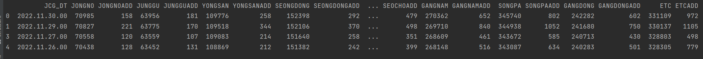
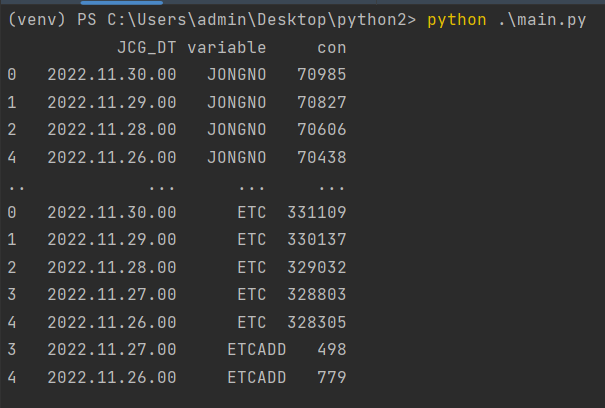

# Dataframe
## 전처리
### 컬럼에 있는 값을 데이터로 쓰기
<br/>
다음과 같이 컬럼에 있는 지역들을 데이터로 옮겨 더 보기 좋게 만들어주고 싶다.

```python
# 서울시 API데이터 불러오기
url = "http://openapi.seoul.go.kr:8088/시크릿키/xml/TbCorona19CountStatusJCG/1/5/" #xml -> json

# 컬럼명 list형식으로 저장
rows=['JONGNOADD', 'JUNGGUADD', 'YONGSANADD', 'GWANGJINADD', 'DDMADD', 'JUNGNANGADD', 'SEONGBUKADD', 'GANGBUKADD', 'DOBONGADD', 'NOWONADD','EPADD','SDMADD','MAPOADD','YANGCHEONADD','GANGSEOADD','GUROADD','GEUMCHEONADD','YDPADD','DONGJAKADD','GWANAKADD','SEOCHOADD','GANGNAMADD','SONGPAADD','GANGDONGADD', 'ETCADD']
columns = ['JONGNO', 'JUNGGU', 'YONGSAN', 'GWANGJIN', 'DDM', 'JUNGNANG', 'SEONGBUK', 'GANGBUK', 'DOBONG', 'NOWON','EP','SDM','MAPO','YANGCHEON','GANGSEO','GURO','GEUMCHEON','YDP','DONGJAK','GWANAK','SEOCHO','GANGNAM','SONGPA','GANGDONG', 'ETC']

# XML형식의 데이터를 Dataframe화
req = requests.get(url).content
xmlObject = xmltodict.parse(req)
dict_data = xmlObject['TbCorona19CountStatusJCG']['row']
df_conf = pd.DataFrame(dict_data)

# 데이터 전처리
df_conf = pd.melt(df_conf,
                  id_vars=['JCG_DT'],  # 기준이 되는 칼럼
                  value_vars=rows,  # 행으로 들어갈 칼럼
                  value_name='con', 
                  ignore_index=False)
```

### 결과
<br/>
컬럼들이 대폭 감소하여 더욱 보기 좋게 변했다.