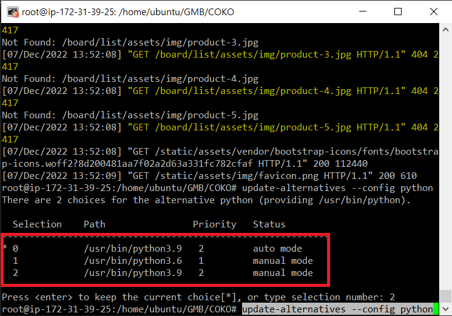

# Ubuntu_Django
## 파이썬 다운
```shell
apt update
apt install software-properties-common -y
add-apt-repository ppa:deadsnakes/ppa # 엔터 한 번 눌러줘야 함
apt install python3.9 -y
```
## python 버전 최신화
```shell
update-alternatives --install /usr/bin/python python /usr/bin/python3.6 1
update-alternatives --install /usr/bin/python python /usr/bin/python3.9 2
update-alternatives --config python # 2번을 입력해 최신화
```
<br/>

## PIP에 Python 버전 적용
```shell
apt -y install software-properties-common git python3.9 python3.9-distutils
mkdir /apps
curl https://bootstrap.pypa.io/get-pip.py -o /apps/get-pip.py
python3.9 /apps/get-pip.py
```

## Git에 Project 불러오기
```shell
mkdir /home/ubuntu/GMB
cd /home/ubuntu/GMB
git init
git clone github 주소
cd COKO
```

## requirements install
```shell
## mysqlclient install 전 준비
apt-get install python3.9-dev libmysqlclient-dev gcc default-libmysqlclient-dev -y

pip install -r requirements.txt
```
## secrets 파일 작성
`secrets.json`
```json
{
    "SECRET_KEY": "SECRET_KEY입력",
    "DB_NAME": "DB 이름",
    "DB_USER": "DB USER 이름",
    "DB_PASSWORD": "비밀번호",
    "DB_HOST": "DB 주소",
    "DB_PORT": "3306"
}
```

