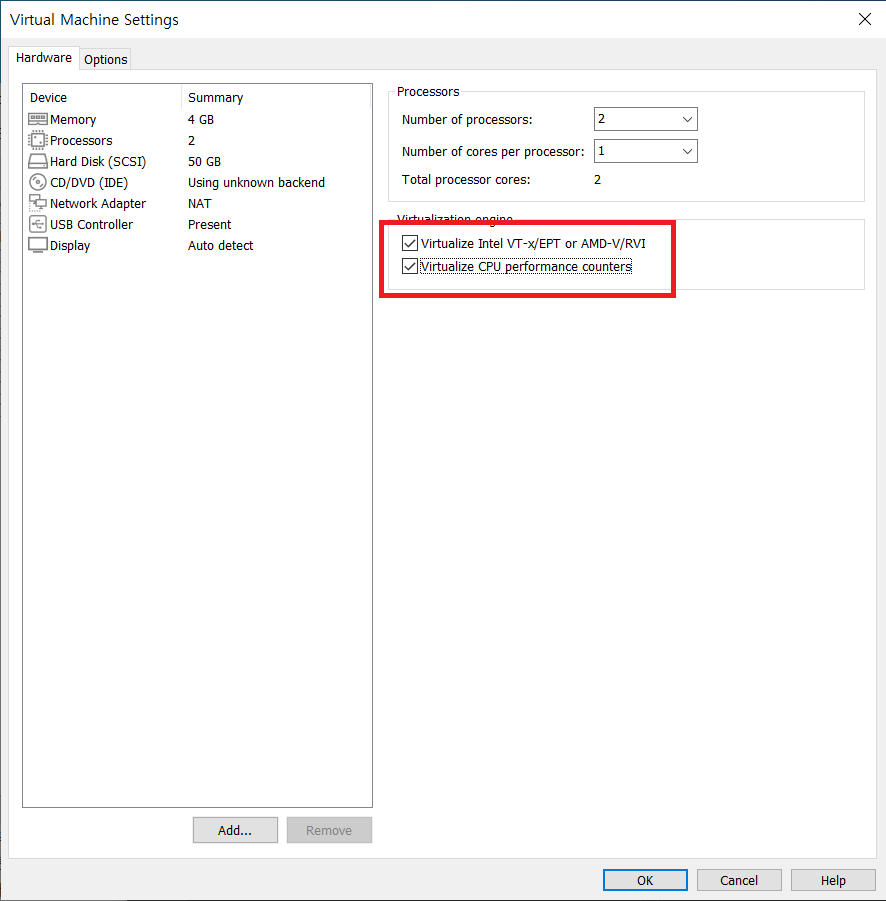
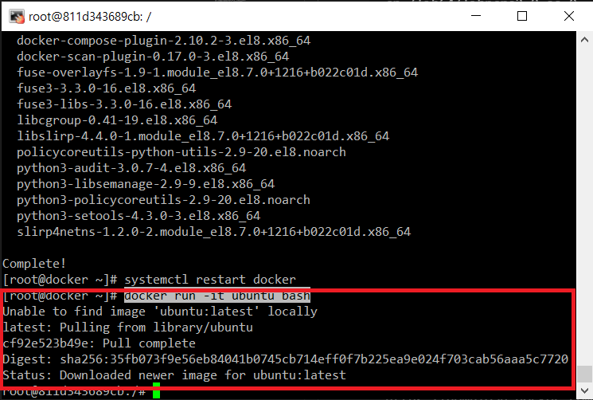
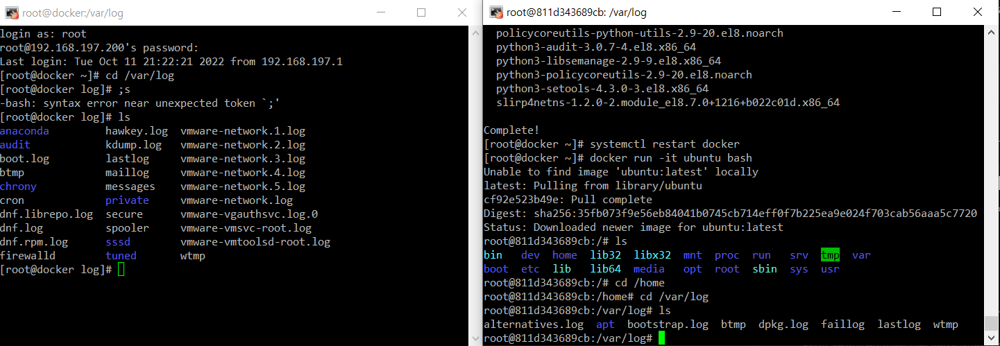
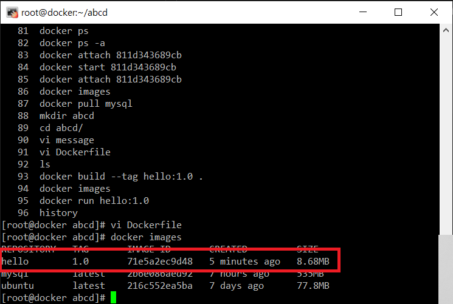
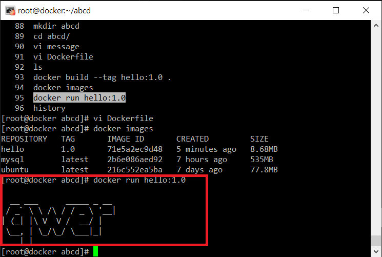

# 도커
- 가상머신 같은 컨테이너를 생산함
- 운영체제를 설치안해도 됨
- 도커허브에서 여러 이미지들을 다운받을 있다.

## 수동으로 컨테이너 환경 만들기
- 가상 OS 설정(docker : 192.168.197.200)
<br/>
가상화 허용으로 바꾼다.<br/>

- 인식이 잘 안될때
```shell
nmcli device
nmcli networking on
nmcli device
```

- test에서 여러 명령어 실행시키기
```shell
cd /
mkdir test
ldd /bin/bash
ldd /bin/ls

cp /lib64/libtinfo.so.6  /test/lib64/
ldd /bin/bash
cp /lib64/libdl.so.2   /test/lib64/
cp /lib64/libc.so.6  /test/lib64/
cp /lib64/ldd /bin/ls  /test/lib64/
ldd /bin/ls
cp /lib64/libselinux.so.1  /test/lib64/
cp /lib64/libcap.so.2  /test/lib64/
cp /lib64/libc.so.6 /test/lib64/
cp /lib64/libpcre2-8.so.0 /test/lib64/
cp /lib64/libdl.so.2 /test/lib64/
cp /lib64/ld-linux-x86-64.so.2 /test/lib64/
cp /lib64/libpthread.so.0 /test/lib64/
mkdir /test/bin
cp /bin/bash /test/bin/
mkdir /test/usr
mkdir /test/usr/bin
cp /usr/bin/ls /test/usr/bin/
chroot /test ls
```

## 자동으로 컨테이너 환경 만들기

### 도커 설치
```shell
yum install -y yum-utils 
yum-config-manager --add-repo https://download.docker.com/linux/centos/docker-ce.repo
yum-config-manager --enable docker-ce-nightly
yum-config-manager --enable docker-ce-test
yum install -y docker-ce docker-ce-cli containerd.io --allowerasing

systemctl restart docker
```

### 도커 컨테이너 실행
```shell
docker run -it ubuntu bash  # 도커 허브에서 우분투 이미지를 가져옴
```
<br/>
<br/>
왼쪽이 기존 OS, 오른쪽이 컨테이너로 실행한 OS<br/>

```shell
exit #컨테이너 나가기 이러면 컨테이너가 종료되므로 Ctrl p,q로 빠져나온다.
docker ps   # 실행되고 있는 컨테이너 출력
docker ps -a    # 종료된 컨테이너를 출력
docker start [이름] or [ID]
docker attach [이름] or [ID]
docker stop [이름] or [ID]
docker pull [이미지 이름]   # 이미지 파일만 가져옴
```

### 이미지

- 도커 회원가입<br/>
회원가입 : https://hub.docker.com/ <br/>

- 컨테이너 개발 순서
    1. 디렉토리를 준비, 이미지에 포함시킬 파일들을 모은다.
    2. Dokerfile 작성
    3. 유닛 테스트
    4. 이미지 빌드
    5. 컨테이너 동작 확인
<br/><br/><br/>
- 간단한 이미지 만들기
```shell
mkdir abcd
cd abcd/
vi message  # 아무거나 작성
```
```shell
vi Dockerfile
```
```shell
FROM  alpine:latest
RUN   apk update && apk add figlet
ADD   ./message /message
CMD   cat /message | figlet
```

```shell
docker build --tag hello:1.0 .
docker images
```
<br/>

- 이미지 파일 실행
```shell
docker run hello:1.0
```
<br/>
