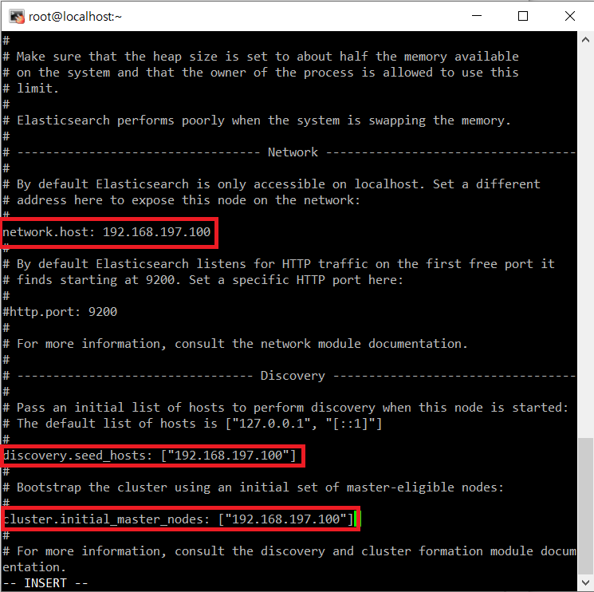
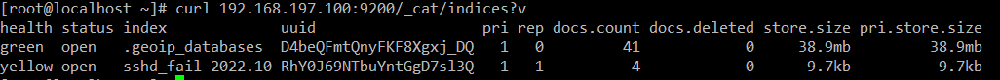
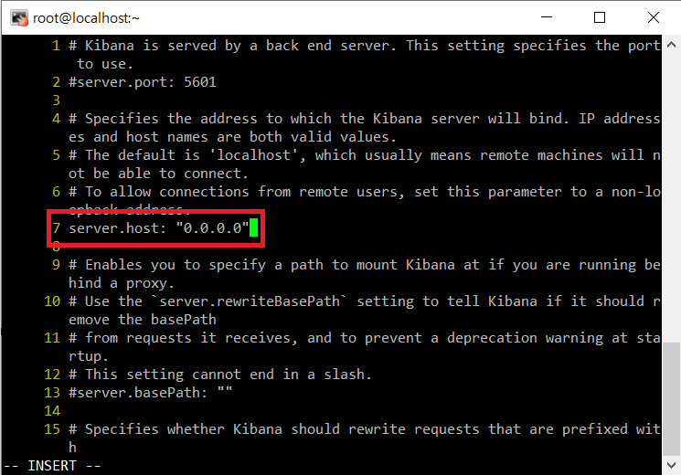
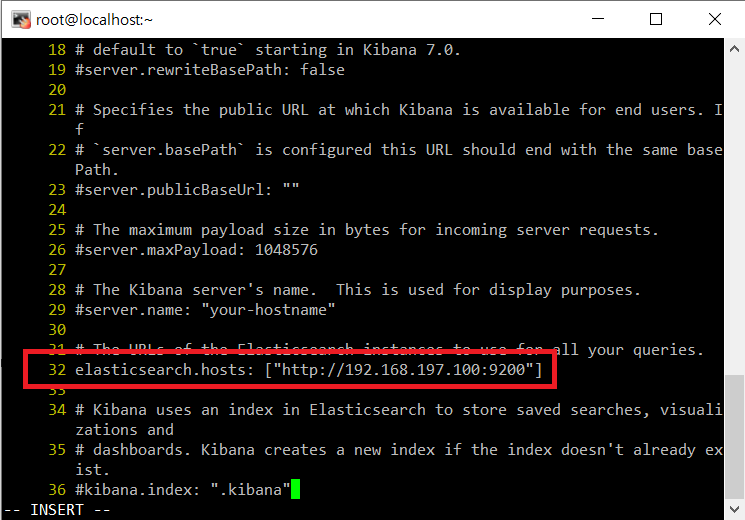
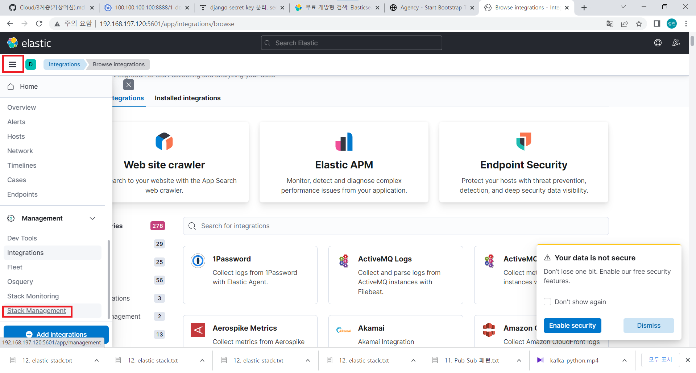
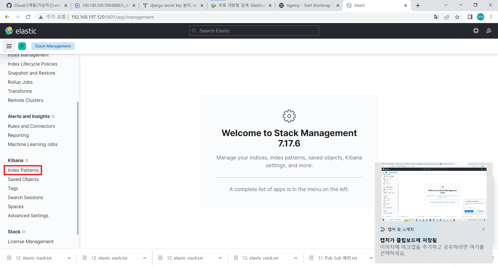
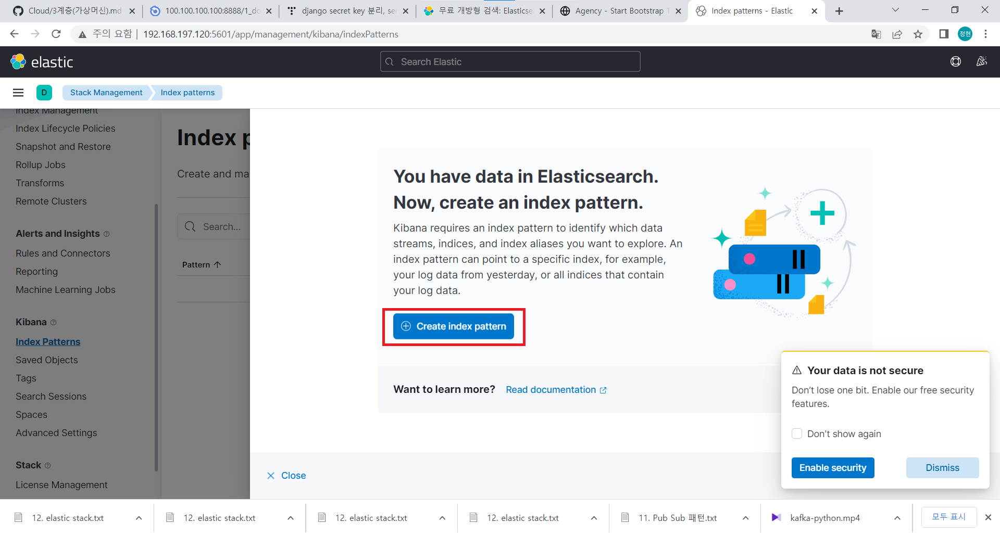
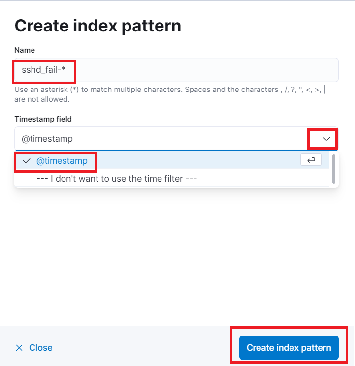
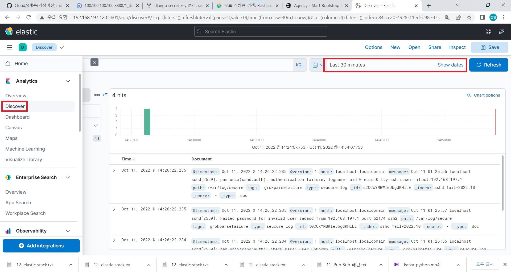

# Elastic

## 설치
0. 가상머신 준비
```
		cpu	mem	프로그램
	centos8	2	4	엘라스틱서치    ip : 192.168.197.100
	centos8	1	2	로그스태시      ip : 192.168.197.110
	centos8	1	2	키바나          ip : 192.168.197.120
```

1. 엘라스틱 서치
- 방화벽 해제
```shell
systemctl stop firewalld
systemctl disable firewalld
setenforce 0
```

- 레포지터리 추가
```shell
cat > /etc/yum.repos.d/elasticsearch.repo <<EOF
[elasticsearch-7.x]
name=Elasticsearch repository for 7.x packages
baseurl=https://artifacts.elastic.co/packages/7.x/yum
gpgcheck=1
gpgkey=https://artifacts.elastic.co/GPG-KEY-elasticsearch
enabled=1
autorefresh=1
type=rpm-md
EOF
```
- 설치
```shell
dnf -y install elasticsearch
```
- 바인딩 주소 설정<br/>
```shell
vi /etc/elasticsearch/elasticsearch.yml
```

```shell
network.host: 192.168.197.100
discovery.seed_hosts: ["192.168.197.100"]
cluster.initial_master_nodes: ["192.168.197.100"]
```
<br/>

- 실행
```shell
systemctl enable elasticsearch
systemctl restart elasticsearch
```

2. 로그스태시

- 방화벽 해제
```shell
systemctl stop firewalld
systemctl disable firewalld
setenforce 0
```

- 레포지터리 추가
```shell
cat > /etc/yum.repos.d/elasticsearch.repo <<EOF
[elasticsearch-7.x]
name=Elasticsearch repository for 7.x packages
baseurl=https://artifacts.elastic.co/packages/7.x/yum
gpgcheck=1
gpgkey=https://artifacts.elastic.co/GPG-KEY-elasticsearch
enabled=1
autorefresh=1
type=rpm-md
EOF
```

- 로그스태시 설치
```shell
dnf -y install logstash
```

- 간단한 파이프라인 설정
```shell
vi /etc/logstash/conf.d/sshd.conf
```
```shell
input {
  file {
    type => "seucure_log"
    path => "/var/log/secure"
  }
}
filter {
  grok {
    add_tag => [ "sshd_fail" ]
    match => { "message" => "Failed %{WORD:sshd_auth_type} for %{USERNAME:sshd_invalid_user} from %{IP:sshd_client_ip} port %{NUMBER:sshd_port} %{GREEDYDATA:sshd_protocol}" }
  }
}

output {
  elasticsearch {
    hosts => ["http://192.168.197.100:9200"]    #엘라스틱서치 아이피
    index => "sshd_fail-%{+YYYY.MM}"
  }
}
```

- 실행
```shell
systemctl restart logstash
# 만약 오류가 나면
# ps -ef | grep logstash
# kill -9 logstash번호
```

- 확인<br/>
로그스태시를 다른 창에 실행시켜 접속 아이디를 틀려보면<br/>
```shell
curl 192.168.197.100:9200/_cat/indices?v
```
<br/>

3. 키바나<br/>

- 방화벽 해제
```shell
systemctl stop firewalld
systemctl disable firewalld
setenforce 0
```
- 레포지터리 추가
```shell
cat > /etc/yum.repos.d/elasticsearch.repo <<EOF
[elasticsearch-7.x]
name=Elasticsearch repository for 7.x packages
baseurl=https://artifacts.elastic.co/packages/7.x/yum
gpgcheck=1
gpgkey=https://artifacts.elastic.co/GPG-KEY-elasticsearch
enabled=1
autorefresh=1
type=rpm-md
EOF
```

- 키바나 설치
```shell
dnf -y install kibana
```

- 키바나 설정
```shell
vi /etc/kibana/kibana.yml
```
```shell
# 7번 라인 주석 해제 후 다음과 같이 설정
server.host: "0.0.0.0"

# 32번 라인 주석 해제 후 
elasticsearch.hosts: ["http://    엘라스틱 서치의 IP    :9200"]
```
<br/>
<br/>

- 실행
```shell
systemctl enable kibana
systemctl restart kibana
```

- 확인<br/>
윈도우에서 웹브라우저로 `http://키바나IP주소:5601`<br/>
<br/>
<br/>
<br/>
<br/>
<br/>