# IaC
코드 형태로 인프라를 작성, 정의, 배포, 업데이트하는 것을 의미

## 종류
1. 에드 훅 스크립트
2. 구성 관리 도구
3. 서버 템플릿 도구
4. 서버 프로비전 도구 : Terraform, CloudFormation


## CloudFormation
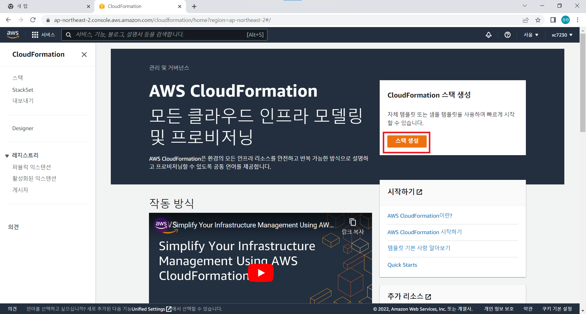<br/>
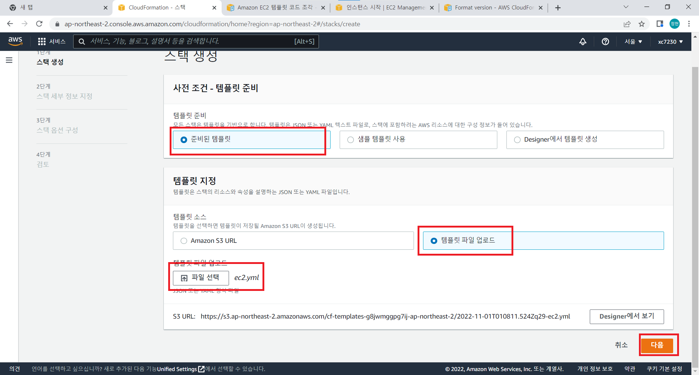<br/>

- ec2.yml파일 생성
```yaml
EC2Instance:
    Type: AWS::EC2::Instance
    Properties:
        ImageId: ami-068a0feb96796b48d  # 내가 생성할 이미지 아이디
        KeyName: cloudcamp  # 내 AWS 키(cloudcamp.rsa)
        InstanceType: t2.micro  # 인스턴스 유형
        SecurityGroups: # 보안 그룹
        - default
        BlockDeviceMappings:
        -
          DeviceName: /dev/sda1
          Ebs:
            VolumeSize: 8   # 크기
```
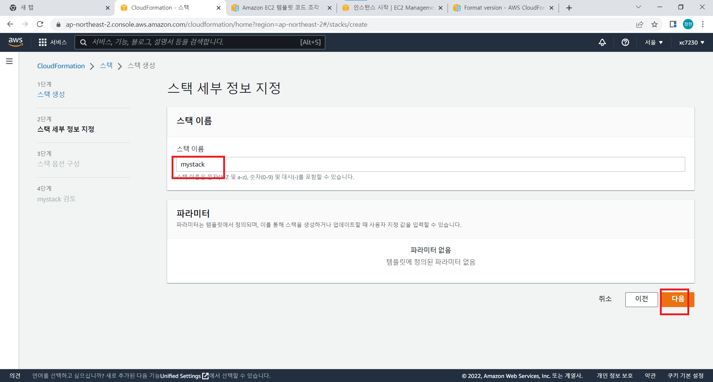<br/>
나머지는 다 기본설정으로<br/>

- 생성 확인<br/>
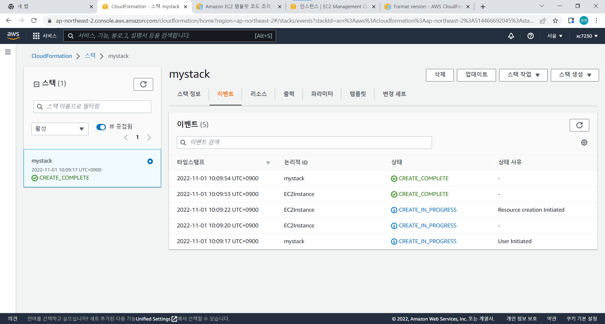<br/>
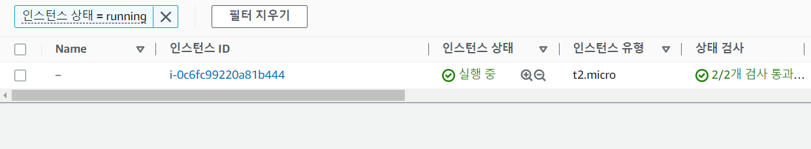<br/>

## Terraform
### 설치
- 다운로드 <br/>
https://www.terraform.io/downloads

- 환경변수 설정<br/>
테라폼 파일을 C드라이브 밑에 `terraform` 디렉토리 생성 후 안에 집어 넣는다.<br/>
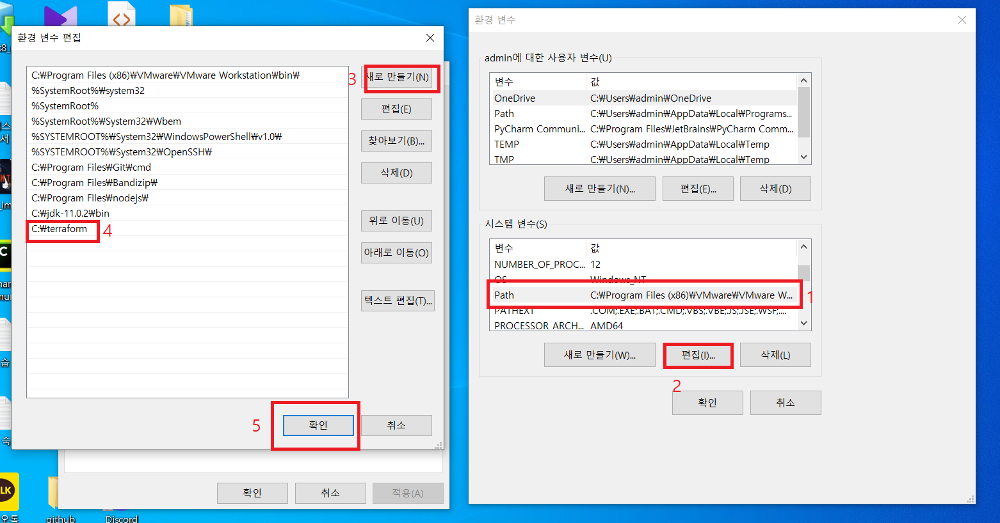<br/>

- 확인<br/>
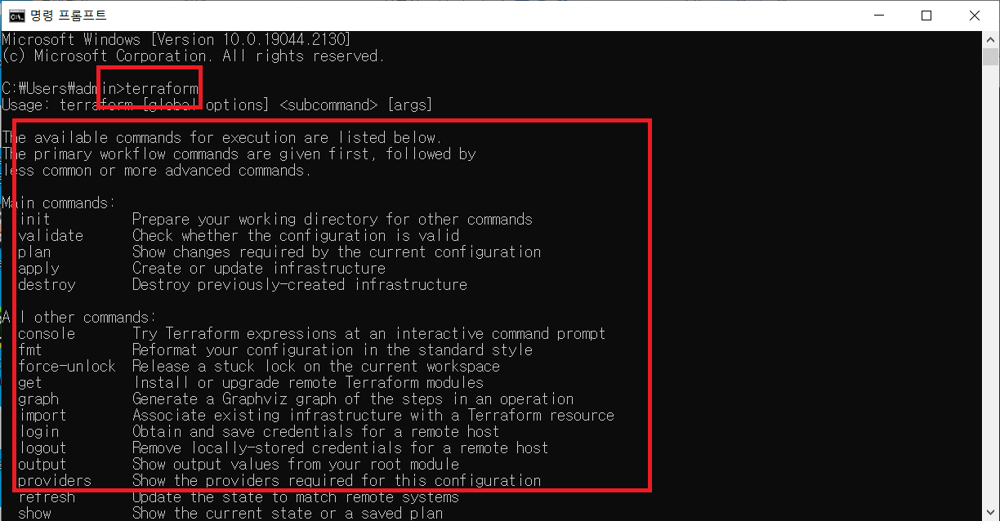<br/>
CMD 명령어에 `terraform`을 입력해서 명령어들이 출력되면 성공이다.<br/>

## AWS CLI
### 설치
- 다운로드<br/>
https://docs.aws.amazon.com/ko_kr/cli/latest/userguide/getting-started-install.html<br/>
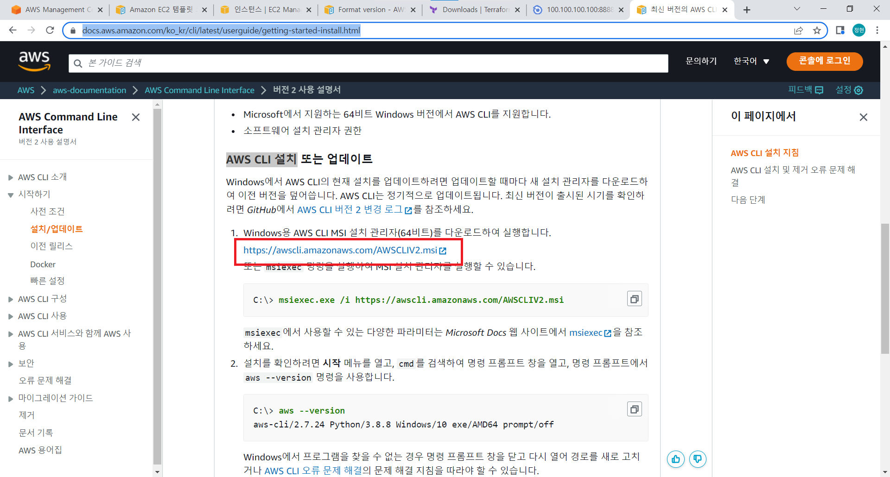<br/>

- 설치<br/>
기본설정으로 설치<br/>


- 확인<br/>
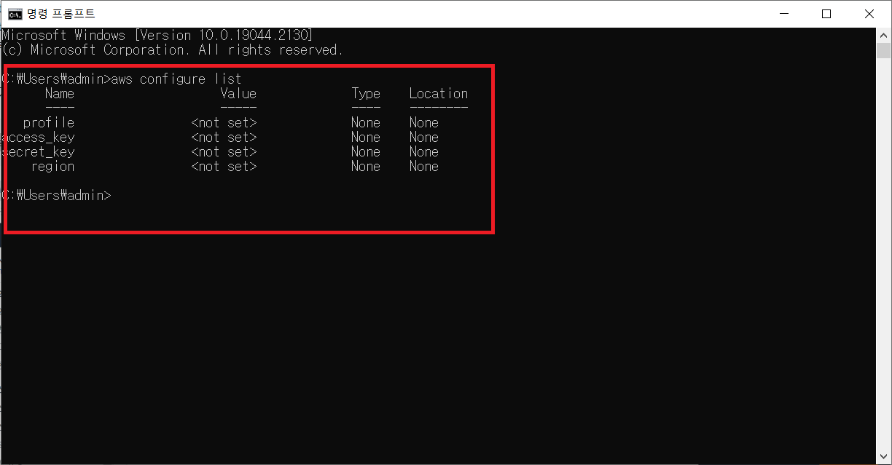<br/>

- 보안키 받기<br/>
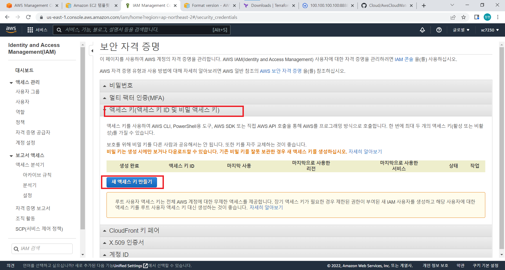<br/>

- CLI설정하기
CMD에서
```shell
aws configure
```
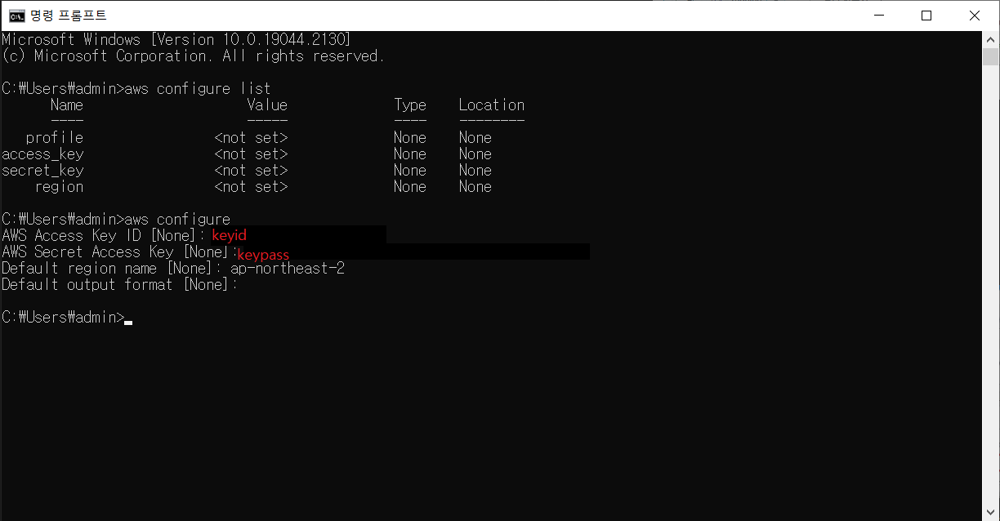<br/>
보안키ID<br/>
보안키PW<br/>
지역명<br/>

### 프로젝트
- VsCode 설정<br/>
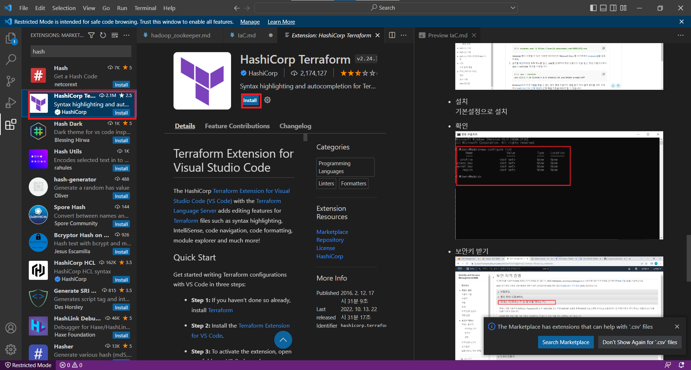<br/>

- tf파일 생성 후 코드 작성<br/>
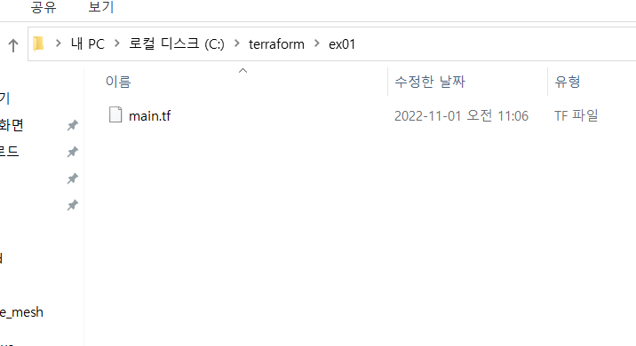<br/>
`main.tf`
```tf
terraform {
  required_providers {
    aws = {
      source  = "hashicorp/aws"
      version = "~> 4.16"
    }
  }

  required_version = ">= 1.2.0"
}

provider "aws" {
  region  = "ap-northeast-2"
}

resource "aws_instance" "app_server" {
  ami           = "ami-068a0feb96796b48d"
  instance_type = "t2.micro"

  tags = {
    Name = "ExampleAppServerInstance"
  }
}
```
- 테라폼 초기화<br/>
```shell
terraform init  # main.tf가 있는 디렉토리로 가서
```

- 확인<br/>
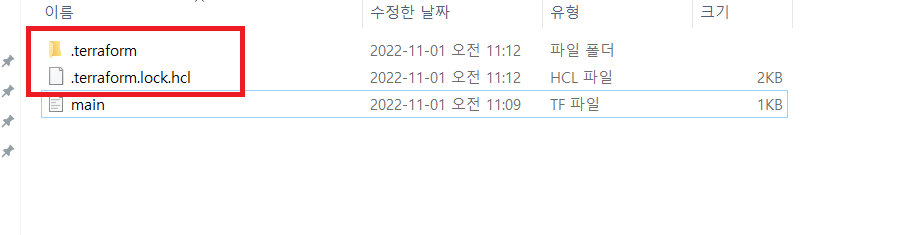<br/>

- 적용<br/>
```shell
terraform apply
```
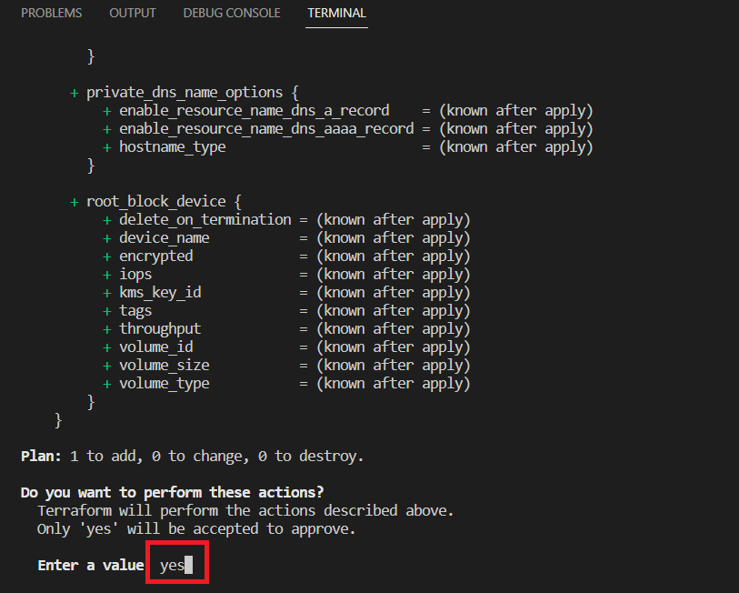<br/>
`yes`를 입력하면 내 AWS EX2 인스턴스가 생성된다.<br/>
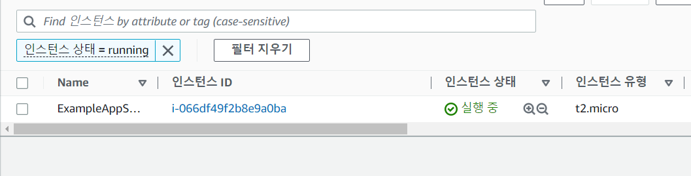<br/>
