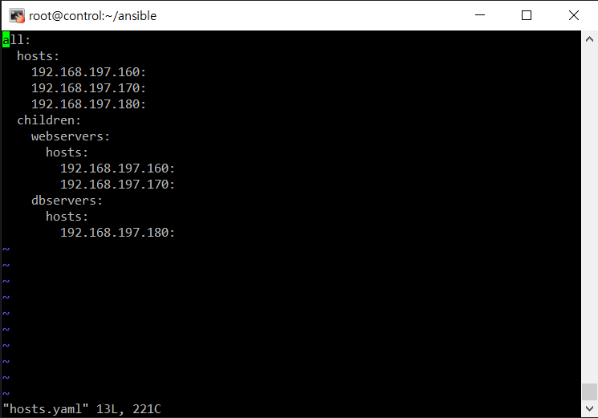
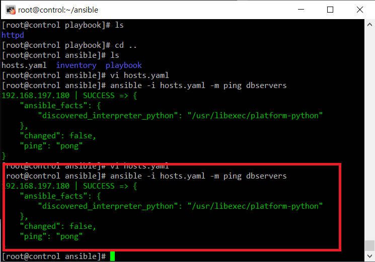

# Ansible
## 앤서블 설치
- 가상 OS 준비
```
control node 192.168.197.150
maanage node01 192.168.197.160
maanage node02 192.168.197.170
maanage node03 192.168.197.180
```

### Manage Node 설정
```shell
ssh-keygen # 엔터 3번
```

### Control Node
```shell
ssh-copy-id root@192.168.197.160    # 매니저 노드 IP

ssh root@192.168.197.160    # 매니저 노드 접속했을때, 비밀번호를 입력하지 않고 들어가지면 성공
```
```shell
dnf -y install centos-release-ansible-29
sed -i -e "s/enabled=1/enabled=0/g" /etc/yum.repos.d/CentOS-SIG-ansible-29.repo
dnf --enablerepo=centos-ansible-29 -y install ansible
```
- Manage 노드들과 연결<br/>
```shell
mkdir ansible/
cd ansible
vi hosts.yaml
```
```yaml
all:
  hosts:
    192.168.197.160:
    192.168.197.170:
    192.168.197.180:
  children:
    webservers:
      hosts:
        192.168.197.160:
        192.168.197.170:
    dbservers:
      hosts:
        192.168.197.180:
```
<br/>
- 확인<br/>
```shell
ansible -i hosts.yaml -m ping dbservers
```
<br/>


## Playbook
### Playbook으로 mysql 설치하기
```shell
mkdir -p /ansible/playbook/mysql
cd /ansible/playbook/mysql
vi mysql-install.yaml
```

```yaml
- hosts: ["192.168.197.180"]
  tasks:
  - name: "Install mysql server"
    shell: |
      yum update -y
      yum install -y mysql-server
    become: yes

  - namm: "Start mysql Server"
    shell: |
      systemctl restart mysqld
    become: yes

  - name: "Install Pyhon3"
    shell: |
      yum install -y python3 python3-pip
    become: yes

  - name: "Install pymysql"
    pip:
      name: pymysql

  - name: "mysql config"
    mysql_user:
      user: root
      password: "qwer1234"
      host: "localhost" # 원격 접속하고 싶으면 "%"
      login_unix_socket: /var/lib/mysql/mysql.sock

```
- Playbook 실행<br/>
```shell
ansible-playbook -i /root/ansible/hosts.yaml /root/ansible/playbook/mysql/mysql-install.yaml

# ansible-playbook  -i  인벤토리파일경로  플레이북파일경로
```

