# InfluxDB
## InfluxDB 설치
```shell
cat <<EOF | sudo tee /etc/yum.repos.d/influxdb.repo
[influxdb]
name = InfluxDB Repository - RHEL \$releasever
baseurl = https://repos.influxdata.com/rhel/\$releasever/\$basearch/stable
enabled = 1
gpgcheck = 1
gpgkey = https://repos.influxdata.com/influxdb.key
EOF

sudo yum -y install influxdb2
```

### 실행 및 확인
```shell
systemctl start influxdb    # 실행
```
http://내아이피:8086 를 입력해 실행되는지 확인해준다.<br/>
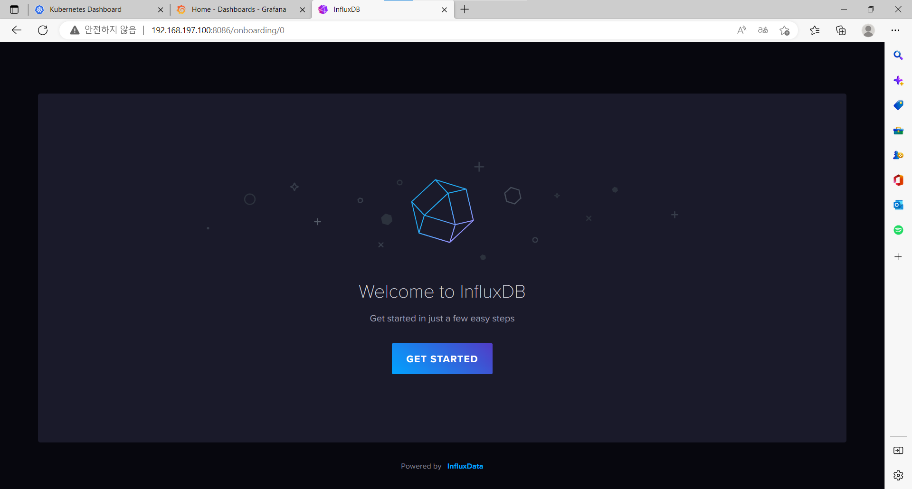<br/>


## Grafana 설치
```shell
wget https://dl.grafana.com/enterprise/release/grafana-enterprise-9.2.5-1.x86_64.rpm
yum install -y grafana-enterprise-9.2.5-1.x86_64.rpm
systemctl restart grafana-server
```

### 실행 및 확인
http://내아이피:3000 을 입력해 실행되는지 확인해준다.<br/>
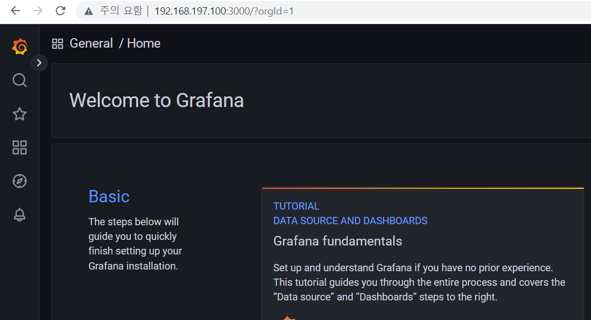<br/>

## InfluxDB, Grafana 연동
### InfluxDB 토큰 발급받기
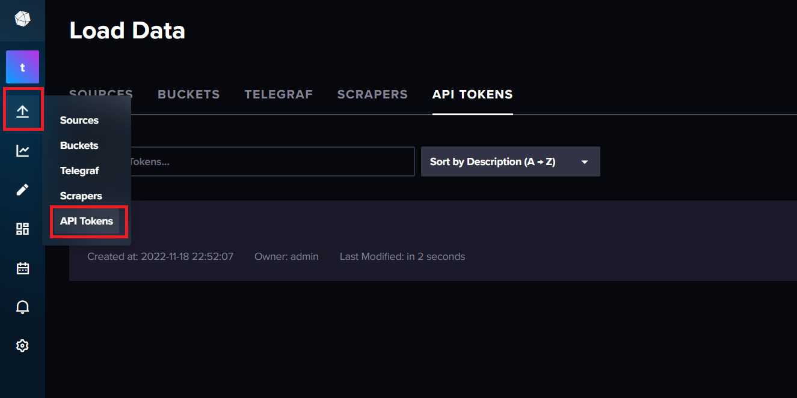<br/>
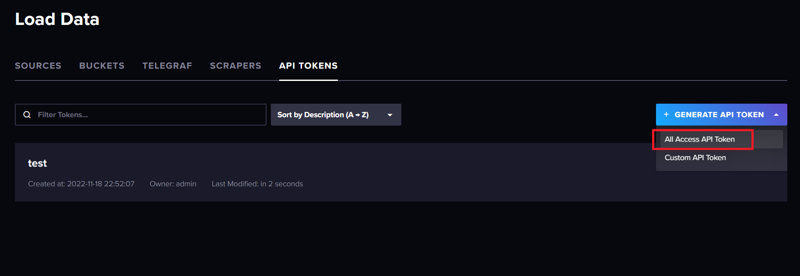<br/>
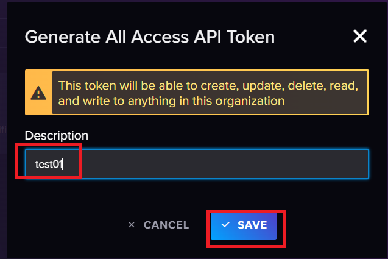<br/>
발급된 토큰 저장<br/>
<br/>

### InfluxDB Organization, Bucket 생성
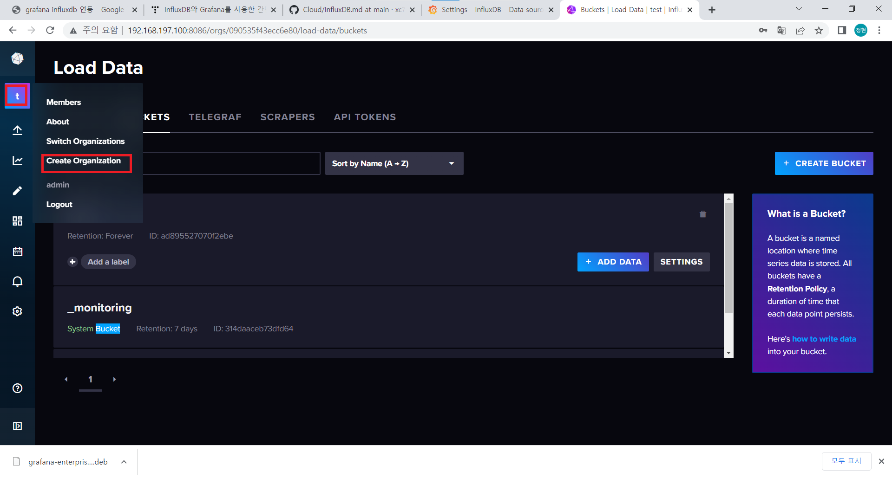<br/>
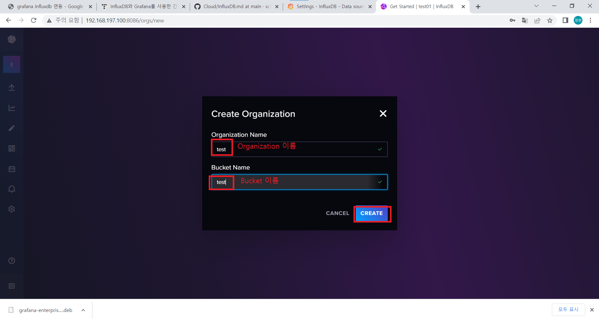<br/>


### InfluxDB, Grafana에 연결
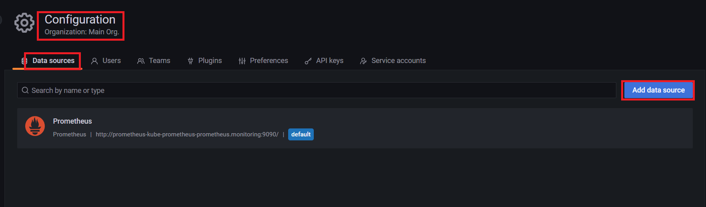<br/>
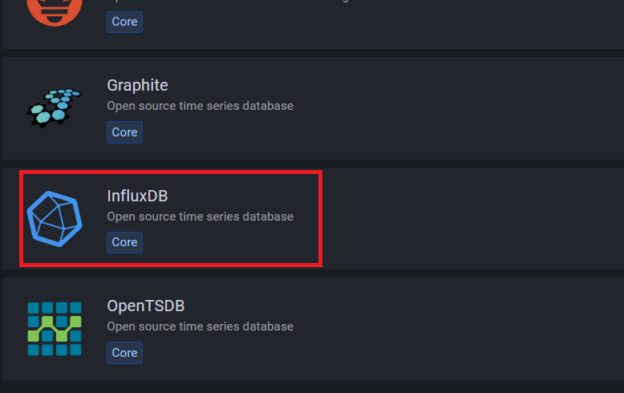<br/>
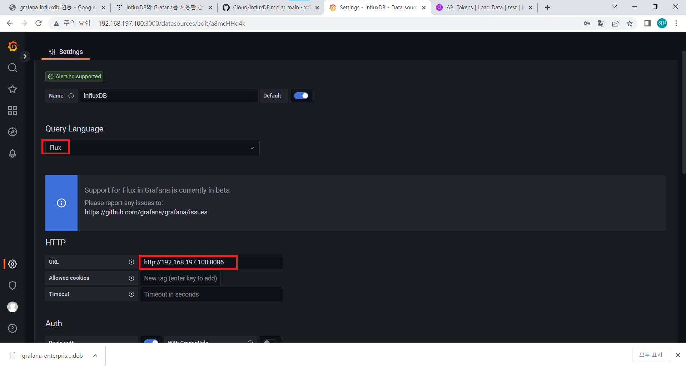<br/>
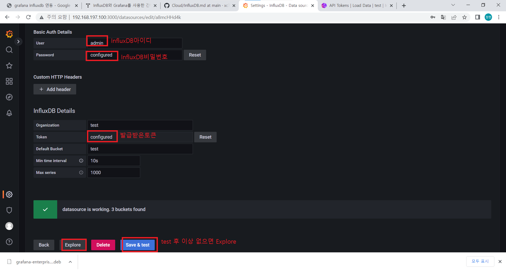<br/>


