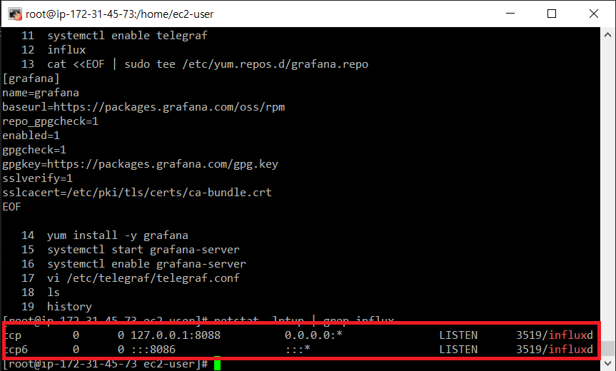
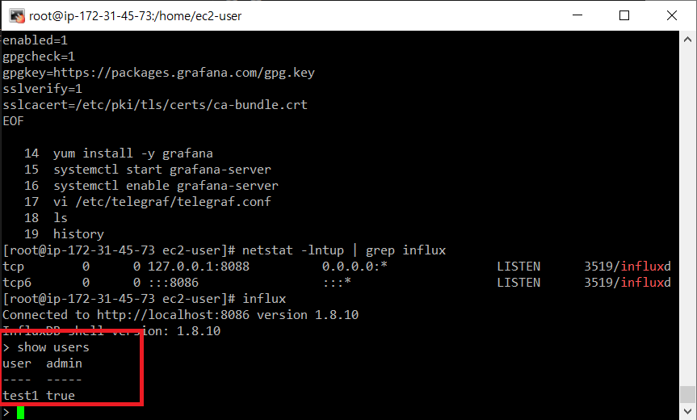
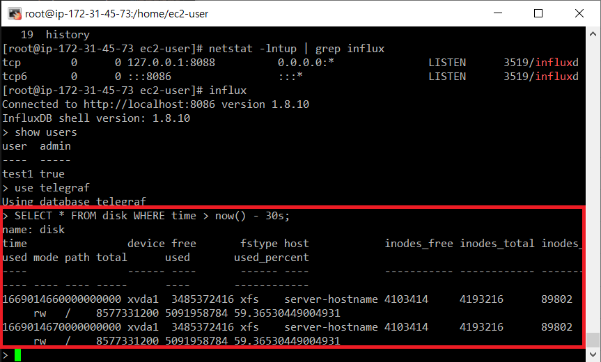
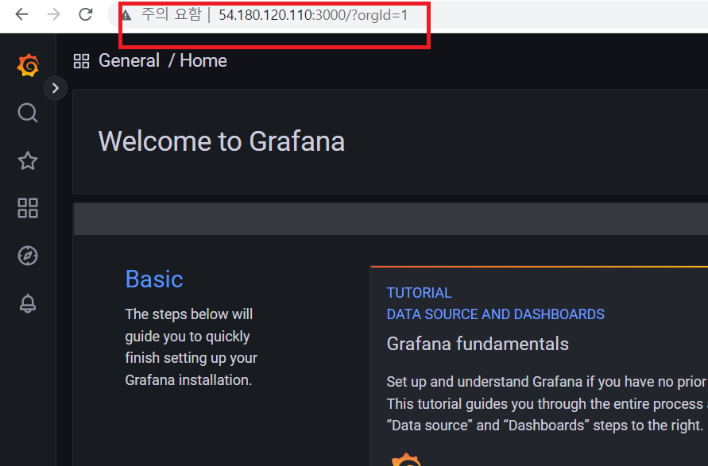

# InflexDB
## InflexDB 설치
```shell
sudo su

cat <<EOF | sudo tee /etc/yum.repos.d/influxdb.repo
[influxdb]
name = InfluxDB Repository - RHEL \$releasever
baseurl = https://repos.influxdata.com/rhel/\7/\$basearch/stable
enabled = 1
gpgcheck = 1
gpgkey = https://repos.influxdata.com/influxdb.key
EOF

yum repolist
yum install influxdb
systemctl start influxdb
systemctl enable influxdb

netstat -lntup | grep influx
```

<br/>

## InflexDB 태스트 계정 생성
```shell
influx
```
```sql
show users
CREATE USER test1 WITH PASSWORD 'test1' WITH ALL PRIVILEGES
show users
```
<br/>

## Telegraf 설치
```shell
yum install telegraf
vi /etc/telegraf/telegraf.conf
```
`telegraf.conf`
```conf
[global_tags]
# Configuration for telegraf agent
[agent]
interval = "10s"
debug = false
hostname = "server-hostname"
round_interval = true
flush_interval = "10s"
flush_jitter = "0s"
collection_jitter = "0s"
metric_batch_size = 1000
metric_buffer_limit = 10000
quiet = false
logfile = ""
omit_hostname = false
###############################################################################
# OUTPUTS #
###############################################################################
[[outputs.influxdb]]
urls = ["http://localhost:8086"] # InfluxDB가 설치된 서버의 IP를
database = "telegraf" # 데이터바에스 이름, 생성이 되어있지 않으면 자동 생성됨
timeout = "5s"
username = "admin" # InfluxDB 기본 계정
password = "admin"
retention_policy = ""
###############################################################################
# INPUTS #
###############################################################################
[[inputs.cpu]]
percpu = true
totalcpu = true
collect_cpu_time = false
report_active = false
[[inputs.disk]]
ignore_fs = ["tmpfs", "devtmpfs", "devfs", "iso9660", "overlay", "aufs", "squashfs"]
[[inputs.io]]
[[inputs.mem]]
[[inputs.net]]
[[inputs.system]]
[[inputs.swap]]
[[inputs.netstat]]
[[inputs.processes]]
[[inputs.kernel]]
```

```shell
systemctl start telegraf
systemctl enable telegraf
```

```shell
influx
```

### telegraf 확인
```sql
use telegraf
SELECT * FROM disk WHERE time > now() - 30s; 
```
<br/>

## Grafana 설치
```shell
cat <<EOF | sudo tee /etc/yum.repos.d/grafana.repo
[grafana]
name=grafana
baseurl=https://packages.grafana.com/oss/rpm
repo_gpgcheck=1
enabled=1
gpgcheck=1
gpgkey=https://packages.grafana.com/gpg.key
sslverify=1
sslcacert=/etc/pki/tls/certs/ca-bundle.crt
EOF

yum install grafana # 설치
systemctl start grafana-server # 구동
systemctl enable grafana-server # 활성화(부팅시 자동으로 구동이 되도록)
```

## Grafana 구동
내 IP:3000 으로 Grafana 대시보드 접속<br/>
<br/>


