# 쿠버네티스
- 가상머신 준비
```
		cpu(vt)	mem	프로그램
	centos8	2	4	master     ip : 192.168.197.100
	centos8	2	4	node1      ip : 192.168.197.110
	centos8	2	4	node2      ip : 192.168.197.120
```

- 네트워크 연동(master, node1, node2)
```shell
vi /etc/hosts
```
```shell
# 맨 밑에 추가
192.168.197.100 master
192.168.197.110 node1
192.168.197.120 node2
```
## 쿠버네티스 설치 및 설정
### 공용(master, node1, node2)
- 방화벽 설정
```shell
firewall-cmd --permanent --add-port=6443/tcp
firewall-cmd --permanent --add-port=2379-2380/tcp
firewall-cmd --permanent --add-port=10250/tcp
firewall-cmd --permanent --add-port=10251/tcp
firewall-cmd --permanent --add-port=10252/tcp
firewall-cmd --permanent --add-port=10255/tcp
firewall-cmd --reload
modprobe br_netfilter
echo '1' > /proc/sys/net/bridge/bridge-nf-call-iptables

setenforce 0

sed -i --follow-symlinks 's/SELINUX=enforcing/SELINUX=disabled/g' /etc/sysconfig/selinux

init 6  # 재시작
```

- 도커 설치
```shell
yum install -y yum-utils
yum-config-manager --add-repo https://download.docker.com/linux/centos/docker-ce.repo
yum-config-manager --enable docker-ce-nightly
yum-config-manager --enable docker-ce-test
yum install -y docker-ce docker-ce-cli containerd.io --allowerasing

mkdir /etc/docker

cat <<EOF | sudo tee /etc/docker/daemon.json
{
"exec-opts": ["native.cgroupdriver=systemd"],
"log-driver": "json-file",
"log-opts": {
"max-size": "100m"
},
"storage-driver": "overlay2"
}
EOF

systemctl daemon-reload
systemctl restart docker
systemctl enable docker
```

- k8s 설치
```shell
firewall-cmd --add-masquerade --permanent
firewall-cmd --reload

cat <<EOF > /etc/sysctl.d/k8s.conf
net.bridge.bridge-nf-call-ip6tables = 1
net.bridge.bridge-nf-call-iptables = 1
EOF

sysctl --system # 위의 명령어가 제대로 기입됐는지 확인
```
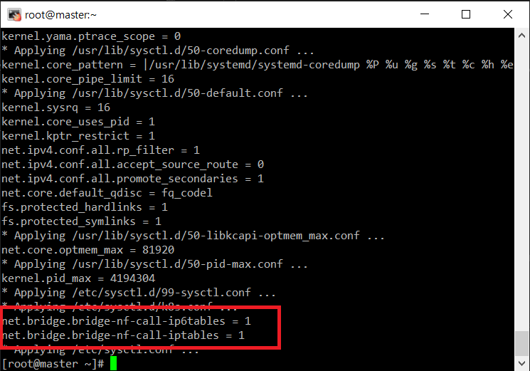<br/>

```shell
cat <<EOF > /etc/yum.repos.d/kubernetes.repo
[kubernetes]
name=Kubernetes
baseurl=https://packages.cloud.google.com/yum/repos/kubernetes-el7-x86_64
enabled=1
gpgcheck=1
repo_gpgcheck=1
gpgkey=https://packages.cloud.google.com/yum/doc/yum-key.gpg https://packages.cloud.google.com/yum/doc/rpm-package-key.gpg
EOF

# 쿠버네티스 1.22.5 버전 다운
dnf install -y kubelet-1.22.5 kubeadm-1.22.5 kubectl-1.22.5 --disableexcludes=kubernetes

systemctl enable kubelet
systemctl start kubelet

```
- k8s swap 설정
```shell
swapoff -a

vi /etc/fstab
#/dev/mapper/cl-swap none swap defaults 0 0 주석 처리해야 함
```
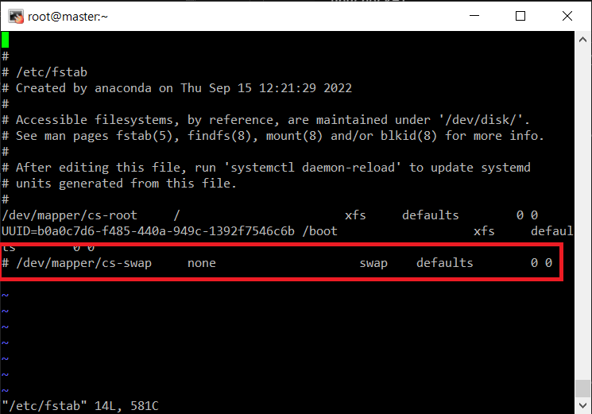<br/>

### master 설정
```shell
kubeadm init --pod-network-cidr 192.168.1.0/24
# 만약 에러가 나면 명령어 kubeadm reset 입력해서 리셋 후 다시 시작한다.


#나오는 명령어 따로 저장해둔다. 노드 연결할때 쓰는 명령어로 사람마다 다름 master에서 실행x
kubeadm join 192.168.197.100:6443 --token 5b2pjz.sf4632azhzpcp7f7 \
        --discovery-token-ca-cert-hash sha256:a624bb31c56ec6595a9c8adfe4a7ce5721aae18bd78150ac457bc6f5ca109b20  
```
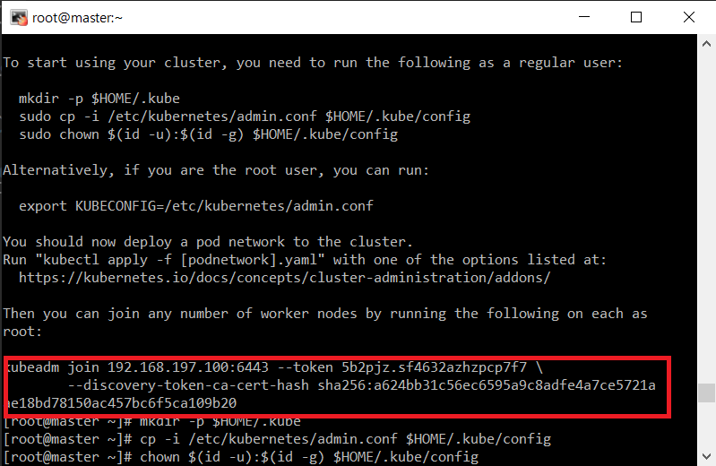<br/>
```shell
mkdir -p $HOME/.kube
cp -i /etc/kubernetes/admin.conf $HOME/.kube/config
chown $(id -u):$(id -g) $HOME/.kube/config

kubectl get nodes
```
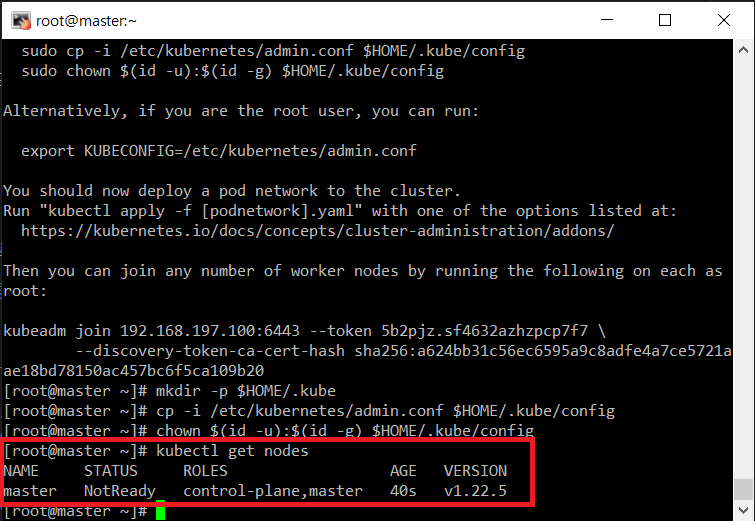<br/>

- 컨테이너 네트워크 설정
```shell
dnf -y install wget
wget https://docs.projectcalico.org/manifests/calico.yaml
vi calico.yaml  # 4551, 4552번째 줄, 주석 제거하고 줄 맞추기
```
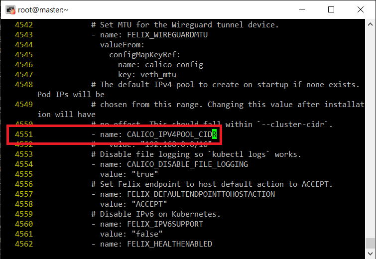<br/>
<br/>

```shell
kubectl apply -f calico.yaml    # 설정 끝난 yaml파일 실행
```

### node 설정
- 방화벽 설정
```shell
firewall-cmd --zone=public --permanent --add-port={10250,30000-32767}/tcp
firewall-cmd --reload
```
- master와 연결
```shell
kubeadm join 192.168.197.100:6443 --token 5b2pjz.sf4632azhzpcp7f7 \
        --discovery-token-ca-cert-hash sha256:a624bb31c56ec6595a9c8adfe4a7ce5721aae18bd78150ac457bc6f5ca109b20  #사람마다 다름
```

### 확인(master)
- 컨테이너 확인
```shell
kubectl get pod -n kube-system  # 다 Running 뜨는지 확인
```
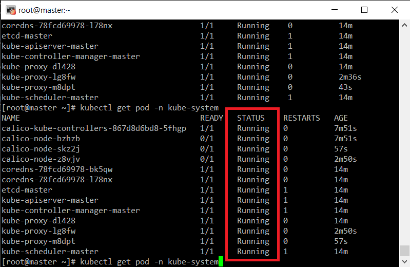<br/>

- 노드 연결 확인
```shell
kubectl get nodes   # 다 Ready뜨는지 확인
```
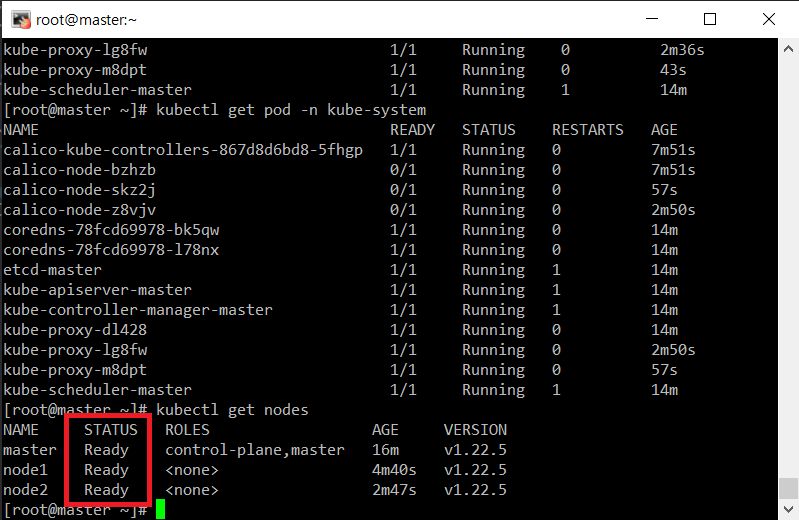<br/>

설정을 다 했으면 스냅샷을 남겨 백업해둔다.<br/>

## Pod
- 파드는 컨테이너를 하나 이상 모아 놓은 것, 쿠퍼네티스에서는 최소단위
1. 매니페스트<br/>
매니페스트란 쿠버네티스의 오브젝트를 생성하기 위한 메타 정보를 YAML이나 JSON으로 기술한 파일<br/>

2. YAML 파일<br/>
키: 값 형태로 작성하는 파일<br/>

## 대시보드 설정
### master
```shell
wget https://raw.githubusercontent.com/kubernetes/dashboard/v2.5.0/aio/deploy/recommended.yaml
vi recommended.yaml
```
```shell
39 spec:
40   ports:
41     - port: 443
42       targetPort: 8443
43   selector:
44     k8s-app: kubernetes-dashboard
45   type: NodePort     #여기 추가
```
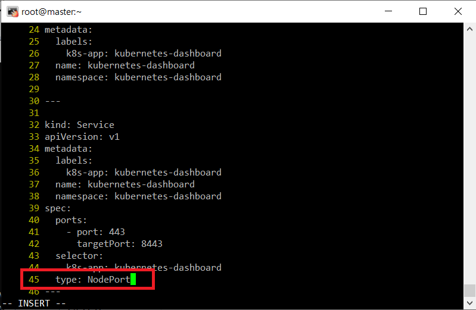<br/>

- yaml 파일 실행
```shell
kubectl apply -f recommended.yaml
kubectl get pods -A # 대시보드 파드가 있는지 확인, 없으면 kubectl delete -f recommended.yaml 입력
```
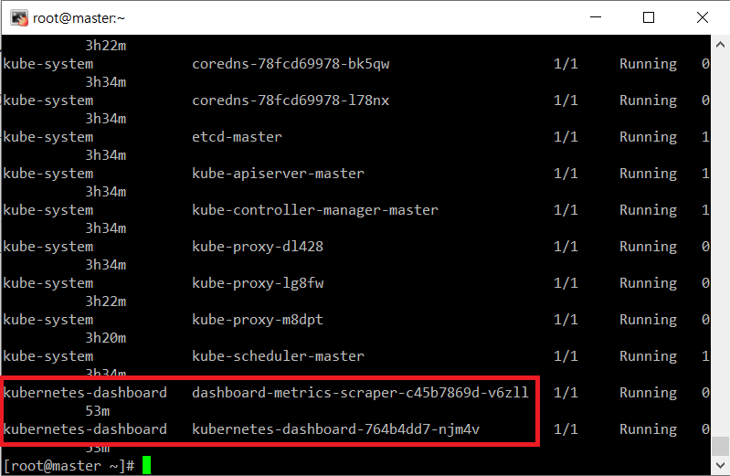<br/>

- 대시보드 포트번호 확인
```shell
kubectl get services -n kubernetes-dashboard    # 포트번호 확인 사람마다 다름
```
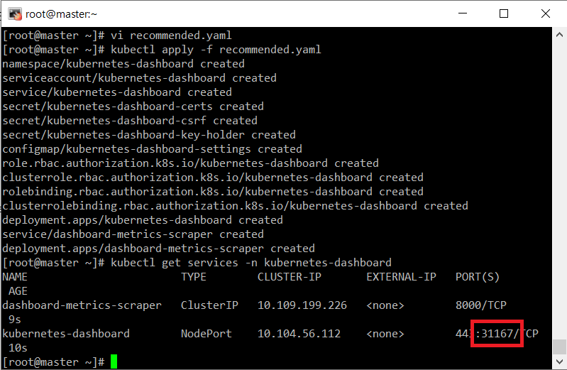<br/>

- 방화벽 설정
```shell
firewall-cmd --permanent --add-port=31167/tcp
firewall-cmd --reload

systemctl stop firewalld
systemctl disable firewalld
setenforce 0    # 모든 노드에 적용
```
- 웹 브라우저로 https://마스터노드IP:확인한포트번호 접속<br/>
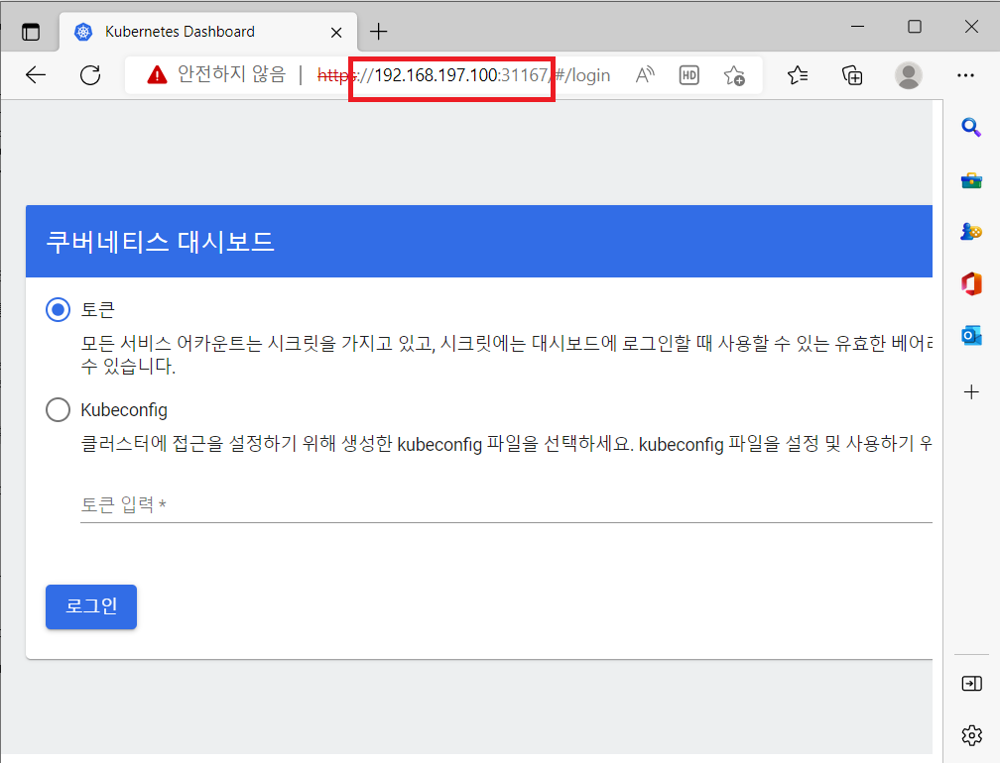<br/>
- 토큰 번호 확인(master)<br/>
```shell
cat <<EOF | kubectl create -f -
 apiVersion: v1
 kind: ServiceAccount
 metadata:
   name: admin-user
   namespace: kube-system
EOF

cat <<EOF | kubectl create -f -
 apiVersion: rbac.authorization.k8s.io/v1
 kind: ClusterRoleBinding
 metadata:
   name: admin-user
 roleRef:
   apiGroup: rbac.authorization.k8s.io
   kind: ClusterRole
   name: cluster-admin
 subjects:
 - kind: ServiceAccount
   name: admin-user
   namespace: kube-system
EOF

kubectl -n kube-system describe secret $(kubectl -n kube-system get secret | grep admin-user | awk '{print $1}')
```
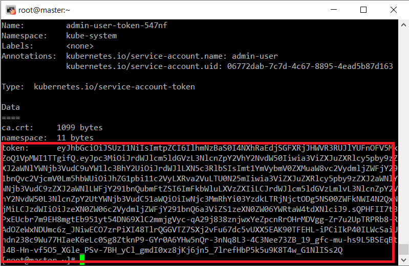<br/>
띄어쓰기 없이 토큰만 복사 후<br/>
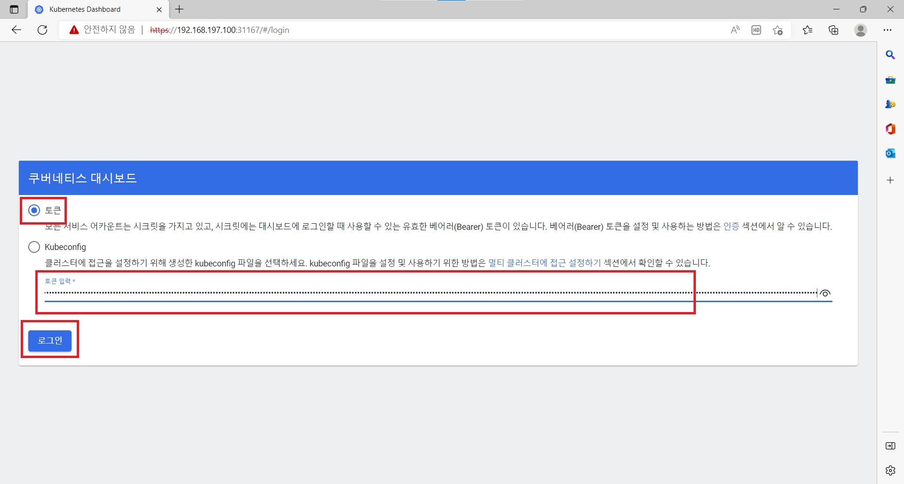<br/>
대시보드 설정 끝<br/>

- 대시보드 파드 추가 하기<br/>
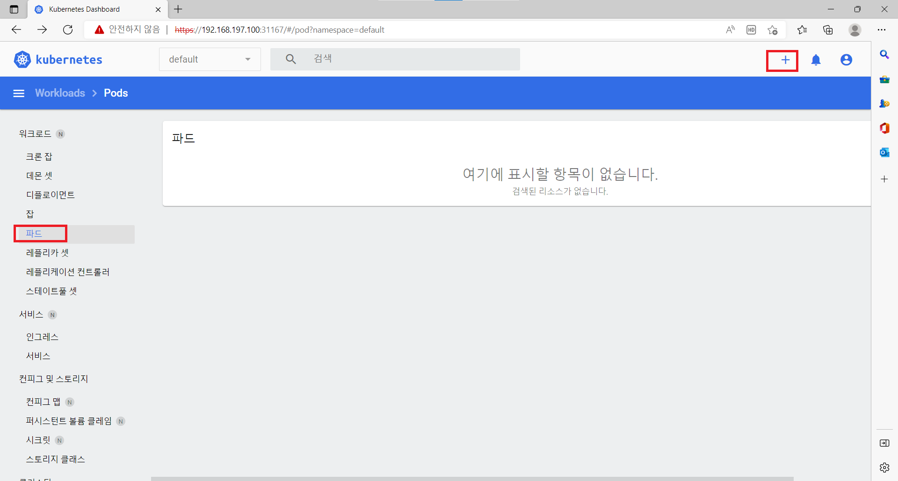<br/>
    - 코드 추가
    ```yaml
    apiVersion: v1
    kind: Pod
    metadata:
    name: nginx
    spec:
    containers:
    - name: nginx
      image: nginx:latest
    ```
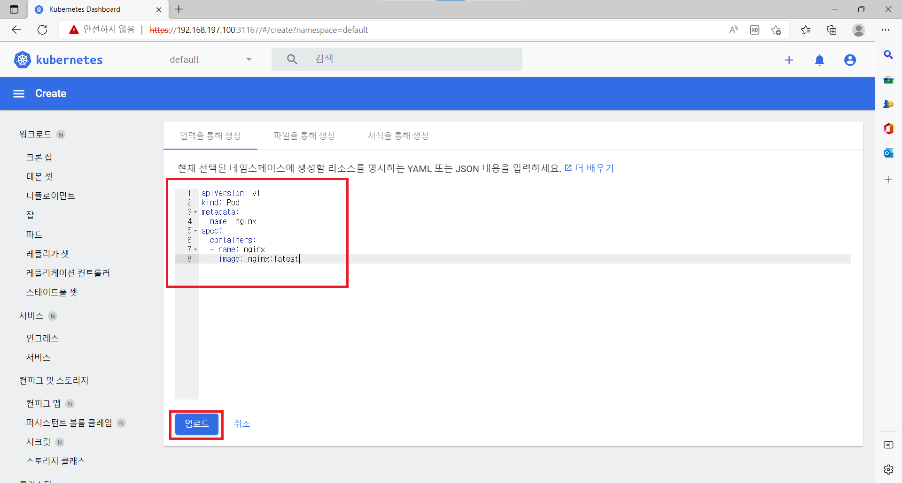<br/>
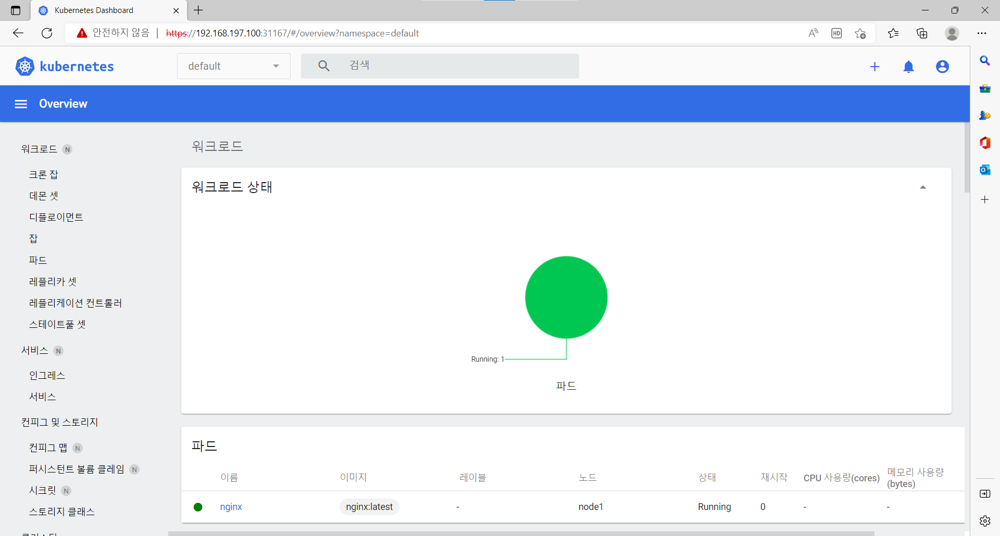<br/>


### 실습
```shell
mkdir test
cd test
vi Dockerfile
```
`Dockerfile`
```shell
FROM  node:slim
ADD ./hello.js /hello.js
EXPOSE 8000
CMD node /hello.js
```
```shell
vi hello.js
```
`hello.js`
```js
var http = require('http');
var content = function(req, resp) {
 resp.end("Hello Kubernetes!" + "\n");
 resp.writeHead(200);
}
var w = http.createServer(content);
w.listen(8000);
```

```shell
docker login # 내 도커 허브 아이디와 비밀번호 후 hello 디렉토리 생성
docker build --tag xc7230/hello:0.1 .
docker push xc7230/hello:0.1
```


- 파드 추가
```yaml
apiVersion: v1
kind: Pod
metadata:
  name: hello-pod
  label:
    app: hello
spec:
  containers:
  - name: hello-container1
    image: xc7230/hello:0.1
    port:
    - containerPort: 8000
```
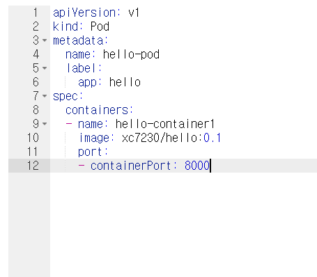<br/>
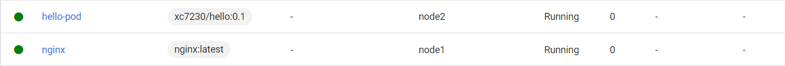<br/>

- 2개 해보기
`Dockerfile`
```shell
FROM  node:slim
ADD ./hello.js /hello.js
EXPOSE 9000
CMD node /hello.js
```
`hello.js`
```js
var http = require('http');
var content = function(req, resp) {
 resp.end("Hello Kubernetes!" + "\n");
 resp.writeHead(200);
}
var w = http.createServer(content);
w.listen(9000);
```
```shell
docker build --tag xc7230/hello:0.2 .
docker push xc7230/hello:0.2
```

```yaml
apiVersion: v1
kind: Pod
metadata:
  name: hello-pod
  label:
    app: hello
spec:
  containers:
  - name: hello-container1
    image: xc7230/hello:0.1
    port:
    - containerPort: 8000
  - name: hello-container2
    image: xc7230/hello:0.2
    port:
    - containerPort: 9000
```
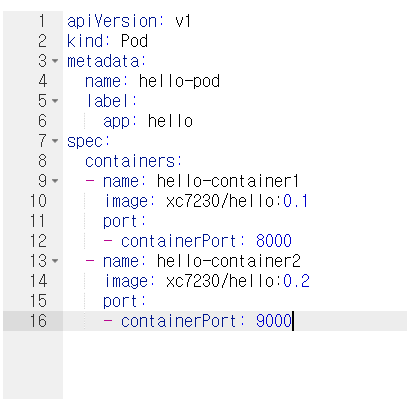<br/>
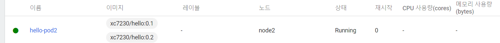<br/>


