# Controller
- 파드를 제어하는 제어자
1. Auto Healing : 특정 노드가 꺼지면 컨트롤러가 파드를 새로 생성함
2. Software Update : 새로운 버전의 파드가 배포되면 새로운 파드로 변경해줌
3. Job : 한 번만 수행되어야 하는 작업이 있을 때, 파드를 생성해서 작업을 수행 후 파드를 삭제
4. AutoScale : HPA(파드가 수평으로 늘어남), VPA(파드 하나의 용량이 커짐), CA(노드 자체를 키워버림)


## 컨트롤러 생성하기
### ReplicaSet
- 파드 생성
```yaml
apiVersion: v1
kind: Pod
metadata:
  name: pod1
  labels:
    type: web
    ver: v1
spec:
  containers:
  - name: container
    image: xc7230/hello:0.1
    ports:
    - containerPort: 8000
  terminationGracePeriodSeconds: 0
```
- 레플리카 셋 생성
```yaml
apiVersion: apps/v1
kind: ReplicaSet
metadata:
  name: replica1
spec:
  replicas: 2   # 필요한 레플리카 수를 적는다.
  selector:
    matchLabels:
      type: web
      ver: v1
    matchExpressions:
    - {key: type, operator: In, values: [web]}
    - {key: ver, operator: Exists}
  template:
    metadata:
      labels:
        type: web
        ver: v1
        location: dev
    spec:
      containers:
      - name: container
        image: xc7230/hello:0.1
      terminationGracePeriodSeconds: 0
```
- 확인<br/>
<br/>

- 레플리카 노드 변경<br/>
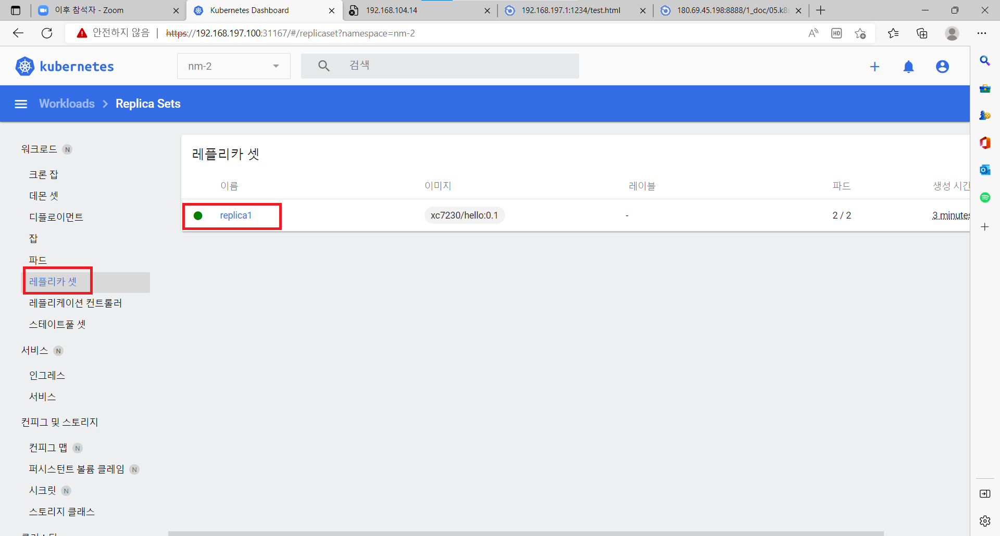<br/>
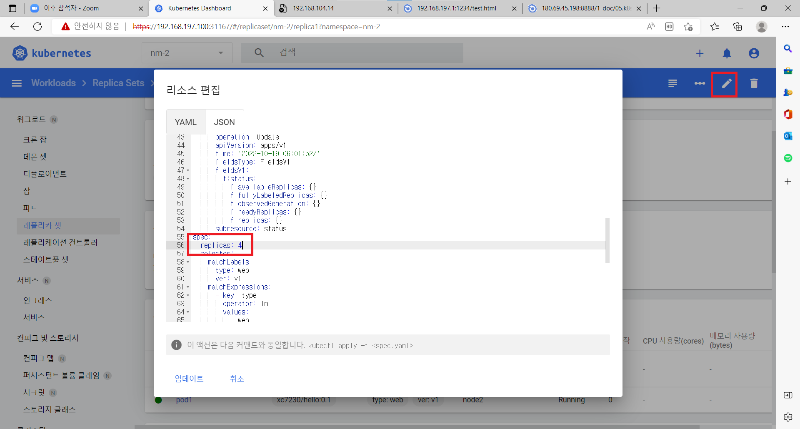<br/>
<br/>

- 디테일하게 추가
```yaml
apiVersion: apps/v1
kind: ReplicaSet
metadata:
  name: replica1
spec:
  replicas: 2
  selector:
    matchExpressions:
    - {key: type, operator: In, values: [web]}
    - {key: ver, operator: Exists}
  template:
    metadata:
      labels:
        type: web
        ver: v1
        location: dev
    spec:
      containers:
      - name: container
        image: 이미지
      terminationGracePeriodSeconds: 0
```

### Deployment
```yaml
apiVersion: apps/v1
kind: Deployment
metadata:
  name: deployment-1
spec:
  selector:
    matchLabels:
      type: app
  replicas: 2
  strategy:
    type: Recreate
  revisionHistoryLimit: 1
  ## 레플리카 셋이 관리할 파드
  template:
    metadata:
      labels:
        type: app
    spec:
      containers:
      - name: container
        image: xc7230/hello:0.1
      terminationGracePeriodSeconds: 10
```
<br/>
디플로이먼트 - 레플리카셋 - 파드가 생성된다.<br/>

- 버전 바꿔보기<br/>
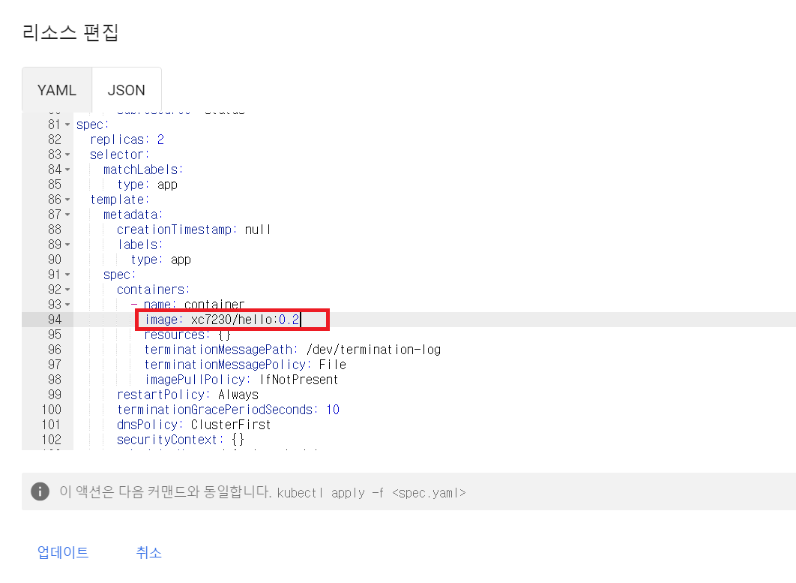<br/>
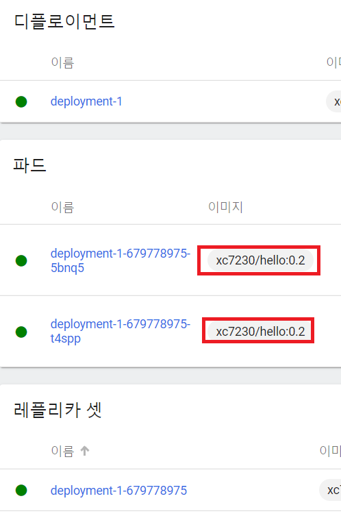<br/>
0.1이었던 버전들의 파드가 사라지고 0.2 버전의 파드가 생성되는걸 볼 수 있다.<br/>
- 바뀐 버전 내역들 확인하기
```shell
kubectl rollout history deployment deployment-1
```
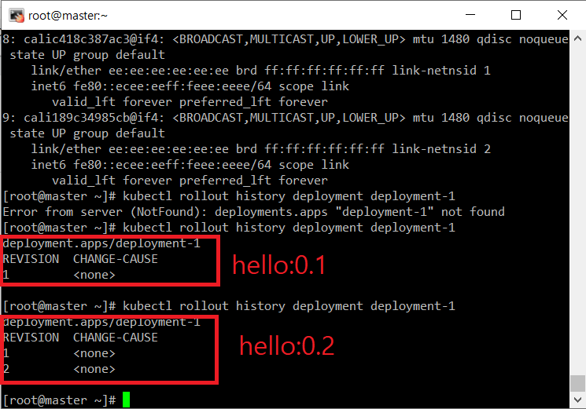<br/>

- 바뀐 버전 전으로 돌아가기(hello:0.2 -> 0.1)
```shell
kubectl rollout undo deployment deployment-1 --to-revision=1
```
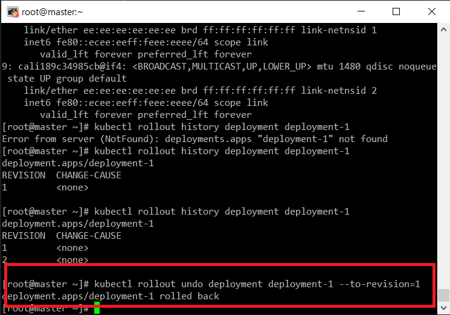<br/>
<br/>

### 파드 관리
- 서비스 생성
```yaml
apiVersion: v1
kind: Service
metadata:
  name: svc-3
spec:
  selector:
    type: app
  ports:
  - port: 80
    targetPort: 80
  type: LoadBalancer
```

```shell
while true; do  curl http://10.106.15.227; sleep 1; done
```

#### 롤링업데이트 디플로이 생성<br/>
우선 변경된 버전 파드가 하나 더 생성되고 순차적으로 바뀐다.
```yaml
apiVersion: apps/v1
kind: Deployment
metadata:
  name: deployment-2
spec:
  selector:
    matchLabels:
      type: app
  replicas: 2
  strategy:
    type: RollingUpdate
  minReadySeconds: 10
  template:
    metadata:
      labels:
        type: app
    spec:
      containers:
      - name: container
        image: cloudcamp2022/hello:0.1
      terminationGracePeriodSeconds: 0
```
- 서비스 생성
```yaml
apiVersion: v1
kind: Service
metadata:
  name: svc-1
spec:
  selector:
    type: app
  ports:
  - port: 8000
```
```shell
while true; do  curl 서비스의 주소; sleep 1; done
```
#### Blue/Green 방식<br/>
- 레플리카 생성
```yaml
apiVersion: apps/v1
kind: ReplicaSet
metadata:
  name: replica1
spec:
  replicas: 2
  selector:
    matchLabels:
      ver: v1
  template:
    metadata:
      name: pod1
      labels:
        ver: v1
    spec:
      containers:
      - name: container
        image: xc7230/hello:0.1
      terminationGracePeriodSeconds: 0
```

- 서비스 생성
```yaml
apiVersion: v1
kind: Service
metadata:
  name: svc-1
spec:
  selector:
    ver: v1
  ports:
  - port: 80
    protocol: TCP
    targetPort: 8000
```

- 버전 올린 레플리카 생성
```yaml
apiVersion: apps/v2
kind: ReplicaSet
metadata:
  name: replica2
spec:
  replicas: 2
  selector:
    matchLabels:
      ver: v2
  template:
    metadata:
      name: pod1
      labels:
        ver: v2
    spec:
      containers:
      - name: container
        image: xc7230/hello:0.2
      terminationGracePeriodSeconds: 0
```

- 서비스에서 버전 바꾸기<br/>
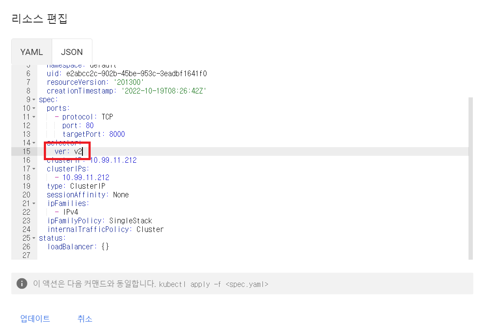<br/>

#### HorizontalPodAutoscaler
- Metrics Server 설치
```shell
kubectl apply -f https://github.com/kubernetes-sigs/metrics-server/releases/download/v0.5.0/components.yaml
```

- 설정 변경
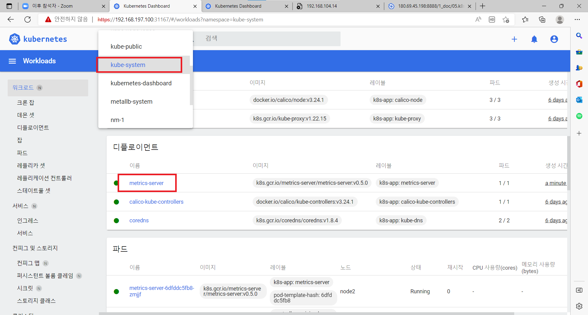<br/>
kube-system - metrics-server 설정 변경
```yaml
    args:
    - '--cert-dir=/tmp'
    - '--secure-port=443'
    - '--kubelet-preferred-address-types=InternalIP,ExternalIP,Hostname'
    - '--kubelet-use-node-status-port'
    - '--metric-resolution=15s'
    - '--kubelet-insecure-tls'	<---- 이걸 추가
```
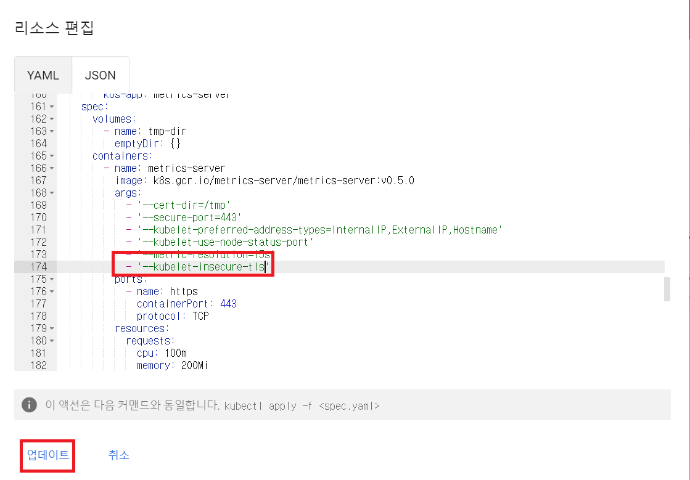<br/>

- 확인
```shell
kubectl get apiservices | grep metrics
```
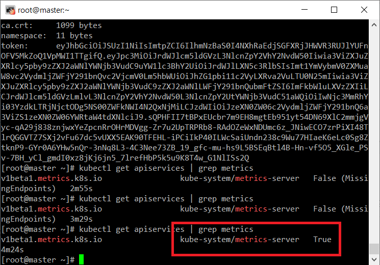<br/>

```shell
kubectl top no
```
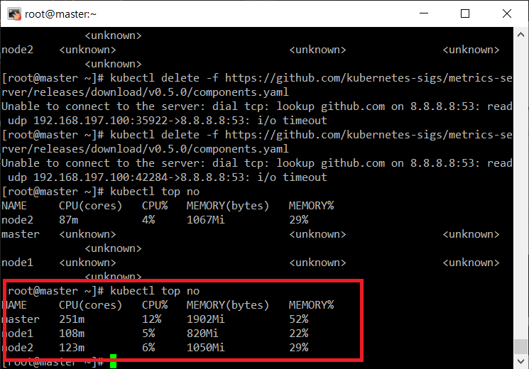<br/>

- 만약 노드가 출력되지 않을시<br/>
metrics-server 설정에서 추가한다.
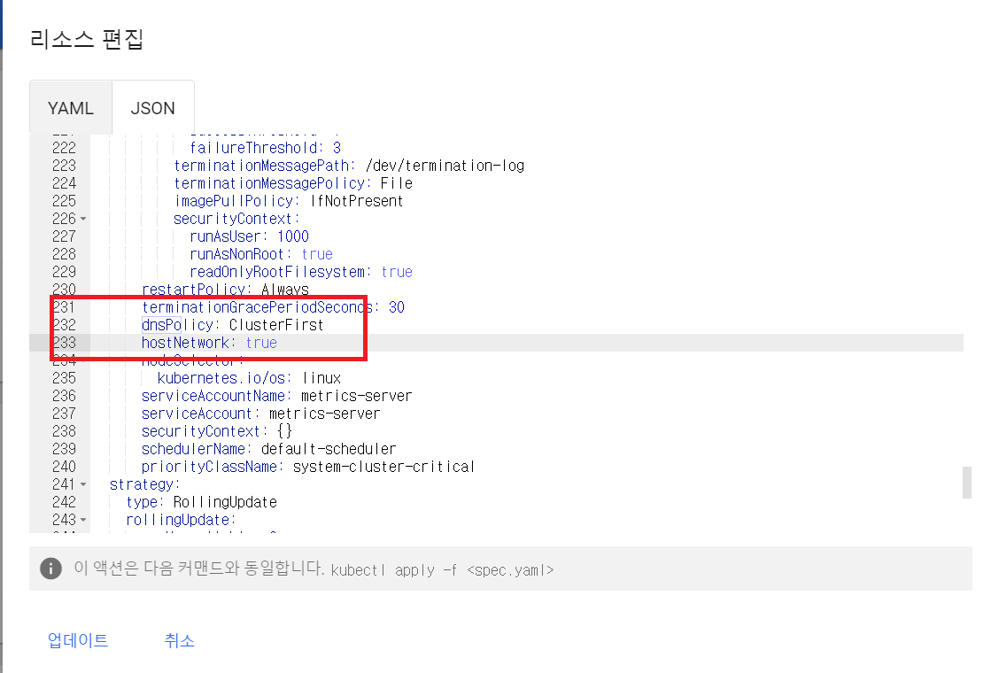<br/>

- HPA 설정
```yaml
apiVersion: apps/v1
kind: Deployment
metadata:
 name: cpu1
spec:
 selector:
   matchLabels:
      resource: cpu
 replicas: 2
 template:
   metadata:
     labels:
       resource: cpu
   spec:
     containers:
     - name: container
       image: xc7230/hello:0.1
       resources:
         requests:
           cpu: 100m
         limits:
           cpu: 200m
```

- 서비스 생성
```yaml
apiVersion: v1
kind: Service
metadata:
 name: svc1
spec:
 selector:
    resource: cpu
 ports:
   - port: 8000
     targetPort: 8000
     nodePort: 30001
 type: NodePort
```

- 오토스케일링 생성
```yaml
apiVersion: autoscaling/v2beta2
kind: HorizontalPodAutoscaler
metadata:
  name: hpa-resource-cpu
spec:
  maxReplicas: 10
  minReplicas: 2
  scaleTargetRef:
    apiVersion: apps/v1
    kind: Deployment
    name: cpu1
  metrics:
  - type: Resource 
    resource:
      name: cpu
      target:
        type: Utilization
        averageUtilization: 50
```

- cpu에 부하 주기
생성된 파드 중 하나의 파드에 접속해 부하를 줘본다.
```shell
apt update
apt install -y stress
stress -c 1
```
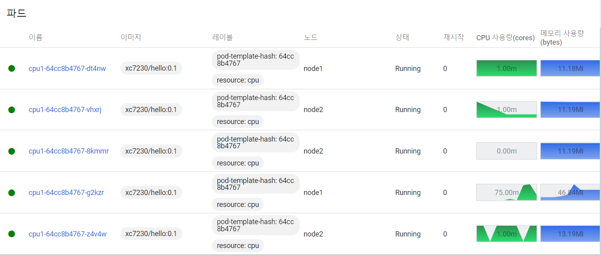<br/>
두 개였던 파드가 부하를 받자 늘어났다.<br/>

- memory 설정
```yaml
apiVersion: apps/v1
kind: Deployment
metadata:
 name: memory1
spec:
 selector:
   matchLabels:
      resource: memory
 replicas: 2
 template:
   metadata:
     labels:
       resource: memory
   spec:
     containers:
     - name: container
       image: xc7230/hello:0.1
       resources:
         requests:
           memory: 10Mi
         limits:
           memory: 20Mi
```
- 서비스 생성
```yaml
apiVersion: v1
kind: Service
metadata:
 name: svc2
spec:
 selector:
    resource: memory
 ports:
   - port: 8000
     targetPort: 8000
     nodePort: 30002
 type: NodePort
```

- 오토스케일링 생성
```yaml
apiVersion: autoscaling/v2beta2
kind: HorizontalPodAutoscaler
metadata:
  name: hpa-resource-memory
spec:
  maxReplicas: 10
  minReplicas: 2
  scaleTargetRef:
    apiVersion: apps/v1
    kind: Deployment
    name: memory1
  metrics:
  - type: Resource 
    resource:
      name: memory
      target:
        type: AverageValue
        averageUtilization: 50
```
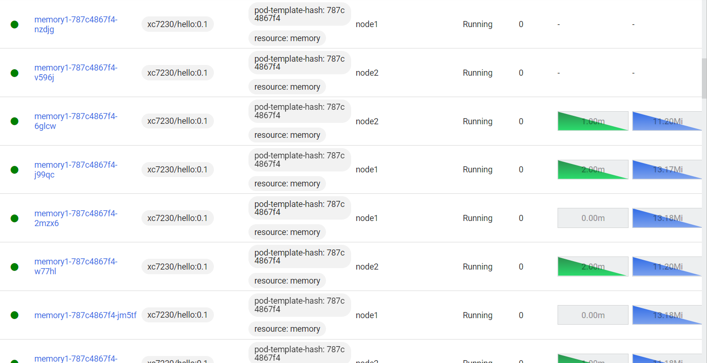<br/>
메모리 사용량이 많은지 단숨에 파드가 늘어난다.<br/>
