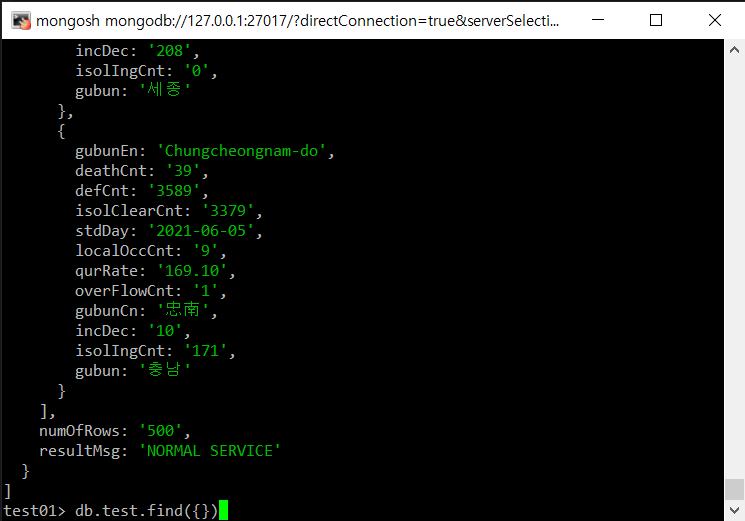

# MongoDB
## 설치
```shell
cat <<EOF> /etc/yum.repos.d/mongodb-org-6.0.repo
[mongodb-org-6.0]
name=MongoDB Repository
baseurl=https://repo.mongodb.org/yum/redhat/$releasever/mongodb-org/6.0/x86_64/
gpgcheck=1
enabled=1
gpgkey=https://www.mongodb.org/static/pgp/server-6.0.asc
EOF

sudo yum install -y mongodb-org

sudo systemctl restart mongod

mongosh
```

```sql
-- DB생성
use "몽고DB이름"    -- use "test01"

-- Collection 생성
db.createCollection("컬렉션이름")   -- db.createCollection("test")

-- Collection 확인
show collections
```

<br/>

## 외부 접속 허용
```shell
vi /etc/mongod.conf
```
아이피 변경, 0.0.0.0은 모든 IP접속 허용이다.<br/>
<br/>


## python과 연동
```python
from pymongo import MongoClient
import requests
import json


# client = MongoClient('localhost', 27017)
client = MongoClient("mongodb://192.168.197.80:27017/")

########### OPEN API DATA ############
url = 'http://apis.data.go.kr/1352000/ODMS_COVID_04/callCovid04Api'
params ={'serviceKey' : '시크릿 키', 'pageNo' : '1', 'numOfRows' : '500', 'apiType' : 'JSON' }
db = client.test01  # mongodb DB접속
response = requests.get(url, params=params)
data = response.text
json_db = json.loads(data)  # api data json으로 저장
########################################
db.test.insert_one(json_db)
```

### 확인
```sql
use test01
db.test.find({})
```
다음과 같이 성공적으로 출력이 된다.<br/>
<br/>