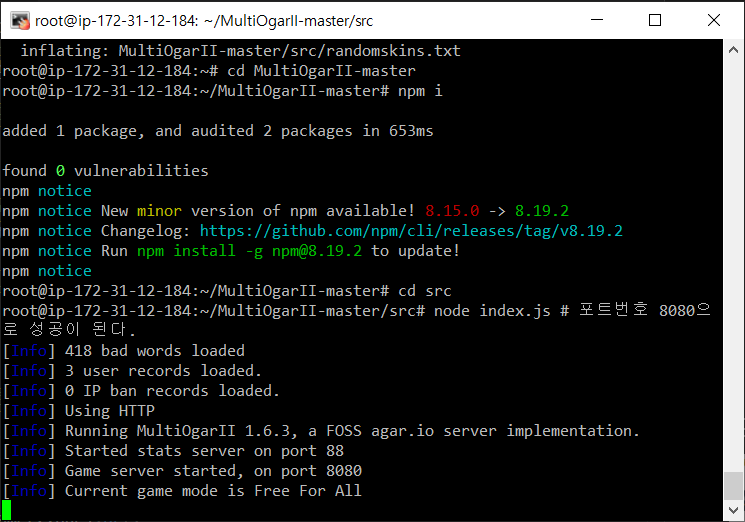
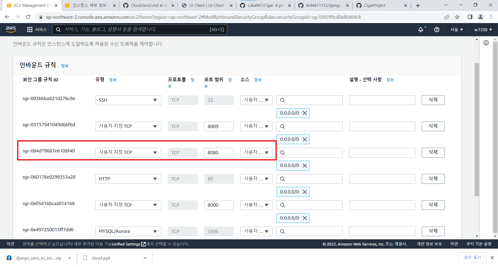
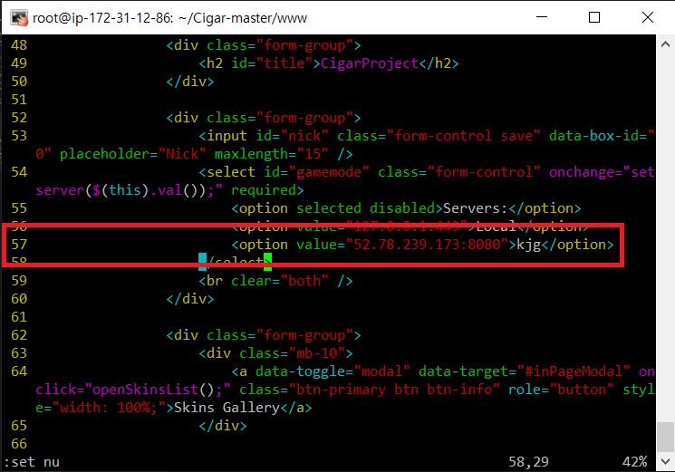
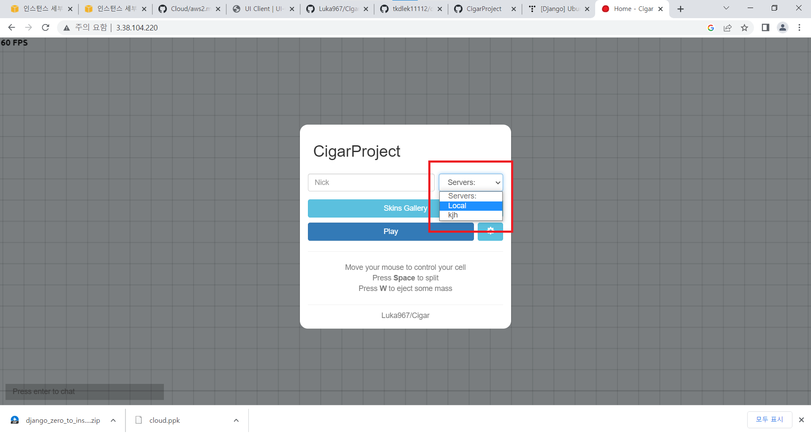

# MultiOgarII
- https://github.com/m-byte918/MultiOgarII/tree/master/src 에 올라와 있는 세포 삼키기 게임을 AWS EC2를 이용해서 구현해라

## WAS설정
```shell
apt update

# 구현하는데 필요한 노드 JS 설치
curl -fsSL https://deb.nodesource.com/setup_lts.x | sudo -E bash -
apt-get install -y nodejs

# git에 있는 코드 다운
wget https://github.com/m-byte918/MultiOgarII/archive/refs/heads/master.zip

# 알집을 풀기위한 프로그램 설치 및 압축 풀기
apt install -y zip
unzip master.zip

# 다운 받은 폴더로 이동
cd MultiOgarII-master

# 안에 있는 노드JS 코드 인스톨
npm i

# 게임 서버 실행
cd src
node index.js # 포트번호 8080으로 성공이 된다.
```
<br/>

## 포트번호 설정
<br/>
게임 서버의 포트번호(8080)을 추가해준다.

## WEB 설정

- 세포 삼키기의 게임 서버를 열렸다. 이제 그것을 웹으로 출력해줄 웹서버를 만들어야 한다.

- https://github.com/Luka967/Cigar 이라는 git에서 세포키우기의 웹서버를 만들어 줬다. 이걸 활용한다.

```shell
apt update
apt install -y apache2
systemctl restart apache2 #서버 작동하는지 확인

wget https://github.com/Luka967/Cigar/archive/refs/heads/master.zip #로그인 코드 저장

# 압축 풀기
apt install -y zip
unzip master.zip

# 권한 부여
chmod -R 755 Cigar-master
chmod -R 755 /var/www

# 로그인 파일 이동
cd Cigar-master/www/
mv * /var/www/html/

# 파일 수정

vi /var/www/html/index.html
```
- index.html
<br/>
다음과 같이 인덱스 57번째 줄에 Was의 주소와 포트 번호(8080)를 추가해준다.<br/>

## 결과
```shell
# 웹서버를 한 번 재시작 해준다.
systemctl restart apache2
```
WEB서버의 주소로 접속해 보면 다음 화면이 출력된다.<br/>

<br/>

그리고 옆에 서버목록에 내가 만든 서버가 올라와 있다.<br/> 
내 서버를 선택하고 Play를 눌러보면<br/>


