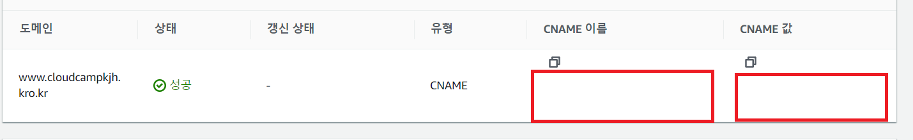
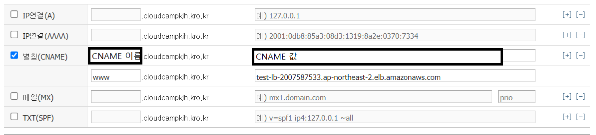
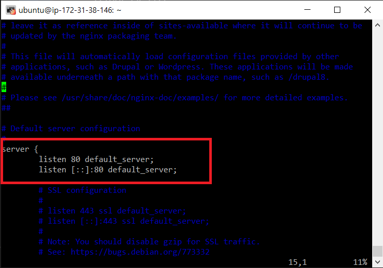
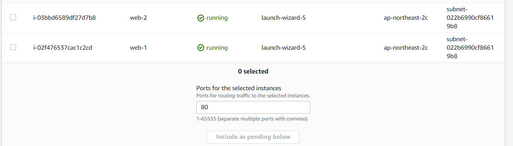
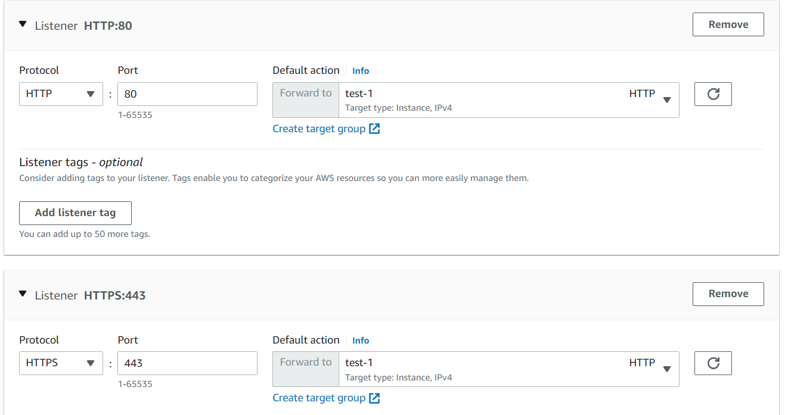
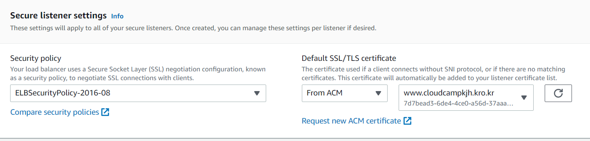
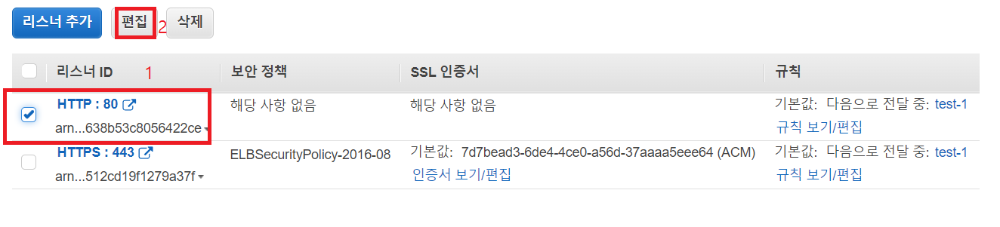
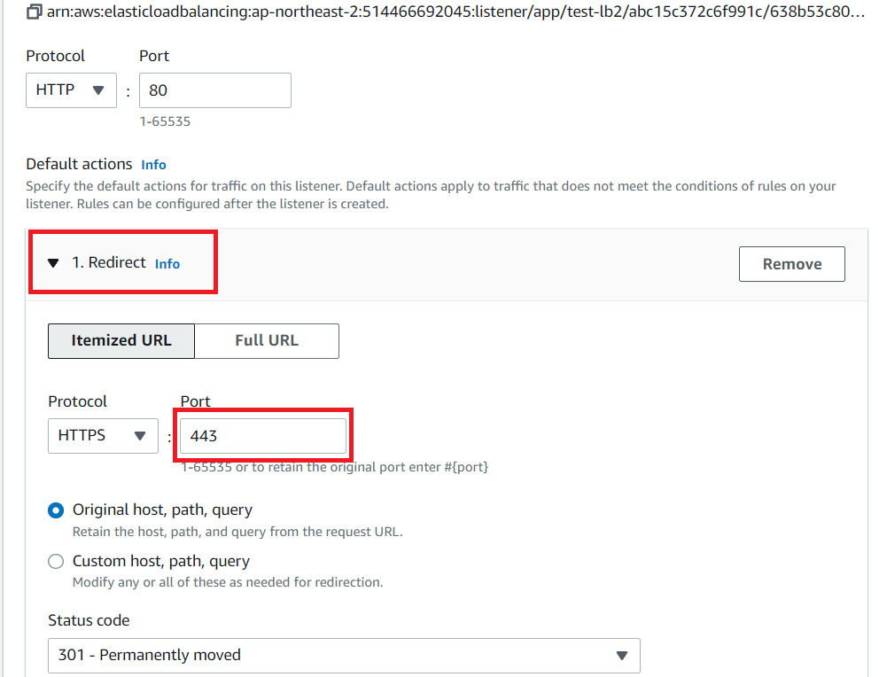
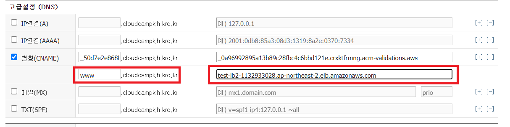

# SSL
## certbot으로 SSL인증하기
### nginx 서버 설치
```shell
apt update
apt install -y nginx
service start nginx
```
`내도메인한국`에서 도메인 등록

### cerbot SSL 인증
```shell
add-apt-repository ppa:certbot/certbot
apt install python-certbot-nginx
vi /etc/nginx/sites-available/default
systemctl restart nginx
certbot --nginx -d www.cloudcampkjh.kro.kr
vi /etc/nginx/sites-available/default
```

```shell

```

## AWS
- ec2 두개 생성, nginx 설치해서 웹서버 실행, 도메인 생성
- AWS Certificate Manager에 도메인 연결 후 생성
  <br/>
- 도메인에 aws 인증서 값 입력<br/>
  <br/>
- 각각의 EC2에 설정 변경<br/>
  ```shell
  vi /etc/nginx/sites-available/default
  ```
  <br/>
- 타겟그룹 생성
  <br/>
- 로드벨런서 생성
    - 타겟그룹 추가<br/>
    <br/>
    - 도메인 추가<br/>
    <br/>
    - 타겟그룹 수정<br/>
    <br/>
    <br/>
- 도메인에 로드벨런서 DNS주소 추가<br/>
  <br/>

 - 확인<br/>
  <br/>


  
