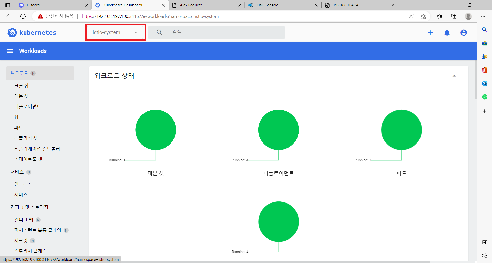
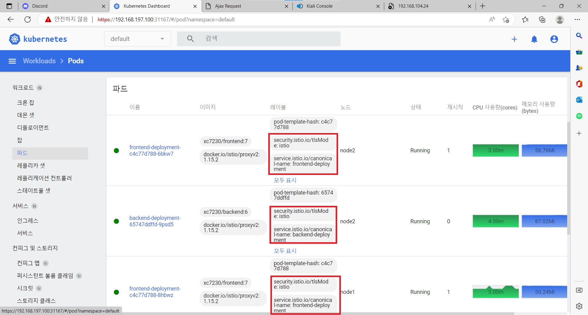
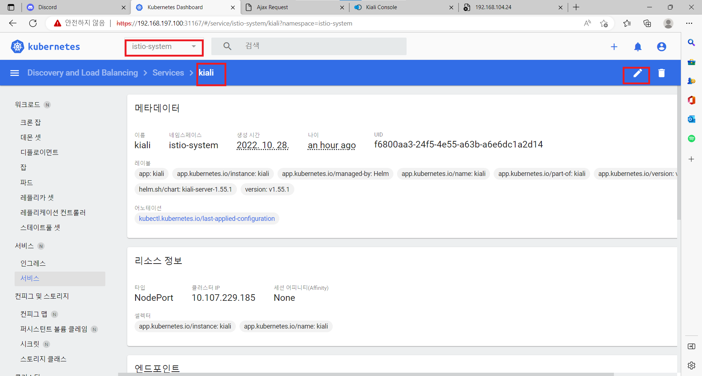
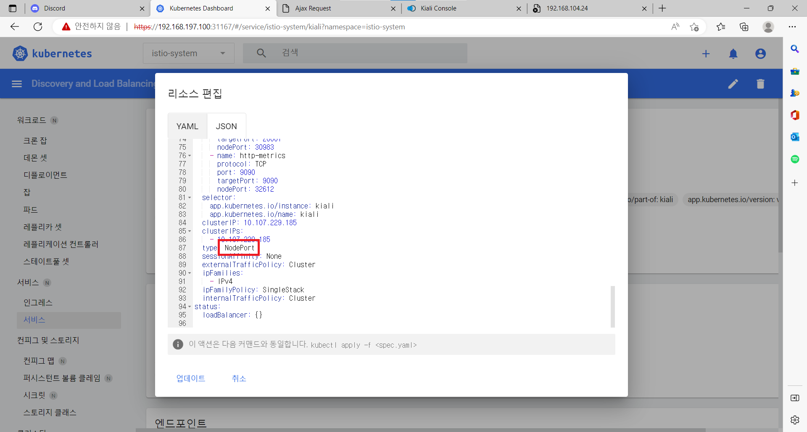
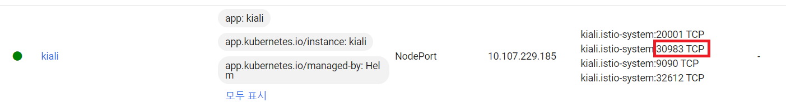
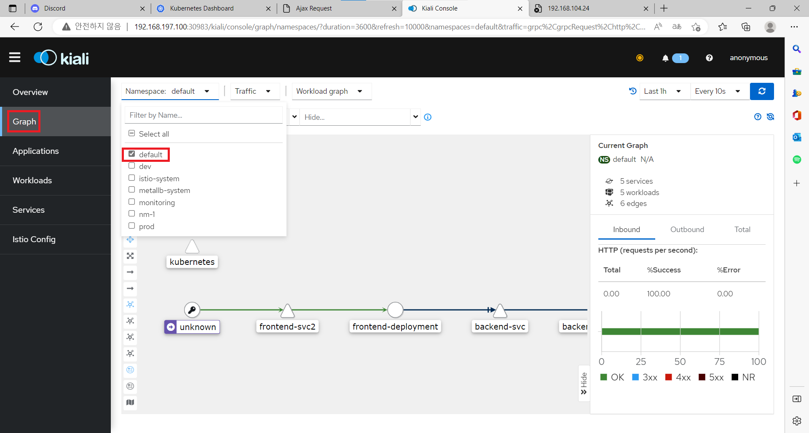

# Service Mesh
## 이스티오(istio)
서미스 매쉬 오픈소스<br/>
### 설치
- 이스티오 명령어(프로그램) 설치
```shell
curl -L https://istio.io/downloadIstio | sh -
echo "export PATH=$HOME/istio-버전/bin:$PATH" >> ~/.bashrc  # 위에 명령어 결과물에 버전이 나온다.
source .bashrc
istioctl --help
```

- 이스티오 컨트롤 플레인 설치하기
    ```shell
    istioctl x uninstall --purge  # 이스티오 삭제
    istioctl install --set components.cni.enabled=true -y
    ```
    컴포넌트가 생성되는걸 확인<br/>
    <br/>

### Istio Automation Injection
- addon 설치<br/>
```shell
kubectl apply -f istio-1.15.2/samples/addons/prometheus.yaml
kubectl apply -f istio-1.15.2/samples/addons/kiali.yaml
```

- 레이블 지정<br/>
해당하는 네임스페이스에 Istio를 적용시킨다.<br/>
```shell
kubectl label ns 네임스페이스이름 istio-injection=enabled
# ex) kubectl label ns default istio-injection=enabled
```
- 확인<br/>
기존에 있던 디플로이먼트들을 재시작한 다음 파드들에게 istio가 잘 적용됐는지 확인한다.<br/>
<br/>

- kiali 서비스 변경<br/>
istio-system 네임스패이스 - 서비스 - kiali의 서비스타입을 ClusterIP에서 NodePort로 변경해준다.<br/>
<br/>
<br/>

- kiali 대시보드 접속<br/>
http://마스터IP:kiali포트번호로 접속<br/>
<br/>
graph에서 연결된 default 네임스페이스가 잘 작동하는지 모니터링 해본다.<br/>
<br/>
