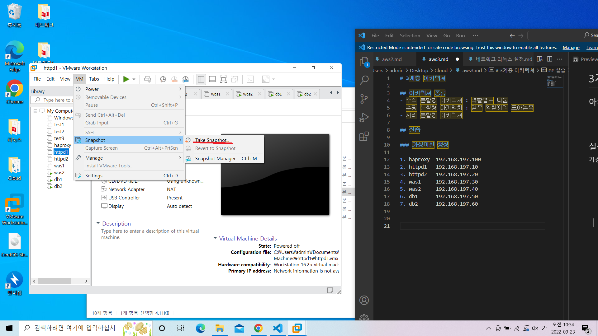
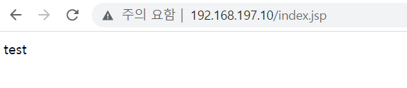

# 3계층 아키텍쳐

## 아키텍쳐 종류
- 수직 분할형 아키텍쳐 : 역활별로 나눔
- 수평 분할형 아키텍쳐 : 같은 역할끼리 모아놓음
- 지리 분할형 아키텍쳐

## 실습

### 가상머신 생성

1. haproxy  192.168.197.100
2. httpd1   192.168.197.10
3. httpd2   192.168.197.20
4. was1     192.168.197.30
5. was2     192.168.197.40
6. db1      192.168.197.50
7. db2      192.168.197.60

### 백업용 스냅샷 만들기


### 실습 1
아파치와 아파치 톰캣 연동하기

#### 아파치 서버 설정(http1 사용)
0. 웹서버 설치
``` shell
yum -y install httpd
```
1. 방화벽 해제
``` shell
systemctl stop firewalld
systemctl disable firewalld
setenforce 0
```
2. 관련 패키지 및 모듈 설치
``` shell
yum install -y httpd httpd-devel gcc gcc-c++
yum install -y wget
wget https://dlcdn.apache.org/tomcat/tomcat-connectors/jk/tomcat-connectors-1.2.48-src.tar.gz
```
3. 모듈 설치
```shell
tar zxvf tomcat-connectors-1.2.48-src.tar.gz		압축 풀고
cd tomcat-connectors-1.2.48-src/native/			이동하고
./configure --with-apxs=/usr/bin/apxs			
yum install -y make
yum install -y redhat-rpm-config 
	make
	
 # tomcat-connectors-1.2.48-src/native/apache-2.0 밑에 mod_jk.so 생성됨

cd /apache-2.0

cp mod_jk.so /usr/lib64/httpd/modules/mod_jk.so

chmod 755 /usr/lib64/httpd/modules/mod_jk.so
```

4. 서버에서 모듈 적용 설정
``` shell
vi /etc/httpd/conf/httpd.conf	파일 60번 라인에 다음 내용 추가
LoadModule jk_module /usr/lib64/httpd/modules/mod_jk.so
	
<IfModule jk_module>
	JkWorkersFile /etc/httpd/conf/workers.properties
	JkLogFile /var/log/httpd/mod_jk.log
	JkLogLevel info
	JkLogStampFormat "[%a %b %d %H:%M:%S %Y]"
	JkMount /*.jsp worker1
</IfModule>
```
5. 워커 파일 생성
 ``` shell
 vi /etc/httpd/conf/workers.properties
	파일 안에 다음 내용 작성
	worker.list=worker1

	worker.worker1.type=ajp13
	worker.worker1.host=[톰캣의 IP] #지금 같은 경우는 was1의 아이피인 192.168.197.30
	worker.worker1.port=8009
```

6. 테스트 파일 생성
``` shell
vi /var/www/html/index.html

# apache1 입력
```

7. 톰캣 설정 후 재시작.


#### 톰캣 서버 설정(was1 사용)
1. 방화벽 해제
```shell
systemctl stop firewalld
systemctl disable firewalld
setenforce 0
```

2. 설치

- JDK 설치
```shell
yum -y install java-1.8.0-openjdk-devel.x86_64

# 버전 확인
java -version
```

- 톰캣
``` shell
yum install -y wget 
wget https://dlcdn.apache.org/tomcat/tomcat-9/v9.0.65/bin/apache-tomcat-9.0.65.tar.gz
tar zxvf apache-tomcat-9.0.65.tar.gz

mv apache-tomcat-9.0.65 /usr/local/tomcat9
```

3. 톰캣 설정
```shell
vi /usr/local/tomcat9/conf/server.xml # 파일에서 153번 줄에 다음 내용 추가
<Context path="" docBase="[이니셜]" reloadable="true" />

# 121번 라인에 다음 내용 추가
<Connector protocol="AJP/1.3"
    address="0.0.0.0"
    secretRequired="false"
    port="8009"
    redirectPort="8443" />

/usr/local/tomcat9/webapps # 디렉토리 밑에 [이니셜] 디렉토리 생성

/usr/local/tomcat9/webapps/[이니셜] # 디렉토리 밑에 index.jsp 파일 생성

vi /usr/local/tomcat9/webapps/[이니셜]/index.jsp 
# 파일에 다음 내용 작성 : test

```

4. 톰캣 서버 실행
```shell
/usr/local/tomcat9/bin/shutdown.sh
/usr/local/tomcat9/bin/startup.sh
```

5. 톰캣 실행 확인
```shell
yum -y install net-tools
netstat -anlp | grep :8080
netstat -anlp | grep :8009

```

6. 확인
내 아파치 서버 192.168.197.10/index.jsp에 들어갔을때, 톰캣에서 만든 index.jsp내용이 출력되어야 함


- httpd의 아이피를 입력했는데 was1의 있는 jsp파일의 내용이 나온다.
http에 jsp를 찾으면 jsp를 담당하는 곳으로 안내해준다.

