# 3계층 AWS로 이용하기
## RDS
- 우리가 사용할 DB를 AWS에 올린다.

### RDS생성및 설정하기
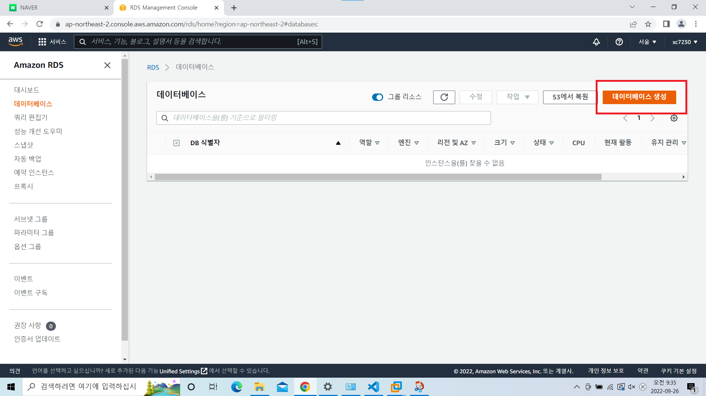
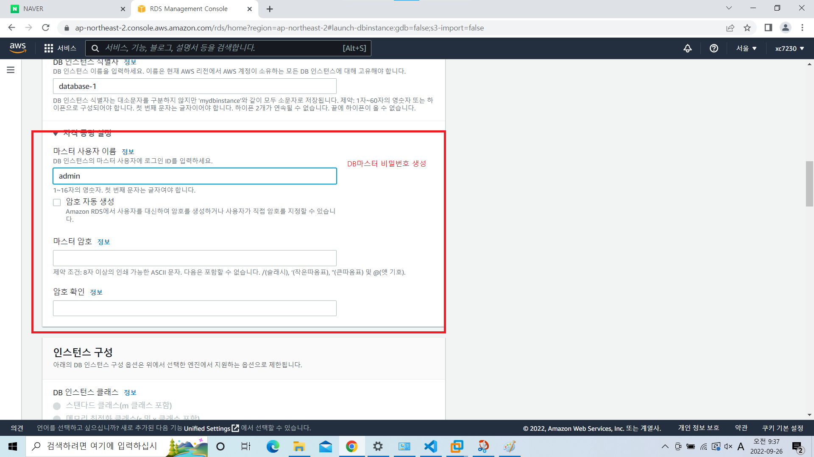
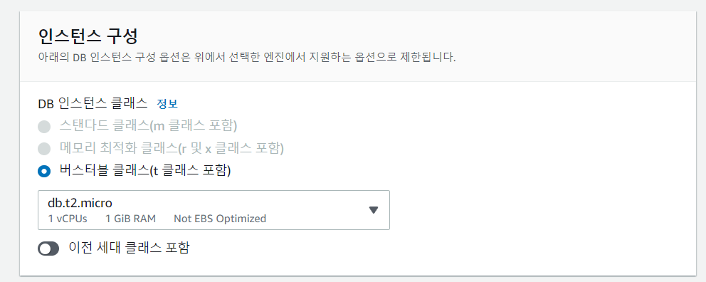
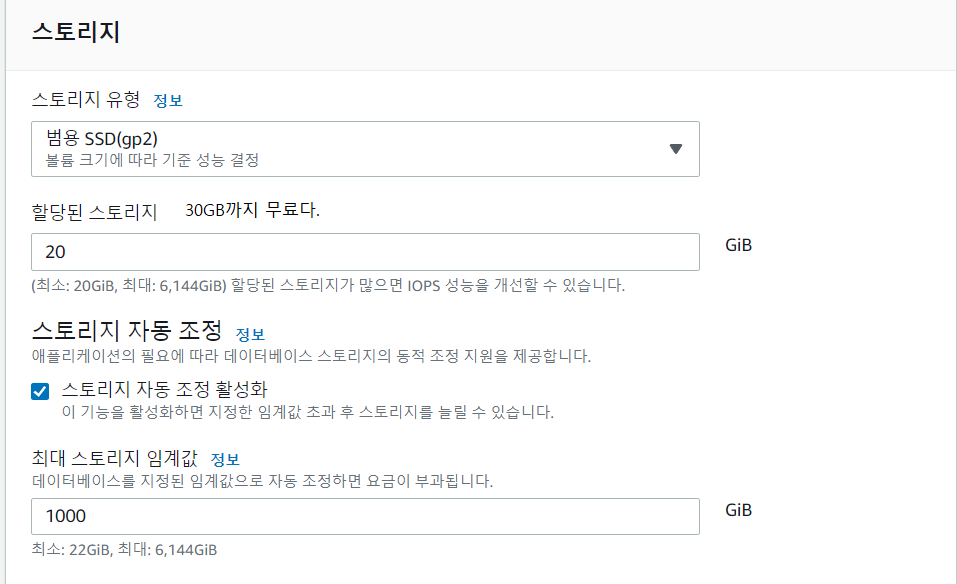
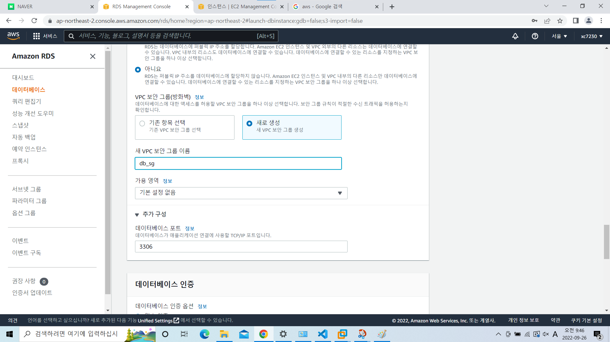
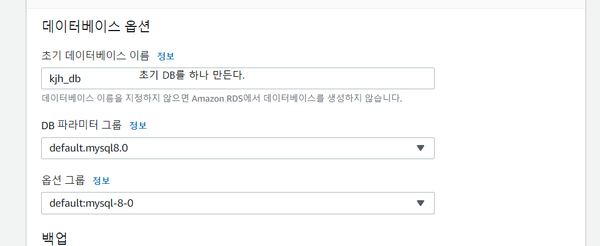

- MySQL Workbench 프로그램 다운

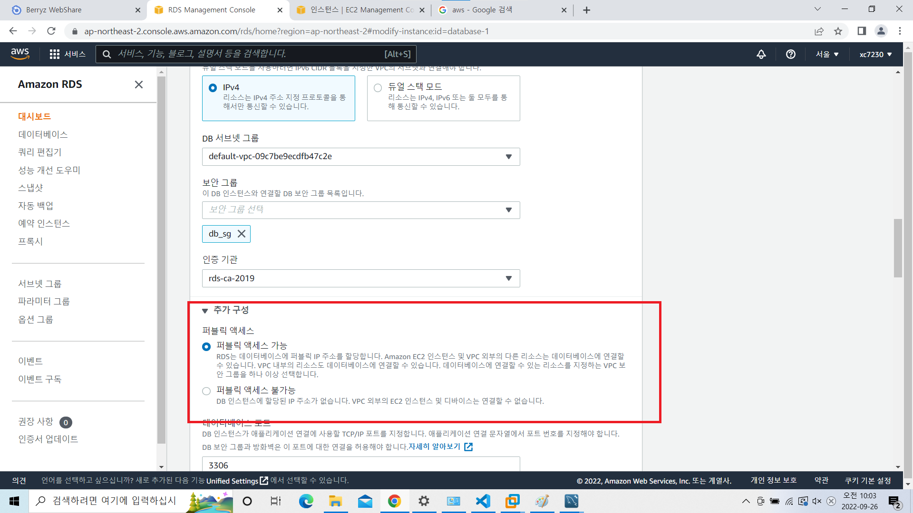
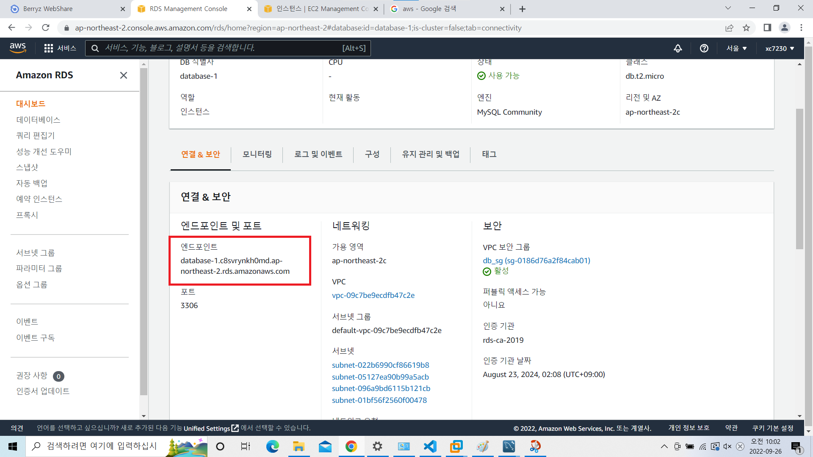
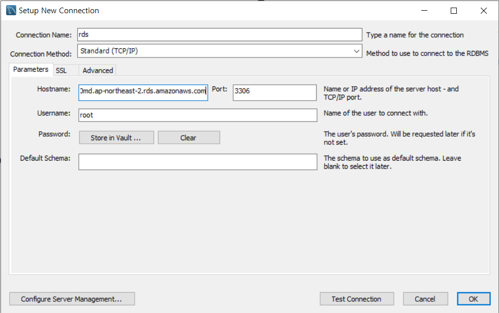
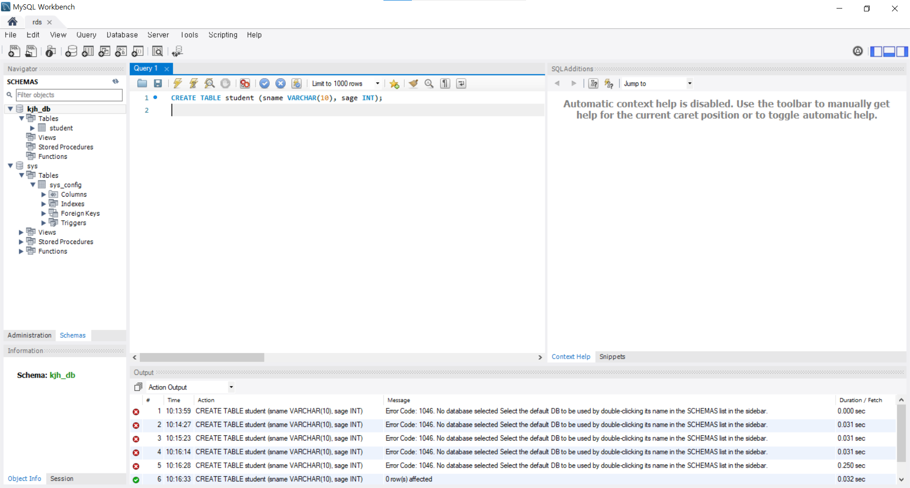

### DB서버 이중화
#### 구성
- 마스터    슬레이브
- 온프레미스    aws
- aws   aws

##### 온프레미스, aws 이중화
- 온프레미스

```shell
#방화벽 제거
systemctl stop firewalld
systemctl disable firewalld
setenforce 0

#mysql다운
yum install -y mysql-server
systemctl restart mysqld

mysql_secure_installation

```
```shell
mysql -u root -p #로그인
```
```mysql
show master status;
CREATE USER 'slave_user'@'%' IDENTIFIED BY 'qwer1234';
GRANT REPLICATION SLAVE ON *.*  TO 'slave_user'@'%';
select * from mysql.user where user='slave_user'\G
```

- aws
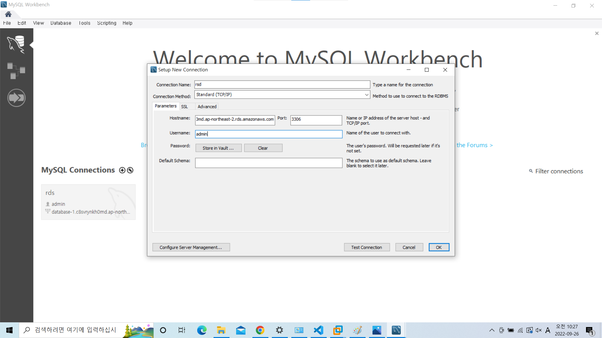
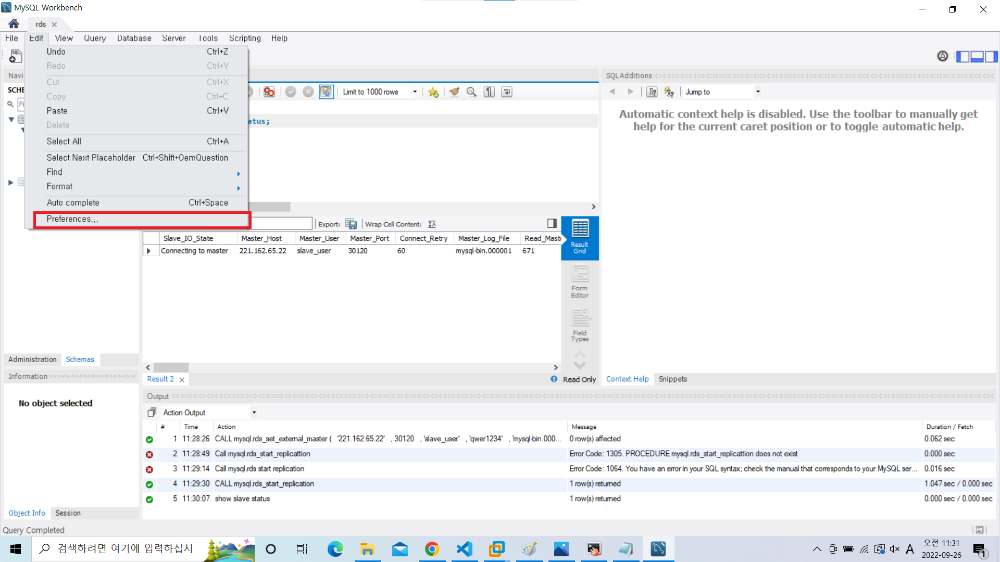
재시작

- 포트포워딩
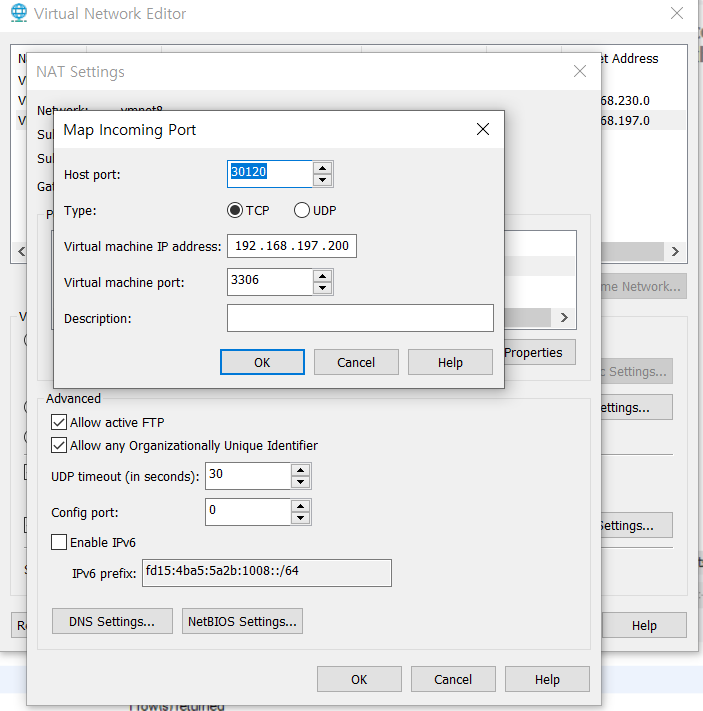


```CALL mysql.rds_set_external_master (
  host_name
  , host_port
  , replication_user_name
  , replication_user_password
  , mysql_binary_log_file_name
  , mysql_binary_log_file_location
  , ssl_encryption
);
```

``` mysql
CALL mysql.rds_set_external_master (
  '221.162.65.22'
  , 30120
  , 'slave_user'
  , 'qwer1234'
  , 'mysql-bin.000001'
  , 671
  , 0
);
```

```
CALL mysql.rds_start_replication;
show slave status;

```