# 하둡
## 설치하기
- 가상머신 준비
```	
    centos8	1	2	master     ip : 192.168.197.10
	centos8	1	2	slave01      ip : 192.168.197.20
	centos8	1	2	slave02      ip : 192.168.197.30
```
- 방화벽 해제
```shell
systemctl stop firewalld
systemctl disable firewalld
setenforce 0
```

- 네트워크 연동(master, slave01, slave02)

```shell
vi /etc/hosts
```
```shell
192.168.197.10 master
192.168.197.20 slave01
192.168.197.30 slave02
```

- 자바 설치(master, slave01, slave02)
```shell
yum install java-1.8.0-openjdk.x86_64 ant -y
```

## master
### 하둡 사용자 생성
```shell
yum install -y wget
useradd -m hadoop
passwd hadoop	# 암호 두 번 입력한다.
```
- ssh 키 설정
```shell
su - hadoop
ssh-keygen -t rsa	# 엔터 여러번
cat ~/.ssh/id_rsa.pub >> ~/.ssh/authorized_keys	# 공개키 로컬에 추가
chmod 640 ~/.ssh/authorized_keys	# 권한 설정
ssh localhost	# 확인 yes를 입력한다.
```

### 하둡 설치
```shell
su - hadoop
wget http://apache.mirror.cdnetworks.com/hadoop/common/hadoop-3.3.4/hadoop-3.3.4.tar.gz	# 버전이 바뀌면 다운이 안될수도 있다. 확인해주자.
tar -xvzf hadoop-3.3.4.tar.gz	# 압축 풀기
ln -s hadoop-3.3.4 hadoop	# 심볼릭 링크 생성
```

### 하둡과 자바 환경 변수 설정
```shell
vi ~/.bashrc
```
맨 밑에 추가
```shell
export JAVA_HOME=/usr/lib/jvm/jre-1.8.0/
export HADOOP_HOME=/home/hadoop/hadoop 
export HADOOP_INSTALL=$HADOOP_HOME 
export HADOOP_MAPRED_HOME=$HADOOP_HOME 
export HADOOP_COMMON_HOME=$HADOOP_HOME 
export HADOOP_HDFS_HOME=$HADOOP_HOME 
export HADOOP_YARN_HOME=$HADOOP_HOME 
export HADOOP_COMMON_LIB_NATIVE_DIR=$HADOOP_HOME/lib/native 
export PATH=$PATH:$HADOOP_HOME/sbin:$HADOOP_HOME/bin 
export HADOOP_OPTS="-Djava.library.path=$HADOOP_HOME/lib/native"
```

```shell
source ~/.bashrc
```

- 하둡 환경 변수 파일 설정
```shell
vi $HADOOP_HOME/etc/hadoop/hadoop-env.sh

## export JAVA_HOME=/usr/lib/jvm/jre-1.8.0/ 다음 부분을 수정해준다.
```
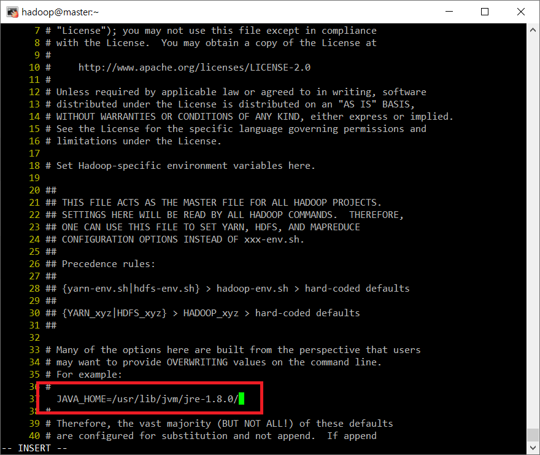<br/>

- 유사분산 모드
```shell
mkdir -p ~/hadoopdata/hdfs/namenode 
mkdir -p ~/hadoopdata/hdfs/datanode
```

```shell
vi $HADOOP_HOME/etc/hadoop/core-site.xml
```
```xml
<configuration>
        <property>
                <name>fs.defaultFS</name>
                <value>hdfs://master:9000</value>	# 내가 설정한 호스트 네임으로 변경해준다.
        </property>
</configuration>
```
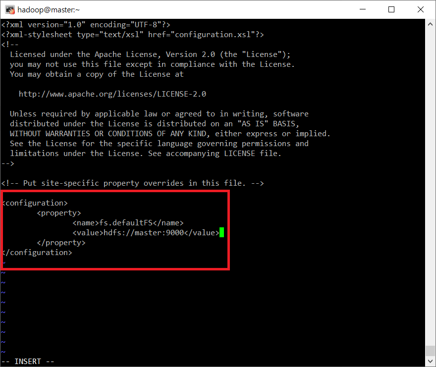<br/>

```shell
vi $HADOOP_HOME/etc/hadoop/hdfs-site.xml
```
```xml
<configuration>
        <property>
                <name>dfs.replication</name>
                <value>1</value>
        </property>
        <property>
                <name>dfs.name.dir</name>
                <value>file:///home/hadoop/hadoopdata/hdfs/namenode</value>
        </property>
        <property>
                <name>dfs.data.dir</name>
                <value>file:///home/hadoop/hadoopdata/hdfs/datanode</value>
        </property>
</configuration>
```
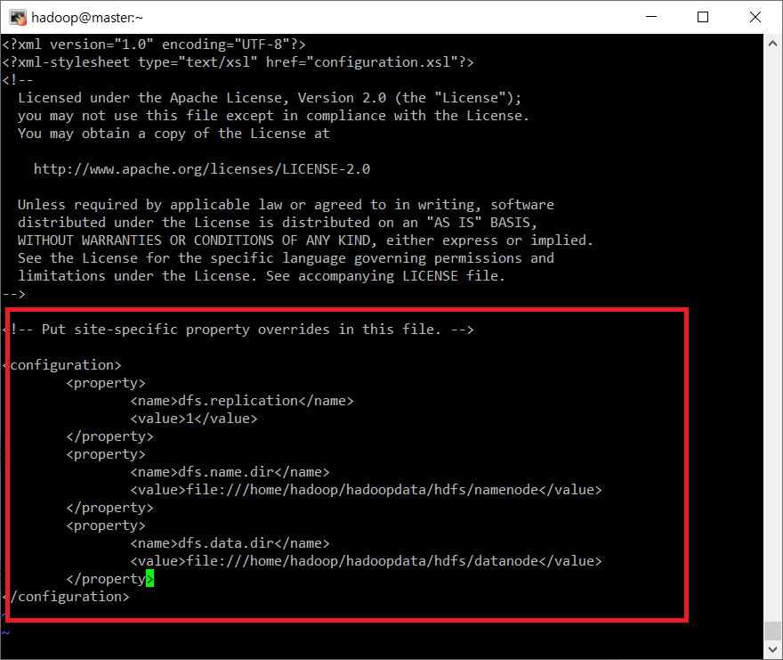<br/>

```shell
vi $HADOOP_HOME/etc/hadoop/mapred-site.xml
```
```xml
<configuration>
        <property>
                <name>mapreduce.framework.name</name>
                <value>yarn</value>
        </property>
        <property>
                <name>yarn.app.mapreduce.am.env</name>
                <value>HADOOP_MAPRED_HOME=$HADOOP_HOME</value>
        </property>
        <property>
                <name>mapreduce.map.env</name>
                <value>HADOOP_MAPRED_HOME=$HADOOP_HOME</value>
        </property>
        <property>
                <name>mapreduce.reduce.env</name>
                <value>HADOOP_MAPRED_HOME=$HADOOP_HOME</value>
        </property>
</configuration>
```
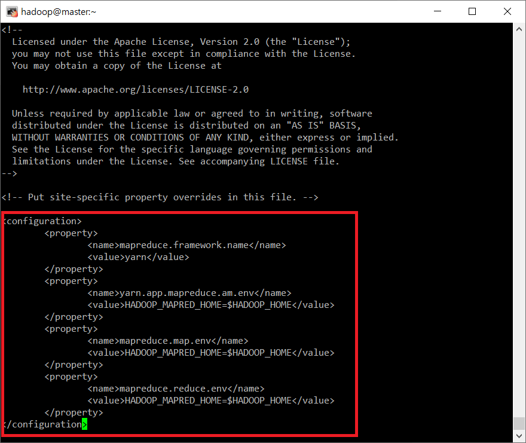<br/>

```shell
vi $HADOOP_HOME/etc/hadoop/yarn-site.xml
```
```xml
<configuration>
        <property>
                <name>yarn.nodemanager.aux-services</name>
                <value>mapreduce_shuffle</value>
        </property>
        <property>
                <name>yarn.nodemanager.vmem-check-enabled</name>
                <value>false</value>
        </property>
</configuration>
```
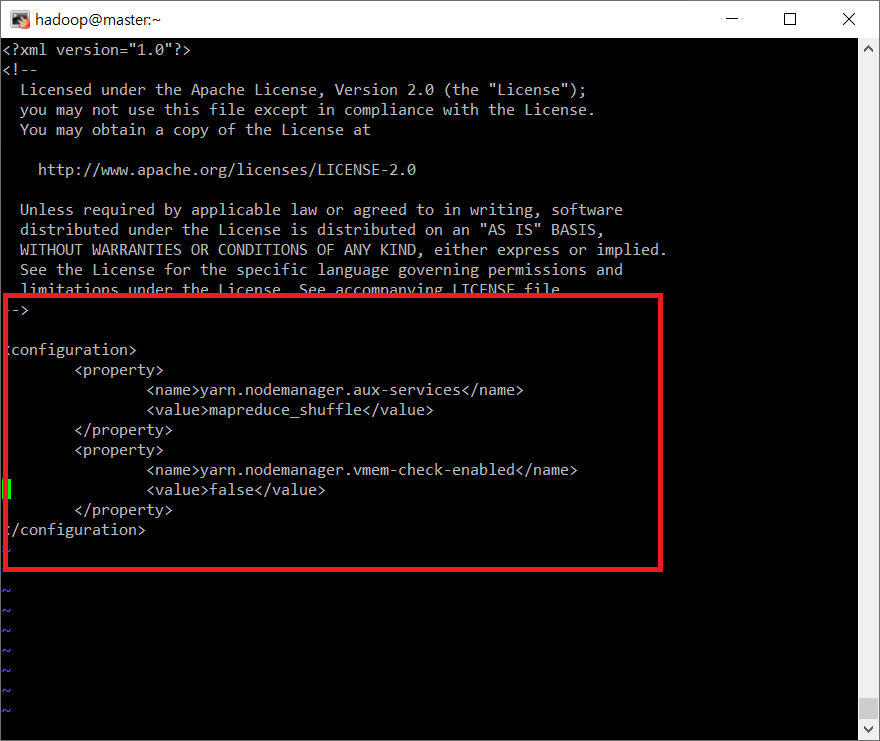<br/>

### 하둡 클러스터
- namenode 포멧
```shell
hdfs namenode -format
```
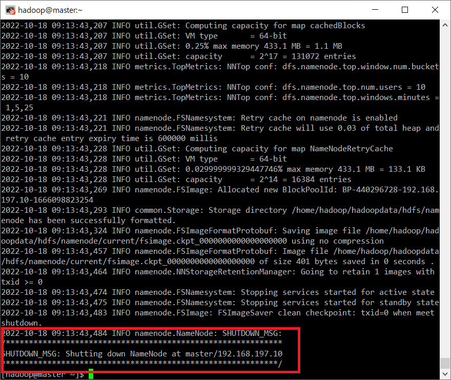<br/>

- hadoop 클러스터 실행
```shell
start-dfs.sh
```
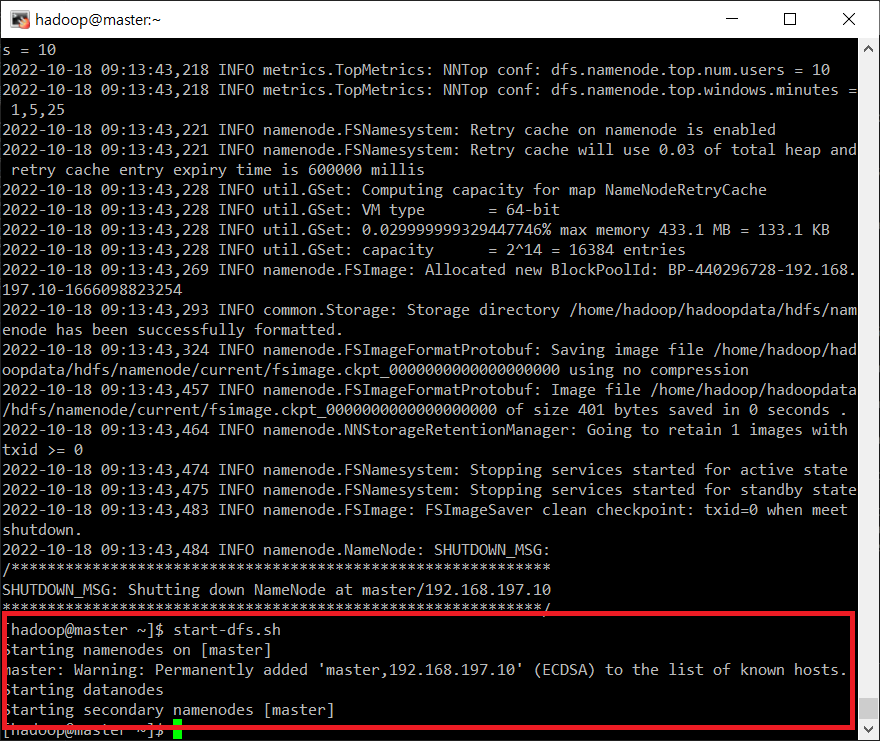<br/>

- yarn 서비스 시작
```shell
start-yarn.sh
```
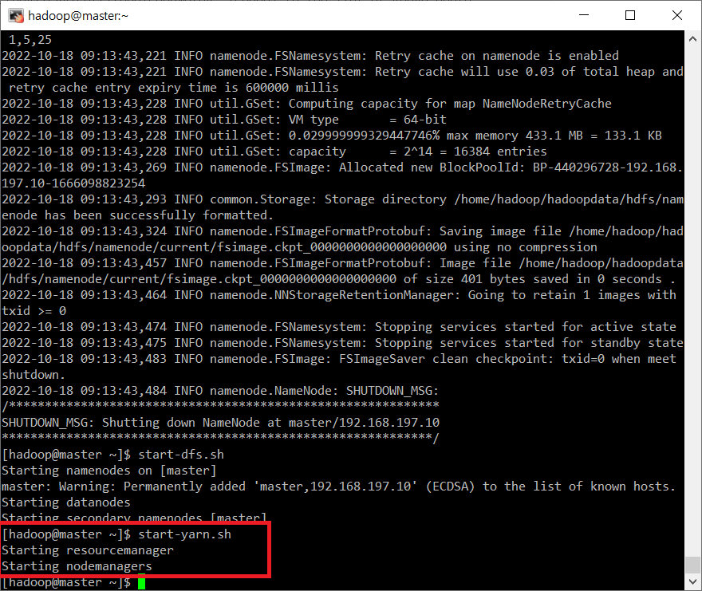<br/>


- 하둡 상태 확인
```shell
jps
```
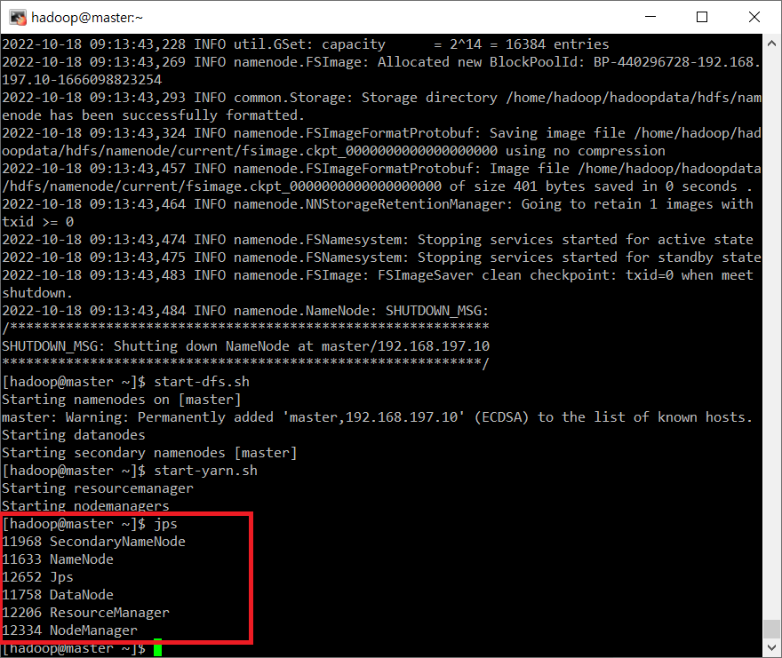<br/>

- 하둡 동작 확인
```shell
cd $HADOOP_HOME
yarn jar share/hadoop/mapreduce/hadoop-mapreduce-examples-3.3.4.jar pi 16 1000
```
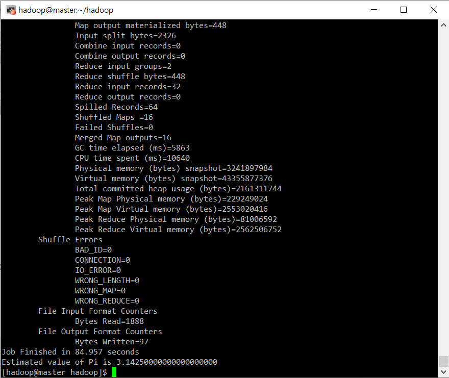<br/>

### 하둡 리소스 매니저
- namenode접속
	- http://192.168.197.10:9870(내 마스터 아이피:9870)으로 접속<br/>
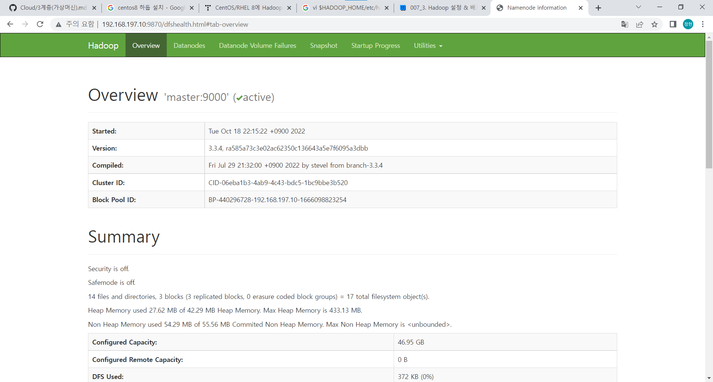<br/>

- 리소스 관리자 접속
	- http://192.168.197.10:8088(내 마스터 아이피:8088)으로 접속<br/>
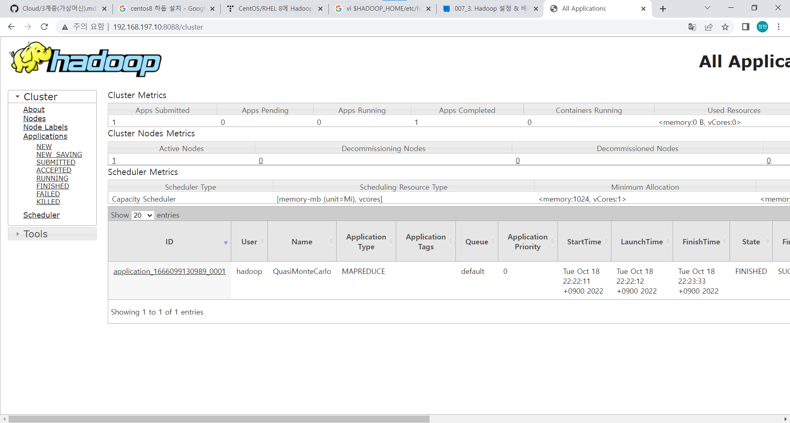<br/>

### 하둡 테스트
- 테스트 디렉토리 생성
```shell
hdfs dfs -mkdir /test1
hdfs dfs -mkdir /test2
hdfs dfs -ls /
```
- namenode 페이지에서 확인<br/>
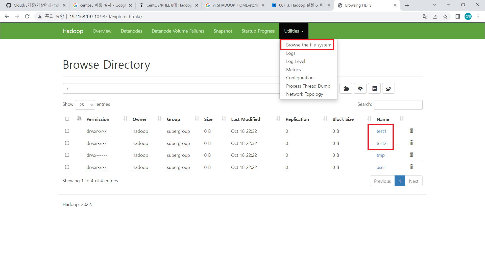<br/>

- 분석 프로그램 실행
	```shell
	hdfs dfs -mkdir /user/root
	hdfs dfs -mkdir /user/root/conf
	hdfs dfs -mkdir /input
	hdfs dfs -copyFromLocal $HADOOP_HOME/README.txt /input
	hdfs dfs -ls /input
	```
	- 단어 개수를 분석해주는 프로그램 실행
		```shell
		hadoop jar $HADOOP_HOME/share/hadoop/mapreduce/hadoop-mapreduce-examples-3.3.4.jar wordcount /input/README.txt ~/wordcount-output
		```
		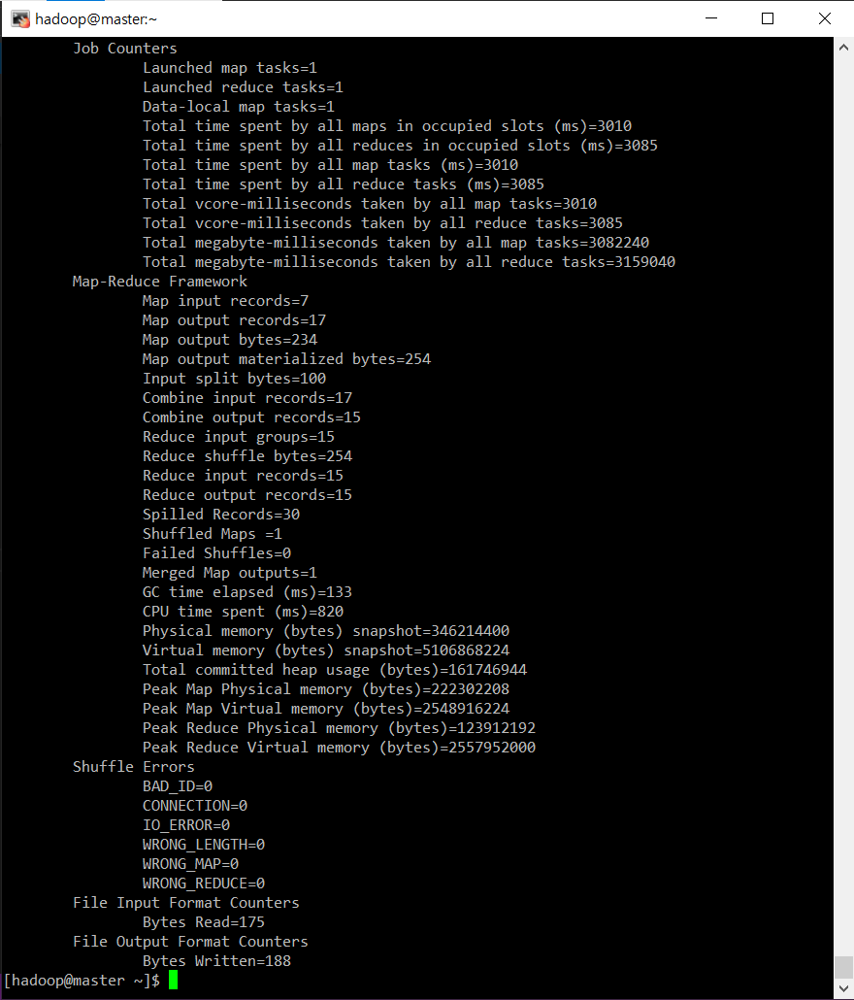<br/>

### Hadoop 서비스 중지
- namenode 종료
```shell
stop-dfs.sh
```

- 리소스 매니저 종료
```shell
stop-yarn.sh
```

## Multi Node Cluster (완전 분산 모드)
### 하둡 사용자 생성(slave01, slave02)
```shell
yum install -y wget
useradd -m hadoop
passwd hadoop	# 암호 두 번 입력한다.
```
- ssh 키 설정
```shell
su - hadoop
ssh-keygen -t rsa	# 엔터 여러번
cat ~/.ssh/id_rsa.pub >> ~/.ssh/authorized_keys	# 공개키 로컬에 추가
chmod 640 ~/.ssh/authorized_keys	# 권한 설정
ssh localhost	# 확인 yes를 입력한다.
```

### ssh공개키 설정
```shell
scp -rp ~/.ssh/authorized_keys hadoop@slave01:~/.ssh/authorized_keys
scp -rp ~/.ssh/authorized_keys hadoop@slave02:~/.ssh/authorized_keys
```

### 하둡 설정(master)

- `hdfs-site.xml` 파일 수정<br/>
```shell
vi $HADOOP_HOME/etc/hadoop/hdfs-site.xml
```
```xml
<configuration>
        <property>
                <name>dfs.replication</name>
                <value>3</value>
        </property>
        <property>
                <name>dfs.namenode.name.dir</name>
                <value>/home/hadoop/hadoopdata/hdfs/namenode</value>
                <final>true</final>
        </property>
        <property>
                <name>dfs.datanode.data.dir</name>
                <value>/home/hadoop/hadoopdata/hdfs/datanode</value>
                <final>true</final>
        </property>
</configuration>
```
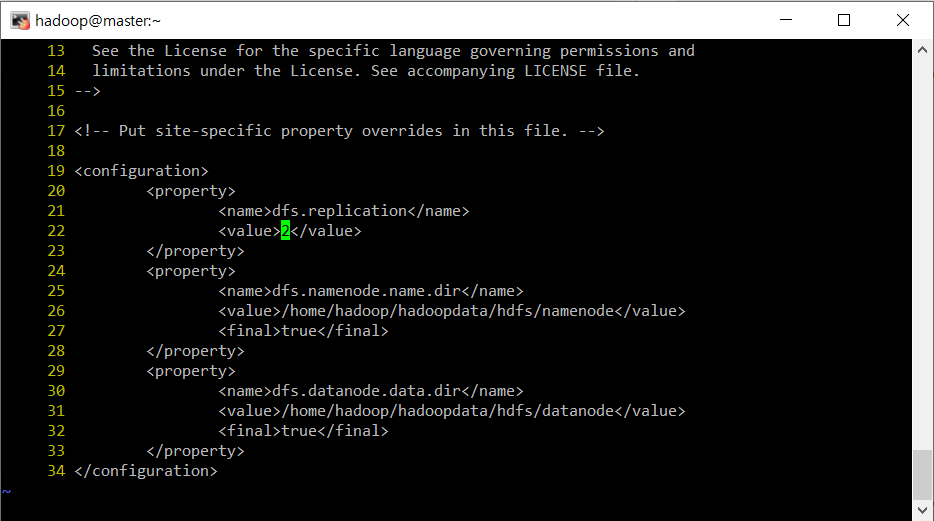<br/>


- `yarn-site.xml` 파일 수정<br/>
```shell
vi $HADOOP_HOME/etc/hadoop/yarn-site.xml
```
```xml
<configuration>

<!-- Site specific YARN configuration properties -->
        <property>
                <name>yarn.resourcemanager.hostname</name>
                <value>master</value>
        </property>
        <property>
                <name>yarn.nodemanager.aux-services</name>
                <value>mapreduce_shuffle</value>
        </property>
        <property>
                <name>yarn.nodemanager.vmem-check-enabled</name>
                <value>false</value>
        </property>
        <property>
                <name>yarn.resourcemanager.address</name>
                <value>master:8032</value>
        </property>
        <property>
                <name>yarn.resourcemanager.scheduler.address</name>
                <value>master:8030</value>
        </property>
        <property>
                <name>yarn.resourcemanager.resource-tracker.address</name>
                <value>master:8031</value>
        </property>

</configuration>
```
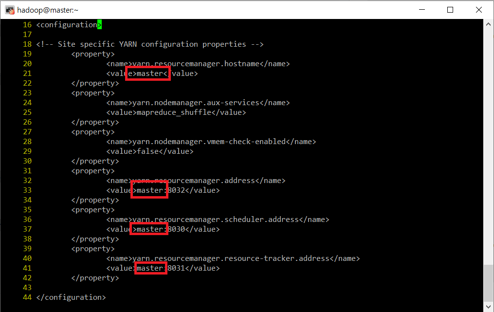<br/>
내가 설정한 호스트 네임으로 바꿔준다.<br/>

- workers 파일 수정
```shell
vi $HADOOP_HOME/etc/hadoop/workers      # 슬레이브 노드의 hostname을 넣어준다.
```
```shell
slave01
slave02
```

### Slave 하둡 설정(slave01, slave02)

- 하둡 설치
```shell
su - hadoop
wget http://apache.mirror.cdnetworks.com/hadoop/common/hadoop-3.3.4/hadoop-3.3.4.tar.gz	# 버전이 바뀌면 다운이 안될수도 있다. 확인해주자.
tar -xvzf hadoop-3.3.4.tar.gz	# 압축 풀기
ln -s hadoop-3.3.4 hadoop	# 심볼릭 링크 생성
```

- 하둡과 자바 환경 변수 설정
```shell
vi ~/.bashrc
```
맨 밑에 추가
```shell
export JAVA_HOME=/usr/lib/jvm/jre-1.8.0/
export HADOOP_HOME=/home/hadoop/hadoop 
export HADOOP_INSTALL=$HADOOP_HOME 
export HADOOP_MAPRED_HOME=$HADOOP_HOME 
export HADOOP_COMMON_HOME=$HADOOP_HOME 
export HADOOP_HDFS_HOME=$HADOOP_HOME 
export HADOOP_YARN_HOME=$HADOOP_HOME 
export HADOOP_COMMON_LIB_NATIVE_DIR=$HADOOP_HOME/lib/native 
export PATH=$PATH:$HADOOP_HOME/sbin:$HADOOP_HOME/bin 
export HADOOP_OPTS="-Djava.library.path=$HADOOP_HOME/lib/native"
```

```shell
source ~/.bashrc
```
### master에 설정 파일 slave에 옮기기(master)
```shell
scp $HADOOP_HOME/etc/hadoop/* slave01:$HADOOP_HOME/etc/hadoop/
scp $HADOOP_HOME/etc/hadoop/* slave02:$HADOOP_HOME/etc/hadoop/
```
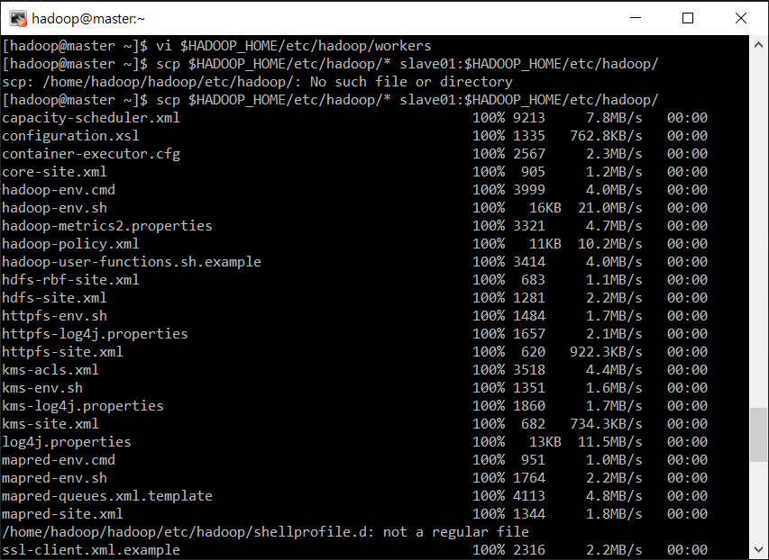<br/>
- 기존 HDFS 저장소 제거
```shell
rm -rf ~/hadoopdata/hdfs/*
```
### 방화벽 설정(master, slave)
- root 권한주기
```shell
su root
vi /etc/sudoers
```
root 계정 밑에 hadoop계정을 추가해주고 다시 `hadoop`계정으로 들어간다.<br/>
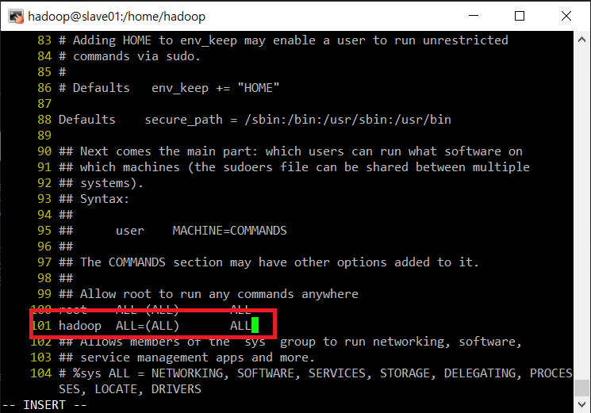<br/>


```shell
sudo firewall-cmd --permanent --add-rich-rule='rule family="ipv4" source address=192.168.197.0/24 port port="80-65535" protocol="tcp" accept'
sudo firewall-cmd --reload
```
### 동작 확인(master)
- hadoop 시작(master)<br/>
```shell
start-dfs.sh
```

- hadoop 확인(master, slave)<br/>
```shell
jps
```
1. master<br/>
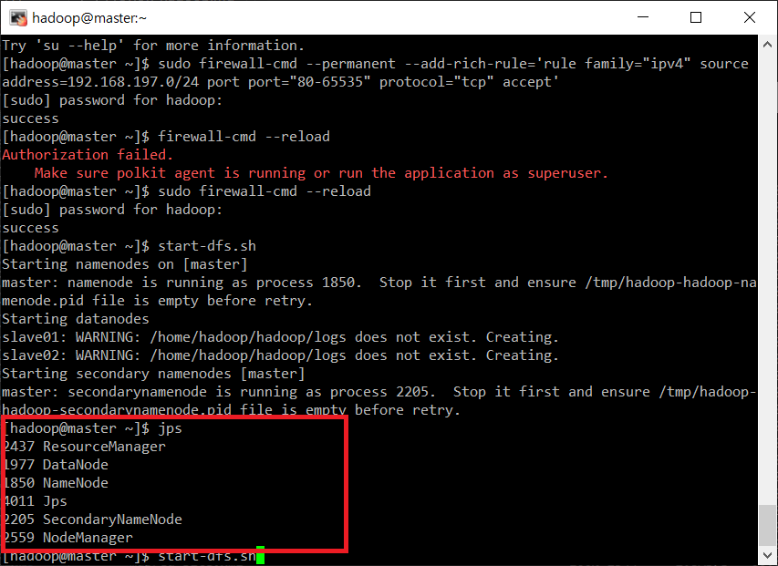<br/>

2. slave<br/>
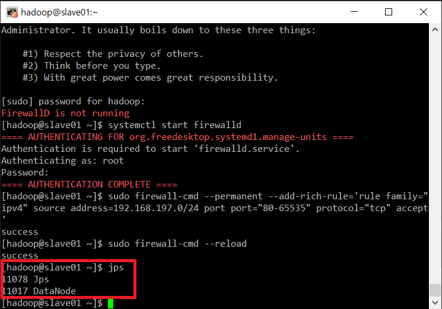<br/>

- Multi Node 확인
`http://masterIP:9870/` 네임노드에 접속해 `Datanodes`에 들어가서 노드들을 확인해준다.<br/>
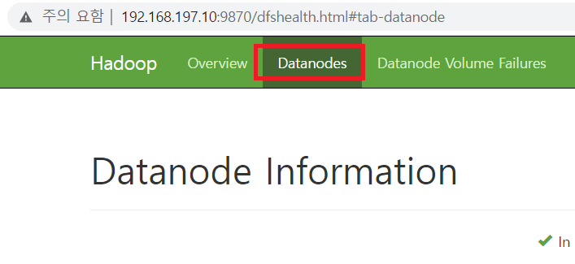<br/>
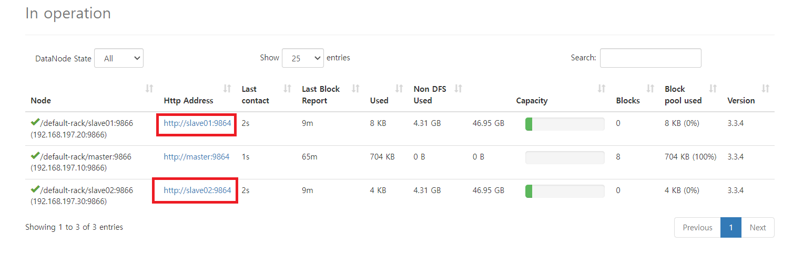<br/>


https://tdoodle.tistory.com/m/entry/How-To-Install-and-Configure-Hadoop-on-CentOSRHEL-8


