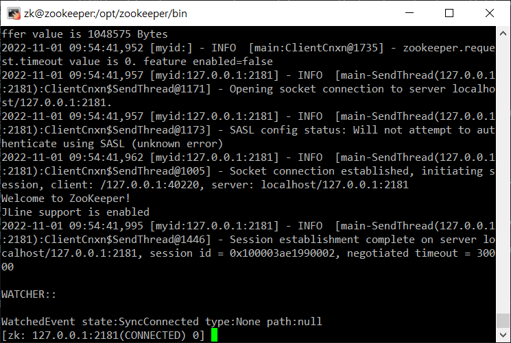

# Hadoop-Zookeeper 연동하기
## Zookeeper 설치
- 가상os 생성
```
zookeeper   192.168.197.80
```
- 주키퍼 사용자 생성<br/>
```shell
useradd zk
passwd zk
```

- 자바 설치(master, slave01, slave02)
```shell
yum install java-1.8.0-openjdk.x86_64 ant -y
```

- zookeeper 다운<br/>
```shell
yum install -y wget
wget https://dlcdn.apache.org/zookeeper/zookeeper-3.7.1/apache-zookeeper-3.7.1-bin.tar.gz  #버전 확인해준다.
mv apache-zookeeper-3.7.1-bin.tar.gz /opt/
cd /opt/
tar xvzf apache-zookeeper-3.7.1-bin.tar.gz
```

- 관리자 권한 설정<br/>
```shell
chown -R zk:zk apache-zookeeper-3.7.1-bin
ln -s apache-zookeeper-3.7.1-bin zookeeper
chown -h zk:zk zookeeper
```

## Zookeeper 설정 변경
```shell
vi /opt/zookeeper/conf/zoo.cfg
```
```cfg
initLimit=5
syncLimit=2
tickTime=2000
dataDir=/data/zookeeper
clientPort=2181
maxClientCnxns=60
server.1=zk01:2888:3888   # 연결할 노드들이 있으면 추가해준다.   
```

## Zookeeper service 연결
```shell
su -l zk
sudo vi /etc/systemd/system/zk.service
```
```service
[Unit]
Description=Zookeeper Daemon
Documentation=http://zookeeper.apache.org
Requires=network.target
After=network.target

[Service]    
Type=forking
WorkingDirectory=/opt/zookeeper
Group=zk
ExecStart=/opt/zookeeper/bin/zkServer.sh start /opt/zookeeper/conf/zoo.cfg
ExecStop=/opt/zookeeper/bin/zkServer.sh stop /opt/zookeeper/conf/zoo.cfg
ExecReload=/opt/zookeeper/bin/zkServer.sh restart /opt/zookeeper/conf/zoo.cfg
TimeoutSec=30
Restart=on-failure

[Install]
WantedBy=default.target
```
```shell
systemctl daemon-reload
```

## Zookeeper 실행
- 실행
```shell
sudo systemctl start zk
```

- 확인
```shell
sudo /opt/zookeeper/bin/zkCli.sh -server 127.0.0.1:2181
```
<br/>

