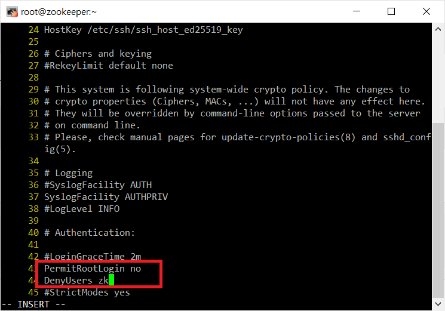

# Hadoop-Zookeeper 연동하기
## Zookeeper 설치
- 가상os 생성
```
zookeeper   192.168.197.80
```
- 주키퍼 사용자 생성<br/>
```shell
useradd zk
passwd zk
```

- sshd를 통해 로그인 불가능하게 설정<br/>
```shell
vi /etc/ssh/sshd_config
```
`PermitRootLogin yes`를 `PermitRootLogin no` 바꿔주고 밑에 줄에 `DenyUsers zk`을 추가한다.<br/>
<br/>

- sshd 재시작<br/>
```shell
systemctl restart sshd
```

- zookeeper 다운<br/>
```shell
yum install -y wget
wget https://dlcdn.apache.org/zookeeper/zookeeper-3.7.1/apache-zookeeper-3.7.1-bin.tar.gz  #버전 확인해준다.
mv apache-zookeeper-3.7.1-bin.tar.gz /opt/
cd /opt/
tar xvzf apache-zookeeper-3.7.1-bin.tar.gz
```

- 관리자 권한 설정<br/>
```shell
chown -R zk:zk apache-zookeeper-3.7.1-bin
ln -s apache-zookeeper-3.7.1-bin zookeeper
chown -h zk:zk zookeeper
```

## Zookeeper 설정 변경
```shell
vi /opt/zookeeper/conf/zoo.cfg
```
```cfg
initLimit=5
syncLimit=2
tickTime=2000
dataDir=/data/zookeeper
clientPort=2181
maxClientCnxns=60
server.1=master:2888:3888   
server.2=slave01:2888:3888
server.3=slave02:2888:3888
```


