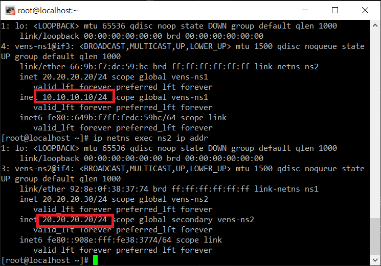

# 쿠버네티스의 구조
## 네트워크
### 실습
가상머신 2대 준비

0. 네임스페이스끼리 통신 확인
```shell
ip netns list
ip netns exec 네임스페이스이름  ip addr
```
1. 네임 스페이스 생성 및 확인
```shell
ip netns add ns1
ip netns add ns2
ip netns list
```

2. 가상의 링크 생성
```shell
# 랜케이블 생성
ip link add vens-ns1 type veth peer name vens-ns1
ip link add vens-ns2 type veth peer name vens-ns2
```
3. 각 네임스페이스를 link에 연결
```shell
# 랜케이블에 연결
ip link set vens-ns1 netns ns1
ip link set vens-ns2 netns ns2
```

4. 가상의 네트워크 장치 상태 변경
```shell
# ip netns exec 네임스페이스이름 ip link set 네트워크장치이름 up
ip netns exec ns1 ip link set vens-ns1 up
ip netns exec ns2 ip link set vens-ns2 up
```
5. 가상의 네트워크 장치에 IP주소 설정
```shell
# ip netns exec 네임스페이스이름 ip address add IP주소/서브넷마스크비트 dev 네트워크장치이름
ip netns exec ns1 ip address add 10.10.10.10/24 dev vens-ns1
ip netns exec ns2 ip address add 20.20.20.20/24 dev vens-ns2
```
<br/>

6. 가상의 공유기 추가
```shell
ip link add bridge1 type bridge
```

7. 가상의 공유기 Ip주소 설정
```shell
# ip addr add 설정할IP주소 dev bridge1
ip addr add 192.168.0.1/24 dev bridge1
```

8. 라우팅 테이블 추가
```shell
# ip netns exec 네임스페이스이름 ip route add default via 가상의공유기의IP
ip netns exec ns1 ip route add default via 192.168.0.1