# 프로메테우스
## 가상머신 설정
3개의 가상머신을 생성한다.<br>
- server : 192.168.197.100
- 01-node : 192.168.197.10
- 02-node : 192.168.197.20

### 호스트 설정

- server
```shell
vi /etc/hostname
```
```shell
server
```

- node(01-node, 02-node)
```shell
vi /etc/hostname
```
```shell
01-node # 02-node는 02-node로 입력
```
### 호스트끼리 연동하기
```shell
vi /etc/hosts
```
```shell
192.168.197.100 server
192.168.197.10 01-node
192.168.197.20 02-node
```
다음 내용을 추가해 주고 재부팅한 뒤, ping [가상머신 이름] 으로 서로간의 통신을 확인해본다.<br/>

## 프로메테우스 설정
1. 서버 설정(server)
- 레포지터리 추가
```shell
cat > /etc/yum.repos.d/prometheus.repo <<'EOF'  # 따로 쳐야함

[prometheus]
name=prometheus
baseurl=https://packagecloud.io/prometheus-rpm/release/el/$releasever/$basearch
repo_gpgcheck=1
enabled=1
gpgkey=https://packagecloud.io/prometheus-rpm/release/gpgkey
       https://raw.githubusercontent.com/lest/prometheus-rpm/master/RPM-GPG-KEY-prometheus-rpm
gpgcheck=1
metadata_expire=300

EOF # 따로 쳐야함 
```

- 설치
```shell
dnf -y install prometheus2
```

- 설정 파일 수정
```shell
vi /etc/prometheus/prometheus.yml
```

```shell
# 맨 마지막에 추가
    static_configs:
      - targets: ["localhost:9090"]
  - job_name: node
    static_configs:
      - targets: ['01-node:9100', '02-node:9100']
```
- 서버 시작
```shell
systemctl stop firewalld # 방화벽 해제
systemctl restart prometheus
```

- 확인
server의 [아이피:9090]을 했을때, 다음 화면이출력되면 성공이다.<br/>
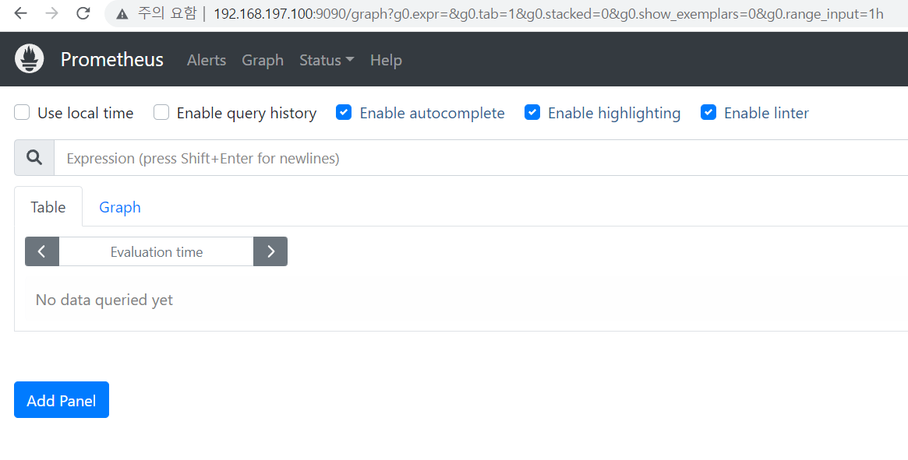<br/>

2. 노드 설정(01-node, 02-node)
- 레포지터리 추가
```shell
cat > /etc/yum.repos.d/prometheus.repo <<'EOF'  # 따로 쳐야함

[prometheus]
name=prometheus
baseurl=https://packagecloud.io/prometheus-rpm/release/el/$releasever/$basearch
repo_gpgcheck=1
enabled=1
gpgkey=https://packagecloud.io/prometheus-rpm/release/gpgkey
       https://raw.githubusercontent.com/lest/prometheus-rpm/master/RPM-GPG-KEY-prometheus-rpm
gpgcheck=1
metadata_expire=300

EOF # 따로 쳐야함 
```

- 설치
```shell
dnf -y install node_exporter
```

- 실행
```shell
systemctl stop firewalld # 방화벽 해제
systemctl restart node_exporter
```

- 확인
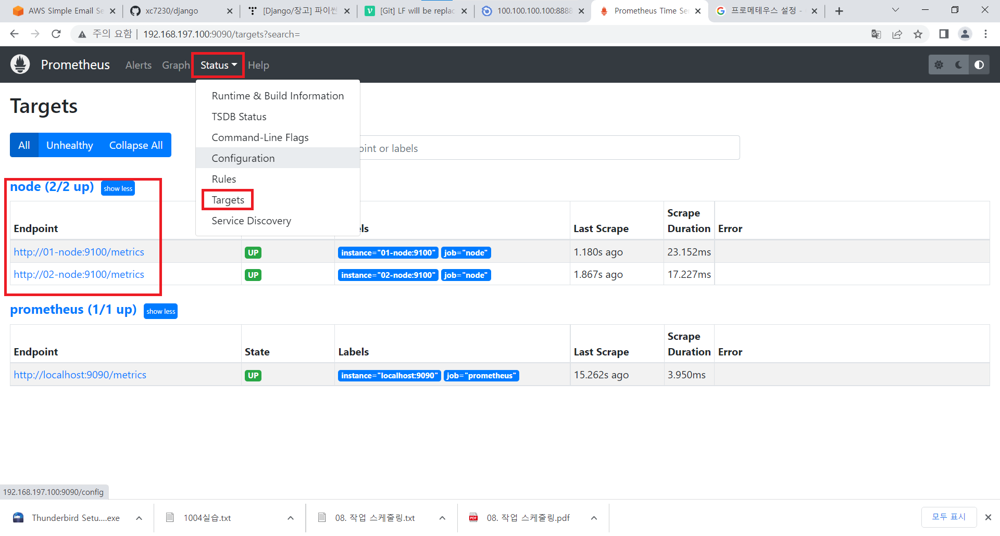<br/>


## 그라파나

### 설정
1. 서버 설정(server)
- 설치
```shell
dnf -y install grafana
```
- 설정 파일 수정
```shell
vi /etc/grafana/grafana.ini
```
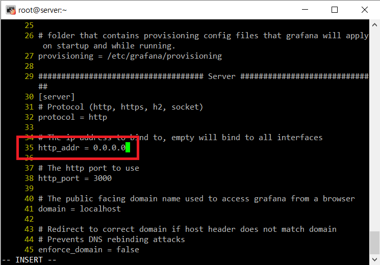<br/>
35번째 줄을 다음과 같이 바꾼다.<br/>

- 확인
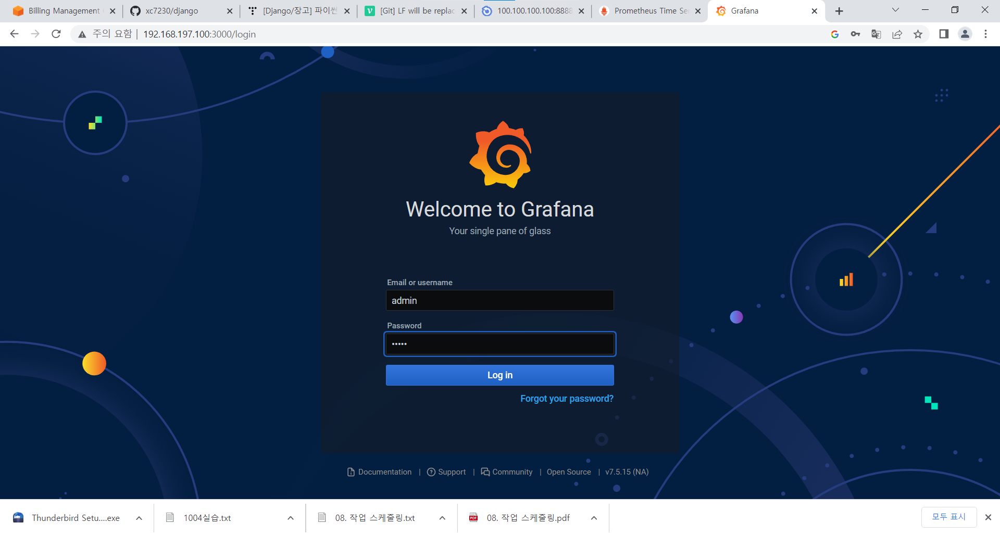<br/>
`server의 ip:3000`으로 접속, 초기 아이디 패스워드 모두 `admin`이다. 접속해서 새로운 비밀번호를 설정한다.<br/>

### 프로메데우스와 연동
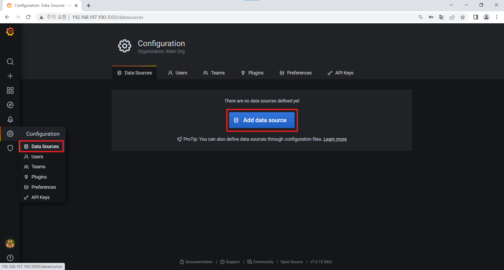<br/>
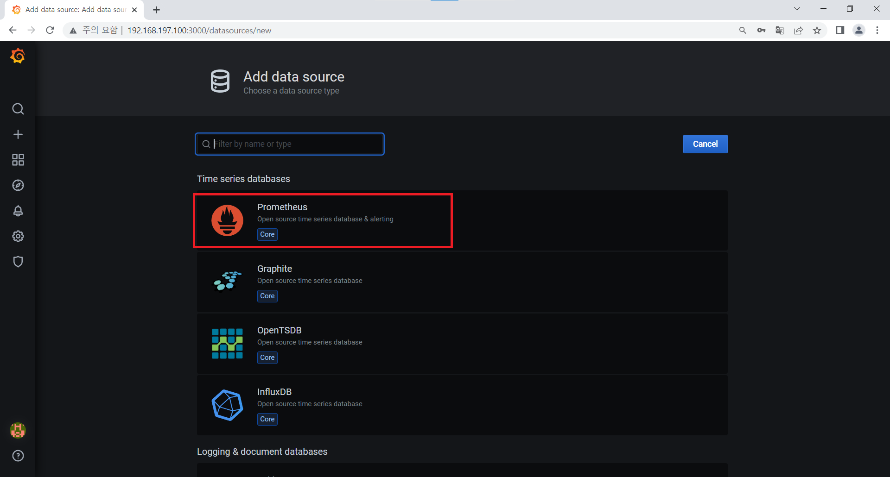<br/>
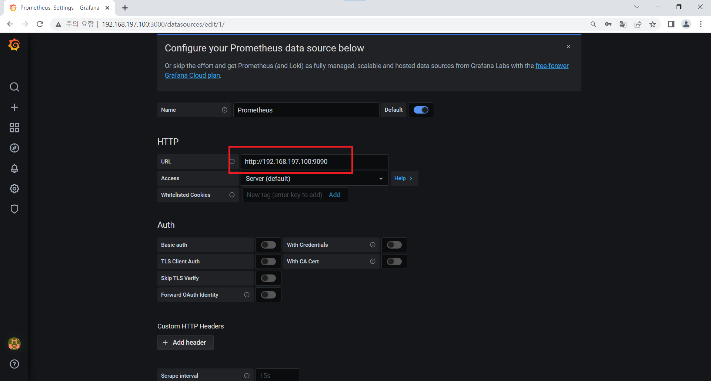<br/>
자기 프로메테우스 서버의 ip주소<br/>
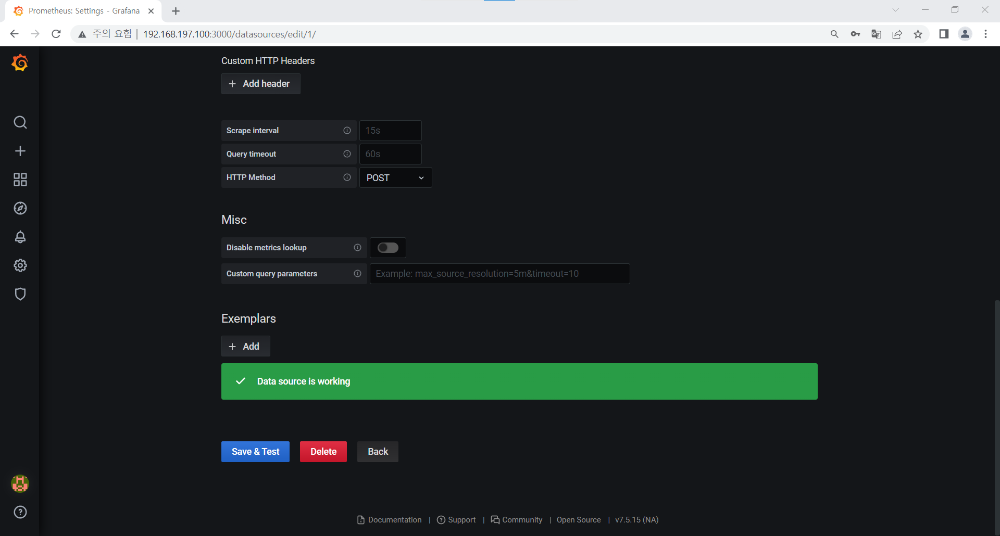<br/>

### 대시보드 설정
- 템플릿 다운 : https://grafana.com/grafana/dashboards/15780-opstree-node-exporter-a/
- 적용<br/>
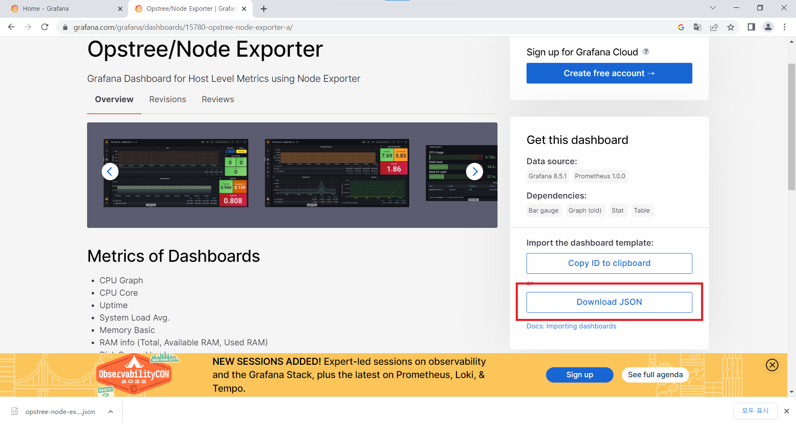<br/>
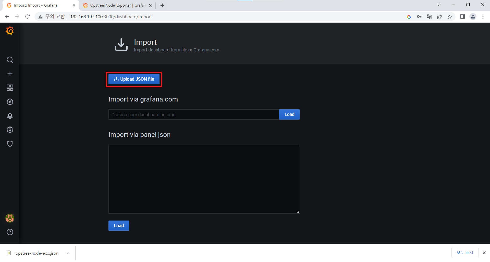<br/>
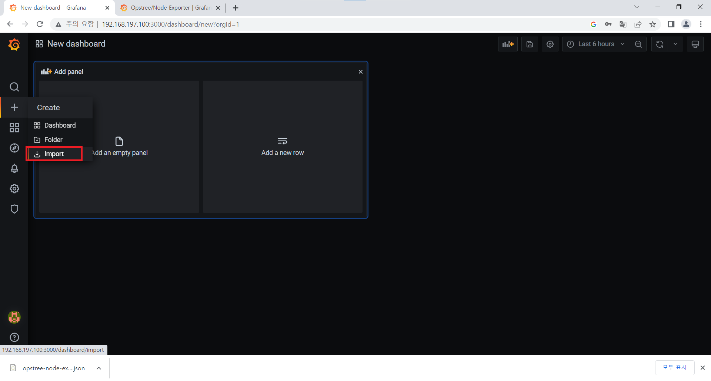<br/>

- 직접 만들기<br/>
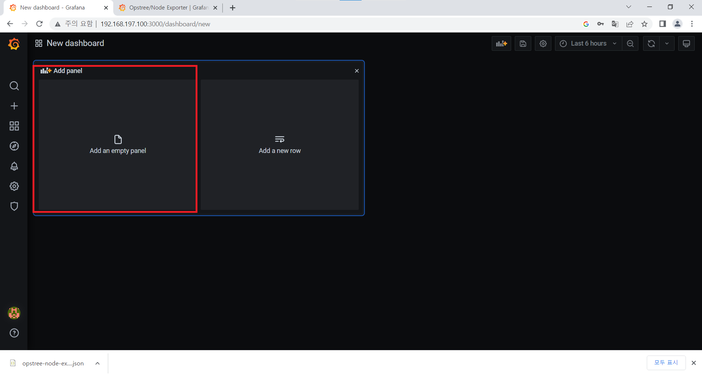<br/>
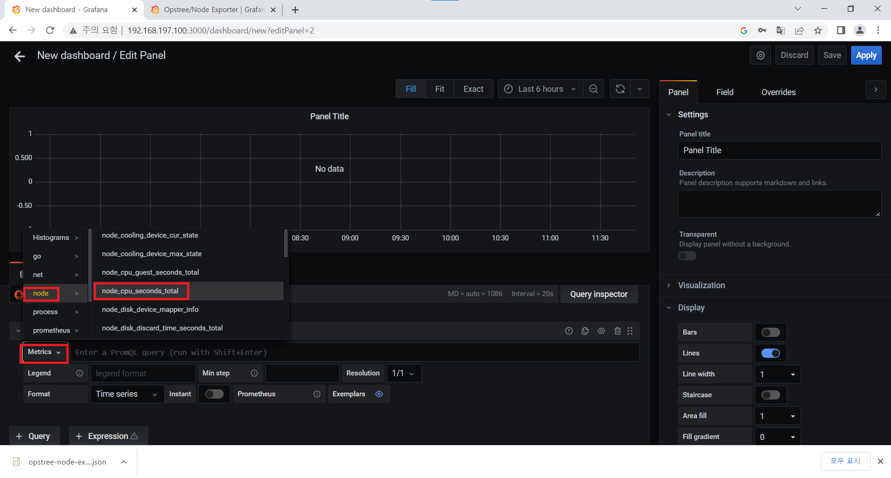<br/>
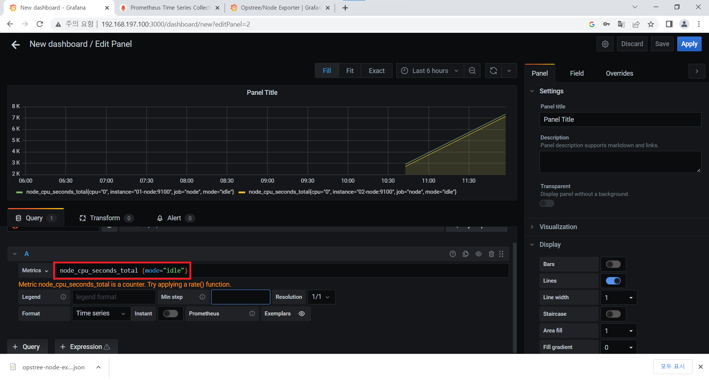<br/>

cpu남은양 확인<br/>
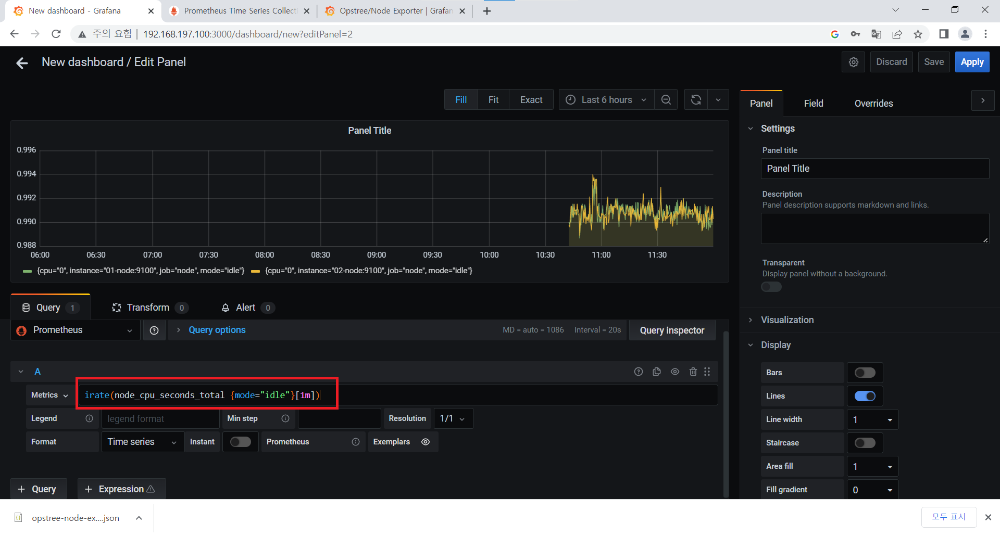<br/>
```json
irate(node_cpu_seconds_total {mode="idle"}[1m])
```

cup사용양 확인<br/>
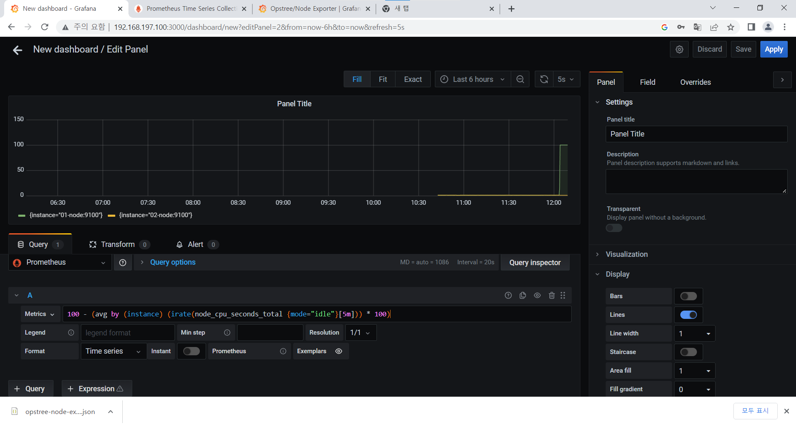<br/>
```json
100 - (avg by (instance) (irate(node_cpu_seconds_total {mode="idle"}[5m])) * 100)
```
